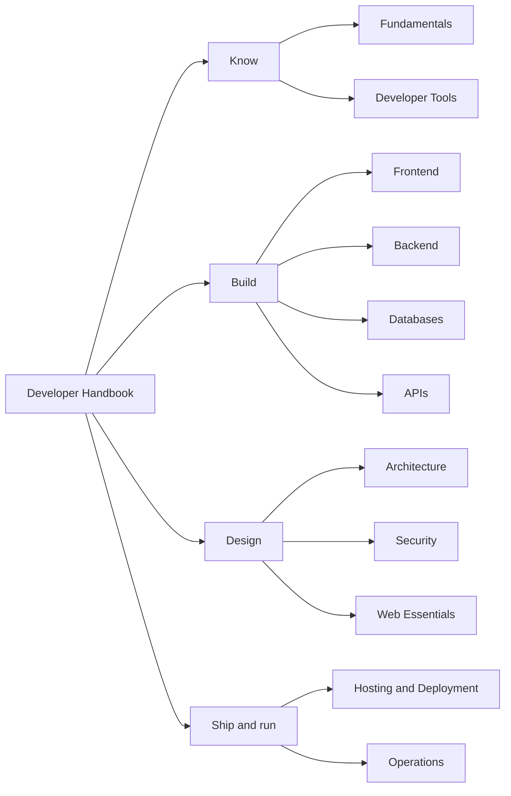

# Introduction

### Welcome, Developers! 👋

This handbook is your go-to resource for navigating web development workflows,
best practices, and essential tools. Whether you're new to coding or seeking to
refresh your skills, this guide is here to support your success.

### What You'll Discover 🔍

- **Development Workflows**: Understand the methodologies and processes for managing projects effectively.
- **Best Practices**: Learn about coding standards, design principles, and optimization techniques for delivering high-quality work.
- **Tutorials and Guides**: Follow detailed tutorials and guides on various topics, from setting up your development environment to using essential dev tools.
- **Tools and Resources**: Explore the tools, libraries, and frameworks that developers use to build robust applications.

### How this handbook is organised

Topics are grouped into eleven sections, ordered along the life of a project:
what you need to know, what you build with, how you design it, and how you ship
and run it. Within each section, pages are ordered the way you would learn them
— concepts first, then commands, then practices, then the mistakes people make.

Every page is meant to stand on its own: the explanation lives on the page, and
external links belong under _References_ rather than as a substitute for one.

### Where to start

- **Want the full map?** Browse [All Topics](/knowledge-base) for every section
  at a glance.
- **Looking for a specific answer?** Search with <kbd>Ctrl</kbd> + <kbd>K</kbd>
  — it indexes the full text of every page.
- **New to version control?** [Git](/knowledge-base/git) is the foundation most
  other workflows build on.
- **Building a UI?** [React](/knowledge-base/react-js) and
  [Next.js](/knowledge-base/next-js) are the most developed sections here.

We hope this handbook becomes a valuable companion on your development journey.
Explore the sections to get the most out of our development practices and
resources!

Happy coding! 🚀
