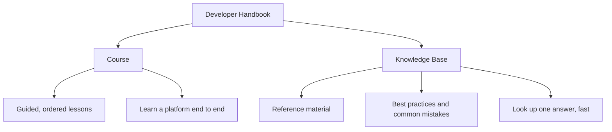

# Introduction

### Welcome, Developers! 👋

This handbook is your go-to resource for navigating web development workflows,
best practices, and essential tools. Whether you're new to coding or seeking to
refresh your skills, this guide is here to support your success.

### What You'll Discover 🔍

- **Development Workflows**: Understand the methodologies and processes for managing projects effectively.
- **Best Practices**: Learn about coding standards, design principles, and optimization techniques for delivering high-quality work.
- **Tutorials and Guides**: Follow detailed tutorials and guides on various topics, from setting up your development environment to using essential dev tools.
- **Tools and Resources**: Explore the tools, libraries, and frameworks that developers use to build robust applications.

### How this handbook is organised

The handbook is split into two complementary sections. Courses take you through
a topic in a deliberate order; the knowledge base is there for the moment you
need one specific answer.

### Where to start

- **Learning a platform from scratch?** Begin with the [Course](/course) section
  and work through the lessons in order.
- **Looking for a specific answer?** Search with <kbd>Ctrl</kbd> + <kbd>K</kbd>,
  or browse the [Knowledge Base](/knowledge-base).
- **New to version control?** [Git](/knowledge-base/git) is the foundation most
  other workflows build on.

We hope this handbook becomes a valuable companion on your development journey.
Explore the sections to get the most out of our development practices and
resources!

Happy coding! 🚀
