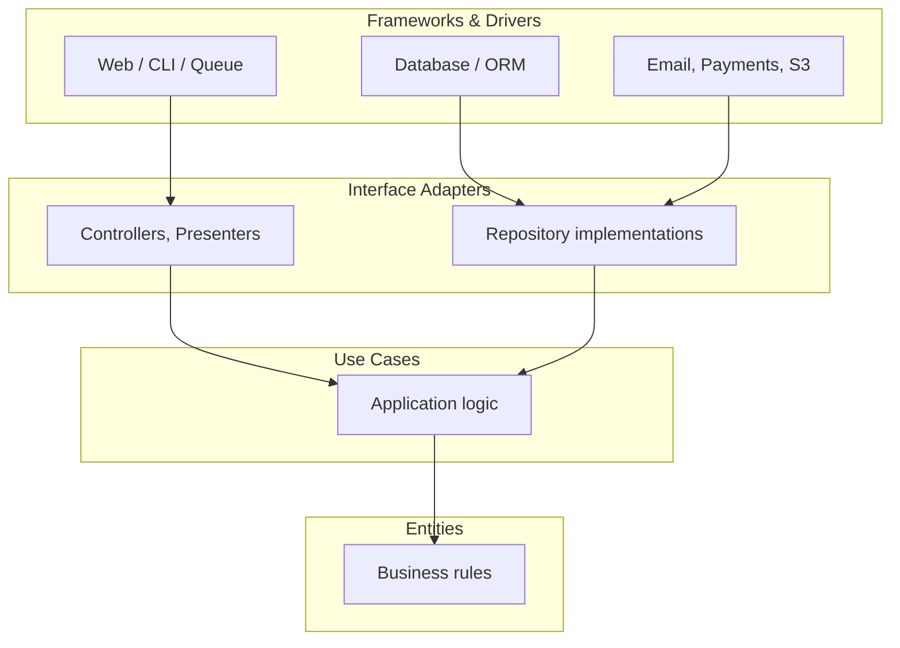

# Clean Architecture

## Introduction

Clean Architecture organises an application so that **business rules do not
depend on frameworks, databases, or how the application is delivered.**

**The problem it solves.** In a conventional layered application, the domain
depends on the ORM, which depends on the database. Change the ORM and the domain
changes. Test the pricing rules and you need a database. Six years later the
framework is unfashionable and the business logic cannot be extracted from it,
because it was never separable.

**The single rule.** Everything follows from one constraint:

> **Source code dependencies point only inwards, towards higher-level policy.**

An inner layer knows nothing about an outer one. The domain does not import the
ORM, the web framework or the HTTP library. Where an inner layer needs something
from outside — to save an order, to send an email — it **declares an interface**
and an outer layer implements it. That is
[dependency inversion](/knowledge-base/architecture/solid#d--dependency-inversion)
applied at application scale.

**Many names, one idea.** Hexagonal Architecture (Alistair Cockburn, 2005),
Ports and Adapters, Onion Architecture (Jeffrey Palermo, 2008) and Clean
Architecture (Robert C. Martin, 2012) differ in vocabulary and diagram, not in
substance.

:::caution This is not the default choice
Clean Architecture buys independence at the cost of indirection, more files and
more mapping code. For a CRUD application it is usually the wrong trade. There
is an honest cost section [below](#the-cost) — read it before adopting this.
:::

---

## The Layers



Every arrow points inwards. Nothing points out.

**Entities** — the innermost layer. Business rules that would exist even if the
application did not: an order cannot have a negative total; a subscription
expires after its period. Pure, dependency-free, trivially testable.

**Use cases** — application-specific operations. _Place an order._ _Cancel a
subscription._ They orchestrate entities and call outward through interfaces
they define themselves.

**Interface adapters** — translation. Controllers convert HTTP into use-case
input; repository implementations convert domain objects into rows; presenters
convert results into responses.

**Frameworks and drivers** — the outermost layer, and explicitly _details_:
Express, Django, PostgreSQL, Stripe, the filesystem. In Martin's framing, the
web is a delivery mechanism and the database is a storage mechanism; neither is
the application.

---

## In Practice

```text
src/
├── domain/                     ← no imports from anywhere else in the app
│   ├── order.ts                    entity with behaviour
│   └── errors.ts
├── application/                ← imports domain only
│   ├── place-order.ts              the use case
│   └── ports/                      interfaces the use case needs
│       ├── order-repository.ts
│       └── payment-gateway.ts
├── infrastructure/             ← implements the ports
│   ├── postgres-order-repository.ts
│   └── stripe-payment-gateway.ts
└── interfaces/                 ← delivery mechanisms
    ├── http/order-controller.ts
    └── cli/place-order-command.ts
```

### The entity

```ts title="domain/order.ts"
// No framework imports. No ORM. No HTTP. Just rules.
export class Order {
  private constructor(
    readonly id: OrderId,
    readonly customerId: CustomerId,
    private items: OrderItem[],
    private status: OrderStatus,
  ) {}

  static place(id: OrderId, customerId: CustomerId, items: OrderItem[]): Order {
    if (items.length === 0) throw new EmptyOrder();
    return new Order(id, customerId, items, 'pending');
  }

  totalPence(): number {
    return this.items.reduce((sum, i) => sum + i.pricePence * i.quantity, 0);
  }

  cancel(now: Date): void {
    if (this.status !== 'pending') throw new NotCancellable(this.status);
    this.status = 'cancelled';
  }
}
```

Note `cancel(now: Date)` — the clock is passed in rather than read. An entity
calling `new Date()` is depending on the outside world, and becomes
non-deterministic to test.

### The port and the use case

```ts title="application/ports/order-repository.ts"
// Declared by the INNER layer. This is what makes the dependency invert.
export interface OrderRepository {
  save(order: Order): Promise<void>;
  findById(id: OrderId): Promise<Order | null>;
}
```

```ts title="application/place-order.ts"
export class PlaceOrder {
  constructor(
    private readonly orders: OrderRepository,
    private readonly payments: PaymentGateway,
    private readonly clock: Clock,
  ) {}

  async execute(input: PlaceOrderInput): Promise<PlaceOrderResult> {
    const order = Order.place(OrderId.generate(), input.customerId, input.items);

    const receipt = await this.payments.charge(order.totalPence(), order.id.value);
    await this.orders.save(order);

    return {orderId: order.id.value, receiptId: receipt.id};
  }
}
```

No `Request`, no `Response`, no SQL, no Stripe. This class can be driven by an
HTTP controller, a CLI command, a queue worker or a test with equal ease.

### The adapter

```ts title="infrastructure/postgres-order-repository.ts"
// The OUTER layer implements the INNER layer's interface.
export class PostgresOrderRepository implements OrderRepository {
  constructor(private readonly db: Database) {}

  async save(order: Order): Promise<void> {
    const row = OrderMapper.toPersistence(order);
    await this.db.query('INSERT INTO orders … ON CONFLICT (id) DO UPDATE …', row);
  }

  async findById(id: OrderId): Promise<Order | null> {
    const row = await this.db.queryOne('SELECT * FROM orders WHERE id = $1', [id.value]);
    return row ? OrderMapper.toDomain(row) : null;
  }
}
```

### Wiring

```ts title="main.ts — the composition root"
const db = new Database(config.databaseUrl);

const placeOrder = new PlaceOrder(
  new PostgresOrderRepository(db),
  new StripePaymentGateway(config.stripeKey),
  new SystemClock(),
);

app.post('/orders', makeOrderController(placeOrder));
```

**One place assembles the graph.** Everything else receives what it needs. See
[Dependency Injection](/knowledge-base/architecture/dependency-injection).

---

## Testing

The strongest argument for the approach.

```ts
it('rejects an empty order', () => {
  expect(() => Order.place(id, customerId, [])).toThrow(EmptyOrder);
});

it('charges the total and saves the order', async () => {
  const orders = new InMemoryOrderRepository(); // a fake, not a mock
  const payments = new FakePaymentGateway();

  const result = await new PlaceOrder(orders, payments, fixedClock).execute(input);

  expect(await orders.findById(result.orderId)).not.toBeNull();
  expect(payments.charges).toHaveLength(1);
});
```

No database, no HTTP, no framework boot — these run in milliseconds and test
behaviour rather than plumbing.

**Prefer fakes to mocks.** An `InMemoryOrderRepository` that genuinely stores
and retrieves lets you assert that the order can be read back. A mock only
asserts that `save()` was called, which stays green when `save()` is broken. See
[Testing](/knowledge-base/testing#test-doubles).

Integration tests then verify the adapters against real infrastructure — that
`PostgresOrderRepository` writes correct SQL — and there are far fewer of them.

---

## The Cost

The part usually left out of enthusiastic write-ups.

**More code, and more indirection.** A field added to an order may touch the
entity, the mapper, the persistence model, the migration, the use-case input and
the controller DTO. Six files for one field.

**Mapping everywhere.** Domain objects, persistence rows and API DTOs are three
representations of the same thing, and the mapping is tedious, repetitive and a
place for bugs.

**You lose framework leverage.** Laravel, Rails and Django are productive
precisely because the ORM entity _is_ the domain object. Insisting on separation
means giving up scaffolding, model events, admin generation and much of what you
chose the framework for.

**It is harder to learn.** A new developer can follow a Rails controller
immediately. Following a request through controller → DTO → use case → port →
adapter → mapper → repository takes considerably longer.

**Premature adoption is common.** A CRUD application built this way has all the
cost and none of the benefit, because the business rules it is protecting amount
to validation.

### When it is worth it

- **Complex domain logic** that genuinely exists independently of storage —
  insurance rating, payroll, trading, logistics scheduling.
- **Long-lived systems** expected to outlive their current framework.
- **Multiple delivery mechanisms** — HTTP, gRPC, CLI, queue consumers, batch
  jobs — over the same operations.
- **Regulated domains** where business rules must be auditable and testable in
  isolation.

### When it is not

- CRUD applications, admin panels, content sites, most internal tools.
- Prototypes and anything whose shape is still moving.
- Small teams who will benefit more from framework conventions than from
  independence.

**A pragmatic middle path** works for most applications: keep a service layer
that does not import HTTP types, and put interfaces in front of genuinely
external systems — payments, email, storage, the clock. That captures most of
the testability benefit at a fraction of the cost. See
[MVC](/knowledge-base/architecture/mvc#the-service-layer).

---

## Do's and Don'ts

### Do

- Point every dependency inwards.
- Let inner layers declare the interfaces they need.
- Keep entities free of framework, ORM and I/O imports.
- Pass the clock, randomness and ids in rather than reading them.
- Assemble the object graph in one composition root.
- Prefer fakes to mocks when testing use cases.
- Adopt it where domain complexity justifies it, and not elsewhere.

### Don't

- Don't import the ORM into the domain layer.
- Don't let a use case take an HTTP request or return an HTTP response.
- Don't put an interface in front of everything — invert at real boundaries.
- Don't apply it to CRUD and call the result clean.
- Don't skip the mappers "for now"; leaking a persistence model into the domain
  removes the whole point.
- Don't confuse "clean" with "correct" — a badly modelled domain in clean
  layers is still badly modelled.

---

## Common Mistakes

**Layers without the dependency rule.** Folders named `domain/` and
`infrastructure/` where the domain imports the ORM. The directory structure is
cosmetic; the import direction is the architecture. Enforce it with a lint rule
or a dependency-cruiser check in CI.

**The anaemic domain.** Entities that are property bags while all logic sits in
use cases. That is a service-layer application with extra folders.

**Interfaces with one implementation forever.** A port exists to invert a
dependency across a boundary. `UserServiceInterface` implemented only by
`UserService` is ceremony.

**Leaking the persistence model.** Returning an ORM entity from a repository
means the domain now depends on the ORM through the type system, whatever the
folder names say.

**Mapping fatigue leading to shortcuts.** Reusing the domain object as the API
response couples your public contract to your internal model, and the first
domain refactor becomes a breaking API change.

---

## FAQ

**Is this the same as Hexagonal Architecture?**
Effectively yes. Ports and Adapters, Onion and Clean differ in vocabulary and
diagram, not in the dependency rule.

**Do I need this for a typical web application?**
No. Most benefit from a service layer plus interfaces at external boundaries.
Full Clean Architecture pays off with genuinely complex domain rules.

**Can I use it with Laravel or Django?**
Yes, and you will be fighting the framework. Those frameworks assume the ORM
entity is the domain object; separating them means giving up much of their
leverage. Weigh that honestly.

**Where do DTOs live?**
Input and output DTOs belong to the application layer — they are part of the
use-case contract. HTTP request and response shapes belong to the interface
layer, and are mapped to and from them.

**How does this relate to DDD?**
Complementary. DDD is about modelling the domain — entities, value objects,
aggregates, bounded contexts. Clean Architecture is about where that model sits
relative to everything else.

**Does it require microservices?**
No, and the two are independent. A well-layered monolith is often the better
combination. See [Monoliths](/knowledge-base/architecture/monoliths).

---

## Check your understanding

<Quiz
question="A project has domain/, application/ and infrastructure/ folders. The domain entities extend the ORM's base Model class. Is this Clean Architecture?"
options={[
{
text: 'No — the dependency rule is violated. The domain now depends on the ORM, which is an outer-layer detail, regardless of the folder names',
correct: true,
why: 'The architecture is defined by import direction, not directory structure. An entity extending an ORM base class cannot be tested or reused without the ORM.',
},
{text: 'Yes — the layers are separated into folders as required', why: 'Folders are cosmetic. The constraint is that source dependencies point inwards.'},
{text: 'Yes, provided the ORM is only used for persistence', why: 'Extending the base class is a compile-time dependency from the innermost layer on the outermost one.'},
{text: 'It depends on whether the ORM is an active-record or data-mapper implementation', why: 'A data mapper makes separation easier, but extending any ORM class from the domain inverts the arrow the wrong way.'},
]}
explanation={<>Enforce it mechanically — a <code>dependency-cruiser</code> or ESLint boundary rule that fails CI when <code>domain/</code> imports anything outward. Without enforcement, the direction erodes within a few sprints.</>}
reference={{label: 'Common mistakes', href: '/knowledge-base/architecture/clean-architecture#common-mistakes'}}
/>

<Quiz
question="Who should own the OrderRepository interface, and why does it matter?"
options={[
{
text: 'The application layer that uses it — that is what inverts the dependency, so the infrastructure adapter conforms to the domain rather than the reverse',
correct: true,
why: 'If the inner layer declares what it needs, the arrow points inwards. If the interface lives with the database code, the inner layer imports outward and nothing has been inverted.',
},
{text: 'The infrastructure layer, alongside its implementation', why: 'Then the use case must import from infrastructure — the ordinary dependency direction, with an extra interface for no benefit.'},
{text: 'A shared contracts package that both import', why: 'Workable in a multi-service setup, but for one application it adds a package without changing the direction meaningfully.'},
{text: 'The domain layer, with entities', why: 'Defensible in some formulations, though the repository is usually an application-layer concern since it serves use cases.'},
]}
explanation={<>This is the whole trick of dependency inversion: the consumer defines the contract. The provider implements it. That is what lets the outer layer be replaced without the inner layer noticing.</>}
reference={{label: 'The port and the use case', href: '/knowledge-base/architecture/clean-architecture#the-port-and-the-use-case'}}
/>

<Quiz
question="Which projects are poor candidates for full Clean Architecture?"
type="multiple"
options={[
{text: 'A CRUD admin panel over twelve database tables', correct: true, why: 'The business rules amount to validation. You pay all the indirection cost and protect almost nothing.'},
{text: 'A prototype whose domain model is still changing weekly', correct: true, why: 'Every change touches six files. Rapid iteration and heavy mapping are a poor fit.'},
{text: 'A content-managed marketing site', correct: true, why: 'Essentially no domain logic to isolate from the framework.'},
{text: 'An insurance rating engine with intricate rules that outlive any framework', why: 'A strong candidate — complex domain logic that genuinely exists independently of storage and delivery.'},
{text: 'A payroll system that must be auditable and driven by both an API and batch jobs', why: 'Also a strong candidate: complex rules, regulatory scrutiny, and multiple delivery mechanisms over the same operations.'},
]}
explanation={<>The middle path suits most applications: a service layer that never imports HTTP types, plus interfaces in front of genuinely external systems. Most of the testability, a fraction of the cost.</>}
reference={{label: 'The cost', href: '/knowledge-base/architecture/clean-architecture#the-cost'}}
/>

<Quiz
question="An entity method calls `new Date()` to decide whether an order is still cancellable. What is the problem?"
options={[
{
text: 'It reaches out to the environment, making the entity non-deterministic and its tests time-dependent — the clock should be passed in',
correct: true,
why: 'Reading the system clock is an outward dependency. Injecting the current time (or a Clock port) keeps the entity pure and makes the behaviour testable at any date.',
},
{text: 'Date objects should never appear in a domain model', why: 'Time is often central to a domain. The issue is reading the clock, not representing time.'},
{text: 'It will produce the wrong timezone', why: 'A real concern in general, but not the architectural problem here.'},
{text: 'Nothing — the clock is not an external system', why: 'It is: it is ambient state that changes independently of your inputs, which is precisely what makes tests flaky.'},
]}
explanation={<>The same applies to randomness, UUID generation and environment variables. Anything ambient becomes a parameter or a port, which is what makes inner layers deterministic.</>}
reference={{label: 'The entity', href: '/knowledge-base/architecture/clean-architecture#the-entity'}}
/>

<Quiz
question="A use case test mocks OrderRepository and asserts that save() was called once. What is weaker about this than using an in-memory fake?"
options={[
{
text: 'It verifies an interaction rather than an outcome — the test stays green even if save() would fail or store the wrong data',
correct: true,
why: 'A fake that genuinely stores lets you assert the order can be read back with the right values. A mock only confirms the call happened.',
},
{text: 'Mocks are slower than fakes', why: 'Both are fast; the difference is what they can prove.'},
{text: 'Mocks cannot be used with interfaces', why: 'They work fine with interfaces — that is their usual application.'},
{text: 'Fakes remove the need for integration tests', why: 'They do not. Adapters still need testing against real infrastructure; there are simply fewer such tests.'},
]}
explanation={<>Mock-heavy tests also break on every refactor, because they assert <em>how</em> the code works rather than <em>what</em> it produces. A fake asserts the outcome and survives internal change.</>}
reference={{label: 'Testing', href: '/knowledge-base/architecture/clean-architecture#testing'}}
/>

---

## References

- [Robert C. Martin: The Clean Architecture](https://blog.cleancoder.com/uncle-bob/2012/08/13/the-clean-architecture.html)
  — the original article and diagram.
- [Alistair Cockburn: Hexagonal Architecture](https://alistair.cockburn.us/hexagonal-architecture/)
  — Ports and Adapters, which predates and largely matches it.
- [Martin Fowler: Presentation Domain Data Layering](https://martinfowler.com/bliki/PresentationDomainDataLayering.html)
  — a measured take on when layering pays.
- [Domain-Driven Design Reference](https://www.domainlanguage.com/ddd/reference/)
  — Evans, on modelling the domain the architecture protects.
- [dependency-cruiser](https://github.com/sverweij/dependency-cruiser) —
  enforce the dependency rule in CI.
