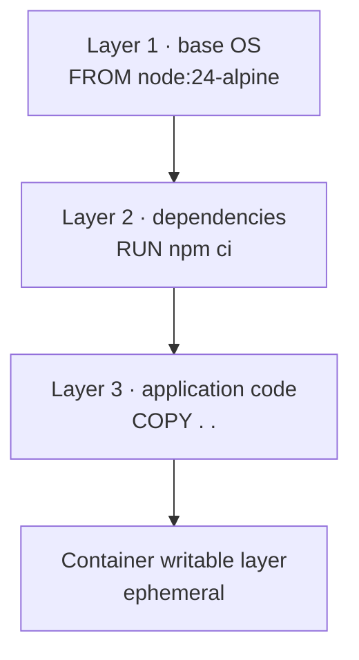

# Docker

## Introduction

Docker packages an application together with its runtime, libraries and system
dependencies into an **image** that runs identically anywhere a container
runtime exists.

**The problem it solves** is the gap between environments. A Node application
needs a particular Node version, some native libraries, specific environment
variables and a writable directory in the right place. Reproducing that on a
developer laptop, a CI runner and three production servers — and keeping them in
step for years — is the work that "works on my machine" describes. An image
makes the environment part of the artefact.

**A container is not a virtual machine.** A VM virtualises hardware and runs a
complete guest kernel. A container is one or more processes on the _host_
kernel, isolated using Linux namespaces (what the process can see) and cgroups
(what it can consume). That is why a container starts in milliseconds and a VM
takes a minute, and also why a Linux container cannot run on a Windows kernel —
Docker Desktop quietly runs a Linux VM for exactly this reason.

**Where you meet it:** local development environments, CI runners, and as the
unit of deployment for essentially every container platform — Kubernetes, ECS,
Cloud Run, Fly.io.

:::note Versions in this page
Written against **Docker Engine 29.7** (July 2026) and **Compose v2.40**. Engine
29 made the containerd image store the default for fresh installs, removed the
legacy builder in favour of BuildKit, removed Docker Content Trust from the CLI,
and deprecated cgroup v1.
:::

---

## Core Concepts

### Images, containers, layers

- An **image** is a read-only template: a stack of filesystem layers plus
  metadata (default command, environment, exposed ports, user).
- A **container** is a running (or stopped) instance of an image, with a thin
  writable layer on top.
- A **layer** is the filesystem delta produced by one build instruction.



Two consequences follow from layering, and they explain most of Docker's
behaviour:

**Layers are cached and shared.** If ten images share `node:24-alpine`, that
base is stored once. If a build instruction and everything before it are
unchanged, the layer is reused rather than re-executed.

**Layers are additive and immutable.** Deleting a file in a later layer hides
it; it does not remove it. This is why the following does _not_ shrink an image
— the secret is still in layer two, readable by anyone with the image:

```dockerfile
COPY secrets.json .        # layer 2: the file is now permanent
RUN rm secrets.json        # layer 3: hides it, does not remove it
```

The writable container layer disappears when the container is removed. Anything
that must survive goes in a volume.

### Registries and tags

A **registry** stores images; Docker Hub is the default. An image reference is
`registry/namespace/name:tag`, defaulting to Docker Hub when the registry is
omitted.

**Tags are mutable pointers, not versions.** `node:24-alpine` points at a
different image today than it did last month. For reproducible builds, pin by
digest:

```dockerfile
FROM node:24-alpine@sha256:a1b2c3…
```

A digest is content-addressed and cannot change. Tools like Renovate can keep
pinned digests updated with a reviewable pull request, which gives you
reproducibility _and_ patches.

### The build context

`docker build .` sends the contents of `.` to the builder before anything runs.
A `.dockerignore` is therefore not merely tidy — it determines how much data is
transferred and what can accidentally end up in the image.

```gitignore title=".dockerignore"
node_modules
.git
.env
.env.*
dist
coverage
**/*.log
Dockerfile
.dockerignore
```

Excluding `node_modules` is essential: copying host-built native modules into a
Linux image produces binaries compiled for the wrong platform.

---

## Installation & Setup

```bash
# macOS / Windows — Docker Desktop, which includes a Linux VM
brew install --cask docker
winget install --id Docker.DockerDesktop

# Linux — Docker Engine directly, no VM needed
curl -fsSL https://get.docker.com | sh
sudo usermod -aG docker "$USER"   # then log out and back in
```

```bash
docker --version           # Docker version 29.7.x
docker compose version     # v2.40.x — note: `docker compose`, not `docker-compose`
docker run hello-world     # verify the daemon is reachable
```

The standalone `docker-compose` v1 (a Python script) reached end of life. Compose
v2 is a Go plugin invoked as **`docker compose`** with a space. Scripts still
calling `docker-compose` should be updated.

On Linux, consider **rootless mode**, which runs the daemon as your user rather
than root and removes an entire class of privilege-escalation risk:

```bash
dockerd-rootless-setuptool.sh install
```

`docker init` scaffolds a Dockerfile, `.dockerignore` and `compose.yaml` for a
detected project type — a reasonable starting point rather than a final answer.

---

## Writing a Dockerfile

### The instructions that matter

```dockerfile
FROM node:24-alpine              # base image
WORKDIR /app                     # sets cwd for later instructions; creates it
COPY package.json ./             # host → image
RUN npm ci                       # execute at BUILD time, creating a layer
ENV NODE_ENV=production          # environment variable, persists at runtime
EXPOSE 3000                      # documentation only — publishes nothing
USER node                        # drop privileges
HEALTHCHECK CMD node healthcheck.js
ENTRYPOINT ["node"]              # the executable
CMD ["server.js"]                # default arguments, overridable
```

Three distinctions that cause real confusion:

**`RUN` vs `CMD` vs `ENTRYPOINT`.** `RUN` executes during the build. `ENTRYPOINT`
is what the container runs; `CMD` supplies default arguments to it. With both
set, `docker run myimage other.js` replaces only the `CMD`.

**Exec form, not shell form.** `CMD ["node", "server.js"]` runs `node` as PID 1,
so it receives `SIGTERM` and can shut down gracefully. `CMD node server.js` runs
it under `/bin/sh -c`, which does not forward signals — your container then
takes ten seconds to die and drops in-flight requests on every deploy.

**`EXPOSE` publishes nothing.** It is metadata. Ports are published at run time
with `-p 3000:3000` or in Compose.

### Order instructions by change frequency

This is the single highest-impact optimisation in Docker. The cache invalidates
at the first changed instruction and everything after it must re-run.

```dockerfile
# ❌ Any source change reinstalls every dependency.
COPY . .
RUN npm ci

# ✅ Dependencies reinstall only when the manifests change.
COPY package.json package-lock.json ./
RUN npm ci
COPY . .
```

Put the least-frequently-changing steps first: base image, system packages,
dependency manifests, dependency install, then source.

### Multi-stage builds

Build tooling must not ship to production. A multi-stage build compiles in one
stage and copies only the output into a clean final image.

```dockerfile
# ---- deps: cached until the lockfile changes -------------------------
FROM node:24-alpine AS deps
WORKDIR /app
COPY package.json package-lock.json ./
RUN --mount=type=cache,target=/root/.npm npm ci

# ---- build ----------------------------------------------------------
FROM node:24-alpine AS build
WORKDIR /app
COPY --from=deps /app/node_modules ./node_modules
COPY . .
RUN npm run build

# ---- runtime: no compilers, no dev dependencies, no source ----------
FROM node:24-alpine AS runtime
WORKDIR /app
ENV NODE_ENV=production
COPY package.json package-lock.json ./
RUN --mount=type=cache,target=/root/.npm npm ci --omit=dev
COPY --from=build /app/dist ./dist
USER node
EXPOSE 3000
HEALTHCHECK --interval=30s --timeout=3s --start-period=20s \
  CMD node -e "fetch('http://localhost:3000/health').then(r=>process.exit(r.ok?0:1)).catch(()=>process.exit(1))"
CMD ["node", "dist/server.js"]
```

The result is typically 80–90 % smaller than a single-stage image, and it
contains no compiler, no `git`, and none of your source.

**`RUN --mount=type=cache`** is a BuildKit feature worth adopting: the package
manager cache persists between builds without becoming an image layer. The same
pattern works for `pip`, `apt`, `go mod` and Composer.

### Choosing a base image

| Base             | Size    | Trade-off                                                        |
| ---------------- | ------- | ---------------------------------------------------------------- |
| `node:24`        | ~1.1 GB | Full Debian; every tool present, large attack surface            |
| `node:24-slim`   | ~250 MB | Debian minus extras — a sensible default                         |
| `node:24-alpine` | ~150 MB | musl libc, not glibc; occasional native-module issues            |
| `distroless`     | ~120 MB | No shell, no package manager; hardest to debug, smallest surface |

Alpine's musl libc is the catch: some native modules ship glibc binaries and
either fail to build or behave subtly differently. If you hit unexplained native
crashes on Alpine, try `-slim` before spending a day on it.

Distroless is excellent for production and genuinely awkward to debug — there is
no shell to exec into. Engine 29 supports **debug containers** that attach a
toolbox to a running container, which makes distroless far more practical than
it used to be.

---

## Running Containers

```bash
docker run -d --name api -p 3000:3000 myapp:1.2.0   # detached, port published
docker run --rm -it node:24-alpine sh               # throwaway interactive shell
docker run --env-file .env myapp                    # environment from a file
docker run -v app-data:/data myapp                  # named volume
docker run -v "$PWD:/app" myapp                     # bind mount (development)

docker ps                    # running containers
docker ps -a                 # including stopped
docker logs -f api           # follow logs
docker exec -it api sh       # shell inside a running container
docker stop api && docker rm api
docker stats                 # live resource usage
```

`--rm` is worth making a habit for anything ad hoc; without it, stopped
containers accumulate quietly until `docker system df` surprises you.

### Storage: volumes, bind mounts, tmpfs

| Type           | Where it lives    | Use for                                   |
| -------------- | ----------------- | ----------------------------------------- |
| **Volume**     | Managed by Docker | Databases, uploads — anything persistent  |
| **Bind mount** | A host path       | Source code during development            |
| **tmpfs**      | Host memory only  | Secrets and scratch that must not persist |

```bash
docker volume create pgdata
docker run -v pgdata:/var/lib/postgresql/data postgres:18
docker volume ls
docker volume rm pgdata          # destroys the data
```

Use **volumes** for data and **bind mounts** for code you are editing. A bind
mount over `/app` in development will also shadow the image's `node_modules`,
which is why the standard Compose pattern adds an anonymous volume to keep the
container's copy:

```yaml
volumes:
  - .:/app
  - /app/node_modules # preserve the image's node_modules
```

### Networking

```bash
docker network create app-net
docker run --network app-net --name db postgres:18
docker run --network app-net --name api myapp    # reaches the DB at host `db`
```

On a user-defined network, Docker provides DNS: containers reach each other by
**container name**. This is why Compose services address each other as `db`,
`redis`, `api` rather than by IP.

`-p 8080:3000` maps host port 8080 to container port 3000. Without it, the port
is reachable only from other containers on the same network — which is the
correct configuration for a database.

`localhost` inside a container means _that container_. To reach a service on the
host, use `host.docker.internal`.

---

## Performance

**Build speed** is dominated by cache behaviour:

- Order instructions by change frequency (the biggest win by far).
- Use `--mount=type=cache` for package manager caches.
- Keep the build context small with `.dockerignore`.
- In CI, use a registry cache so cold runners still hit warm layers:

  ```bash
  docker buildx build \
    --cache-from type=registry,ref=myrepo/app:buildcache \
    --cache-to type=registry,ref=myrepo/app:buildcache,mode=max \
    -t myrepo/app:$GIT_SHA --push .
  ```

**Image size** matters for pull time on every deploy and every autoscale event:

- Multi-stage builds; ship only the artefact.
- A `-slim` or `-alpine` base.
- Combine related `RUN` steps and clean up in the _same_ layer:

  ```dockerfile
  RUN apt-get update \
   && apt-get install -y --no-install-recommends curl \
   && rm -rf /var/lib/apt/lists/*
  ```

  Cleaning in a later `RUN` saves nothing — the files are already in a layer.

**Runtime** limits are worth setting explicitly, because a container defaults to
unbounded host resources:

```bash
docker run --memory=512m --cpus=1.5 --pids-limit=200 myapp
```

Note that Node and the JVM historically read host memory rather than the cgroup
limit; modern versions respect it, but check if a container is being OOM-killed
at a size that looks wrong.

**Multi-platform builds** for Apple Silicon developers deploying to x86:

```bash
docker buildx build --platform linux/amd64,linux/arm64 -t myrepo/app:1.2.0 --push .
```

Emulated builds are slow. Native runners per architecture are much faster if you
build often.

---

## Security

Containers are isolation, not a security boundary in the way a VM is. The kernel
is shared.

**Never run as root.** The default is root, and a container escape then starts
from root:

```dockerfile
RUN addgroup -S app && adduser -S app -G app
USER app
```

**Drop capabilities and make the filesystem read-only:**

```bash
docker run --read-only --tmpfs /tmp \
  --cap-drop=ALL --security-opt=no-new-privileges \
  myapp
```

**Never put secrets in the image.** `ENV` and `ARG` values are visible in
`docker history`, and a `COPY`-then-`RM` leaves the file in an earlier layer.
Use BuildKit secrets at build time and the orchestrator's secret mechanism at
run time:

```dockerfile
RUN --mount=type=secret,id=npmrc,target=/root/.npmrc npm ci
```

```bash
docker build --secret id=npmrc,src=$HOME/.npmrc .
```

**Pin base images by digest** and update them deliberately. A `:latest` base
means your build is not reproducible and a compromised upstream tag lands
silently.

**Scan images, and attach provenance:**

```bash
docker scout cves myapp:1.2.0
docker buildx build --sbom=true --provenance=true -t myrepo/app:1.2.0 --push .
```

BuildKit can generate an SBOM and SLSA provenance attestation as part of the
build — since Engine 29.6 these are queryable through the API. That gives
consumers a verifiable record of what is in the image and how it was produced.

**Do not mount the Docker socket** (`/var/run/docker.sock`) into a container
unless you have thought hard about it. Access to the socket is equivalent to
root on the host.

---

## Debugging

```bash
docker logs --tail 100 -f api          # what it printed
docker logs --since 10m api
docker inspect api                     # full config: mounts, env, network, health
docker inspect --format '{{.State.ExitCode}}' api
docker exec -it api sh                 # get inside a running container
docker run --rm -it --entrypoint sh myapp:1.2.0   # get inside a broken image
docker history myapp:1.2.0             # layer sizes and the commands that made them
docker diff api                        # what changed in the writable layer
docker stats api                       # live CPU/memory
docker system df                       # where the disk went
```

| Symptom                               | Cause and fix                                                                           |
| ------------------------------------- | --------------------------------------------------------------------------------------- |
| Container exits immediately, code 0   | The main process finished. A container lives only as long as PID 1.                     |
| Exit code 125 / 126 / 127             | Docker itself failed / command not executable / command not found.                      |
| Exit code 137                         | SIGKILL — almost always OOM. Raise `--memory` or fix the leak.                          |
| Exit code 143                         | SIGTERM — a normal stop.                                                                |
| `Cannot connect to the Docker daemon` | Daemon not running, or your user is not in the `docker` group.                          |
| Port already allocated                | Something else holds the host port. Change the left-hand side of `-p`.                  |
| Cannot reach another container        | Not on the same user-defined network, or using `localhost` instead of the service name. |
| Works locally, fails in CI            | Architecture mismatch (arm64 vs amd64). Build with `--platform`.                        |
| Build ignores your change             | A cached layer. `--no-cache`, or fix the instruction ordering.                          |
| Image is enormous                     | `docker history` shows which layer. Usually a missing multi-stage build.                |
| Slow shutdown, dropped requests       | Shell-form `CMD`, so PID 1 never sees `SIGTERM`. Use exec form.                         |

To debug a container that will not start, override the entrypoint and look
around:

```bash
docker run --rm -it --entrypoint sh myapp:1.2.0
```

For a distroless image with no shell, use a debug container that attaches a
toolbox to the target's namespaces:

```bash
docker debug myapp-container
```

---

## Maintenance

```bash
docker system df                  # disk usage by images, containers, volumes, cache
docker system prune               # remove stopped containers, unused networks, dangling images
docker system prune -a --volumes  # ⚠️ also removes unused images AND volume data
docker builder prune --keep-storage=10gb
docker image prune -a --filter "until=168h"
```

`docker system prune -a --volumes` deletes volumes not attached to a running
container. On a development machine that is often your local database. Prune
volumes deliberately, never as part of a habitual cleanup.

---

## Do's and Don'ts

### Do

- Order Dockerfile instructions from least to most frequently changing.
- Use multi-stage builds so production images contain no build tooling.
- Add a `.dockerignore`, always including `node_modules`, `.git` and `.env`.
- Use exec-form `CMD`/`ENTRYPOINT` so PID 1 receives signals.
- Run as a non-root `USER`.
- Pin base images by digest, and automate updating the digest.
- Put persistent data in named volumes.
- Set memory and CPU limits explicitly.
- Use BuildKit secrets for build-time credentials.

### Don't

- Don't `COPY . .` before installing dependencies.
- Don't put secrets in `ENV`, `ARG`, or a file you delete in a later layer.
- Don't use `:latest` for a base image or a deployment.
- Don't run one container with several processes; run several containers.
- Don't store application state in the container's writable layer.
- Don't mount the Docker socket casually.
- Don't run `docker system prune -a --volumes` on autopilot.
- Don't install debugging tools into the production image "just in case".

---

## Common Mistakes

**Copying source before installing dependencies.** Every code change reinstalls
everything. Copy manifests, install, then copy source.

**Believing `RUN rm` shrinks the image.** Layers are additive. The file remains
in the earlier layer and in `docker history`. Never add a secret you plan to
delete.

**Shell-form `CMD`.** The process runs under `sh -c`, never receives `SIGTERM`,
and is killed after the grace period — dropping in-flight requests on every
deploy.

**Expecting `EXPOSE` to publish a port.** It is documentation. Use `-p`.

**Data in the container.** A container's writable layer is deleted with the
container. Use a volume.

**One container, many processes.** Supervisors inside containers defeat
per-process restart, scaling and log handling. One concern per container.

**`localhost` between containers.** Inside a container, `localhost` is that
container. Use the service name on a shared network.

**Copying host `node_modules`.** Native modules built for macOS/arm64 will not
load on linux/amd64. `.dockerignore` it and install inside the image.

---

## FAQ

**Docker or Podman?**
Podman is daemonless and rootless by default, and its CLI is
Docker-compatible. Docker has the larger ecosystem and Docker Desktop. Both build
OCI images that run anywhere.

**Do I need Kubernetes?**
Not to use Docker. Compose is enough for a single host and for development;
Kubernetes solves multi-node scheduling, and brings substantial operational
cost. See [Microservices](/knowledge-base/architecture/microservices).

**Why is Docker slow on macOS?**
File I/O crosses the VM boundary. Use `:cached`/`:delegated` mount options,
keep `node_modules` inside the container, and enable VirtioFS in Docker Desktop.

**Should images be one layer?**
No. Fewer layers than the naive maximum, yes — but layers are the cache. Combine
related commands; do not collapse everything into one `RUN`.

**Alpine or slim?**
Start with `-slim`. Move to Alpine when size genuinely matters and you have
confirmed your native dependencies work against musl.

**How do I get a shell in a distroless image?**
You cannot — that is the point. Use `docker debug`, or build a debug variant
with a shell from the same base.

---

## Check your understanding

<Quiz
question="A Dockerfile does `COPY . .` and then `RUN npm ci`. Builds take four minutes even for a one-line source change. Why?"
options={[
{
text: 'Copying the source invalidates the cache for every later instruction, so npm ci re-runs on every change',
correct: true,
why: 'The layer cache invalidates at the first changed instruction and everything after it. Copy package.json and the lockfile first, run npm ci, then copy the source.',
},
{
text: 'npm ci is inherently slow and cannot be cached',
why: 'It caches perfectly well when its inputs are unchanged. The problem is that COPY . . changes on every commit.',
},
{
text: 'The base image is being re-downloaded each time',
why: 'Base images are cached locally after the first pull.',
},
{
text: 'BuildKit disables caching for RUN instructions',
why: 'BuildKit caches RUN layers, and additionally supports persistent cache mounts.',
},
]}
explanation={<>Ordering instructions from least- to most-frequently-changing is the highest-impact Docker optimisation there is. Add <code>RUN --mount=type=cache,target=/root/.npm</code> to keep the package cache warm even when the lockfile does change.</>}
reference={{label: 'Order instructions by change frequency', href: '/knowledge-base/docker#order-instructions-by-change-frequency'}}
/>

<Quiz
question="This Dockerfile fragment is intended to use a private registry token without leaking it. Does it work?"
options={[
{
text: 'No — the token is baked into layer 1 and remains readable via docker history even after the rm',
correct: true,
why: 'Layers are additive and immutable. Deleting a file in a later layer only hides it; the earlier layer still contains it and ships with the image.',
},
{
text: 'Yes — the rm removes the file from the final image',
why: 'It removes it from the final filesystem view, not from the layer that added it. Anyone with the image can extract it.',
},
{
text: 'Yes, provided the image is never pushed to a public registry',
why: 'Private registries are not an access control on the credential itself, and images get copied.',
},
{
text: 'No, but only because ARG values are always logged',
why: 'The problem here is the layer, not logging. ARG has its own exposure issues, but the COPY is what persists the file.',
},
]}
explanation={<>Use a BuildKit secret mount instead: <code>RUN --mount=type=secret,id=npmrc,target=/root/.npmrc npm ci</code>. The file is available during that instruction and never becomes part of any layer.</>}
reference={{label: 'Security', href: '/knowledge-base/docker#security'}}>

```dockerfile
COPY .npmrc /root/.npmrc
RUN npm ci
RUN rm /root/.npmrc
```

</Quiz>

<Quiz
question="A container is killed with exit code 137 during load testing. What happened, and what should you check first?"
options={[
{
text: 'SIGKILL, almost always the OOM killer — check the container memory limit and actual usage',
correct: true,
why: '137 is 128 + 9 (SIGKILL). Under load it is nearly always the cgroup memory limit being hit. docker stats and the kernel log confirm it.',
},
{
text: 'The application called process.exit(137)',
why: 'Possible in principle, but 137 is the conventional signal-based code and the load-testing context makes OOM overwhelmingly likely.',
},
{
text: 'A failed health check restarted the container',
why: 'A health-check-driven restart produces a normal stop (SIGTERM, 143) unless the process ignores it.',
},
{
text: 'The image architecture does not match the host',
why: 'That fails at startup with an exec format error, not under sustained load.',
},
]}
explanation={<>Exit codes worth memorising: 125 Docker failed, 126 not executable, 127 not found, 137 SIGKILL/OOM, 143 SIGTERM. Also check that your runtime reads the cgroup limit rather than host memory.</>}
reference={{label: 'Debugging', href: '/knowledge-base/docker#debugging'}}
/>

<Quiz
question="Which of these genuinely reduce a production image's attack surface?"
type="multiple"
options={[
{text: 'A multi-stage build that copies only the compiled output into the final stage', correct: true, why: 'No compilers, no dev dependencies, no source — far less for an attacker to use.'},
{text: 'Adding a USER instruction so the process does not run as root', correct: true, why: 'The default is root. A container escape from root is dramatically worse than from an unprivileged user.'},
{text: 'Pinning the base image by digest', correct: true, why: 'A mutable tag means a compromised or simply different upstream image can land in your build without review.'},
{text: 'Running with --read-only and --cap-drop=ALL', correct: true, why: 'Removes write access and Linux capabilities the process almost certainly does not need.'},
{text: 'Setting EXPOSE only for the ports you use', why: 'EXPOSE is documentation. It publishes nothing and blocks nothing, so it has no security effect.'},
]}
explanation={<>The recurring theme is removing what is not needed — tooling, privileges, write access, capabilities. <code>EXPOSE</code> is the odd one out because it is purely metadata.</>}
reference={{label: 'Security', href: '/knowledge-base/docker#security'}}
/>

<Quiz
question="Your API container cannot reach the Postgres container. Both are running. The connection string uses localhost:5432. What is wrong?"
options={[
{
text: 'Inside a container localhost is that container; on a shared user-defined network the database is reachable by its container or service name',
correct: true,
why: 'Each container has its own network namespace. Docker provides DNS on user-defined networks, so the host should be `db` (or whatever the service is called), not localhost.',
},
{
text: 'Postgres has not published port 5432 to the host',
why: 'Publishing is only needed for access _from the host_. Container-to-container traffic on a shared network does not require it.',
},
{
text: 'The containers need to be linked with the legacy --link flag',
why: '--link is deprecated. User-defined networks with DNS replaced it years ago.',
},
{
text: 'They must share a volume to communicate',
why: 'Volumes are storage. They have nothing to do with network reachability.',
},
]}
explanation={<>The corollary is that a database usually should <em>not</em> publish a port at all: reachable from the API container, unreachable from the internet.</>}
reference={{label: 'Networking', href: '/knowledge-base/docker#networking'}}
/>

---

## References

- [Docker documentation](https://docs.docker.com/) — the authoritative reference.
- [Dockerfile best practices](https://docs.docker.com/build/building/best-practices/)
  — layer ordering, multi-stage builds, image size.
- [Docker Engine 29 release notes](https://docs.docker.com/engine/release-notes/29/)
  — containerd image store default, legacy builder removal, cgroup v1
  deprecation.
- [BuildKit documentation](https://docs.docker.com/build/buildkit/) — cache
  mounts, secrets, attestations.
- [Docker security](https://docs.docker.com/engine/security/) — capabilities,
  rootless mode, seccomp.
- [OCI Image Specification](https://github.com/opencontainers/image-spec) — what
  an image actually is.
