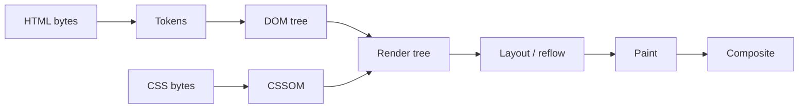

# The DOM

## Introduction

The **Document Object Model** is the browser's in-memory representation of a
document. When a page loads, the browser parses HTML text and builds a tree of
objects; the DOM is the API that lets JavaScript read and change that tree.

HTML on disk is inert text. The DOM is what the page actually _is_ once it is
running. This distinction matters more than it sounds: "View Source" shows you
the text the server sent, while DevTools' Elements panel shows you the live DOM,
which may have been rewritten entirely by scripts.

**The problem it solves.** Before a standard existed, each browser exposed its
own incompatible object model, and scripts had to be written per browser. The
DOM specifies one language-neutral interface — the same tree, the same method
names — so that a single script works everywhere.

**Where you meet it.** Directly, when writing vanilla JavaScript or a small
widget. Indirectly, constantly: React, Vue, Svelte and every other framework are
DOM-manipulation libraries underneath, and their performance characteristics are
DOM performance characteristics. Server-rendered pages hydrate into it, and test
runners simulate it.

:::note Related pages
[Performance](/knowledge-base/web/performance) covers the metrics that DOM work
affects. [XSS](/knowledge-base/security/xss) covers the attacks that careless
DOM writes enable. [React](/knowledge-base/react-js) explains the abstraction
most teams put on top of it.
:::

---

## Core Concepts

### From bytes to pixels

Understanding where the DOM sits in the rendering pipeline explains most of its
performance behaviour:



1. **Parse.** The HTML parser converts bytes to tokens and tokens to nodes,
   building the DOM tree incrementally as bytes arrive.
2. **CSSOM.** Stylesheets are parsed into a parallel object model. CSS is
   render-blocking: the browser will not paint until it knows the styles.
3. **Render tree.** DOM plus CSSOM, minus anything not rendered (`head`,
   elements with `display: none`).
4. **Layout (reflow).** Compute the geometry of every box — position and size.
5. **Paint.** Fill in pixels: text, colours, shadows, borders.
6. **Composite.** Assemble painted layers on the GPU in the right order.

Steps 4–6 are the expensive ones, and the ones your DOM writes trigger.

### Nodes, elements and the type hierarchy

Everything in the tree is a **node**. Elements are one kind of node:

| Type               | `nodeType` | Example                                  |
| ------------------ | ---------- | ---------------------------------------- |
| `Element`          | 1          | `<p>`, `<div>`, `<my-widget>`            |
| `Text`             | 3          | The text inside a paragraph              |
| `Comment`          | 8          | `<!-- todo -->`                          |
| `Document`         | 9          | `document`                               |
| `DocumentType`     | 10         | `<!doctype html>`                        |
| `DocumentFragment` | 11         | Detached container, `<template>` content |

The distinction bites when traversing. Whitespace between tags is a real text
node, so `firstChild` is often a `Text` node containing a newline, not the
element you meant. Prefer the element-only accessors:

| Node-based (includes text) | Element-only (what you usually want) |
| -------------------------- | ------------------------------------ |
| `childNodes`               | `children`                           |
| `firstChild`               | `firstElementChild`                  |
| `lastChild`                | `lastElementChild`                   |
| `nextSibling`              | `nextElementSibling`                 |
| `parentNode`               | `parentElement`                      |

### Attributes are not properties

This is the single most common source of DOM confusion.

- An **attribute** is what appears in the HTML markup. It is always a string.
- A **property** is a field on the JavaScript object. It has a real type.

They are related but not identical:

```js
const input = document.querySelector('#email');

// Attribute: the *initial* value from markup, always a string.
input.getAttribute('value'); // "hello@example.com"

// Property: the *current* value, updated as the user types.
input.value; // whatever is in the box right now
```

Rules of thumb:

- For **form state** (`value`, `checked`, `selected`), use the property. The
  attribute only reflects the initial value and does not track user input.
- For **boolean attributes** (`disabled`, `required`, `readonly`), the property
  is a real boolean. `getAttribute('disabled')` returns `""` when present and
  `null` when absent — both of which are easy to mishandle.
- For **custom data**, use `data-*` attributes and read them via `dataset`:
  `<div data-user-id="7">` is `el.dataset.userId`.
- Some names differ because they collide with JavaScript keywords: the `class`
  attribute is the `className` property; `for` is `htmlFor`.

### Live vs static collections

Some DOM APIs return a snapshot; others return a view that updates itself.

```js
const live = document.getElementsByTagName('li'); // HTMLCollection — live
const staticList = document.querySelectorAll('li'); // NodeList — static

document.body.append(document.createElement('li'));

live.length; // grew by one
staticList.length; // unchanged
```

Live collections cause classic infinite loops:

```js
// ❌ Never terminates: each append makes the collection longer.
const items = document.getElementsByTagName('li');
for (let i = 0; i < items.length; i++) {
  document.body.append(document.createElement('li'));
}
```

`querySelectorAll` returns a static `NodeList`, which is safer and supports
`forEach`. It is not an array, though — use `Array.from()` when you need `map`
or `filter`.

---

## Setup

There is nothing to install; the DOM is the browser. What matters is _when_ your
script runs relative to the tree being built.

```html
<!-- Blocks parsing while it downloads and executes. Avoid. -->
<script src="app.js"></script>

<!-- Downloads in parallel, executes after parsing, in document order. -->
<script src="app.js" defer></script>

<!-- Downloads in parallel, executes the moment it arrives, order not guaranteed. -->
<script src="analytics.js" async></script>

<!-- Modules are deferred by default and run in strict mode. -->
<script type="module" src="app.js"></script>
```

**Use `type="module"` or `defer` for application code.** Both guarantee the DOM
is fully parsed before your script runs, which removes the need for
`DOMContentLoaded` handlers entirely. Reserve `async` for independent scripts
that touch nothing else, such as analytics beacons.

Two lifecycle events are worth knowing:

- **`DOMContentLoaded`** — the HTML is parsed and the DOM is built. Stylesheets,
  images and subframes may still be loading. This is when to initialise UI.
- **`load`** — everything, including images and fonts, has finished. Rarely the
  right hook; it can fire many seconds late.

```js
// Only needed for classic, non-deferred scripts.
document.addEventListener('DOMContentLoaded', () => {
  init();
});
```

For local development against a DOM without a browser (tests, scripts), see
[Testing](#testing) below.

---

## Basic Usage

### Selecting elements

```js
// Modern, CSS-selector based. Prefer these.
const one = document.querySelector('.card[data-featured]');
const all = document.querySelectorAll('nav a');

// Scoped to a subtree — much faster on large documents.
const link = sidebar.querySelector('a.active');

// Fastest single lookup, but only by id.
const root = document.getElementById('app');

// Walk *up* the tree to the nearest matching ancestor.
const row = event.target.closest('tr');

// Test a node against a selector.
if (el.matches('input:invalid')) {
  /* … */
}
```

`closest()` and `matches()` are what make event delegation practical — see
[Events](#events).

### Creating and inserting

```js
const li = document.createElement('li');
li.textContent = 'Deploy on Friday';
li.className = 'task task--urgent';
li.dataset.taskId = '42';

const list = document.querySelector('#tasks');

list.append(li); // last child; accepts multiple nodes and strings
list.prepend(li); // first child
list.before(li); // as a previous sibling of the list
list.after(li); // as a next sibling
li.replaceWith(other); // swap in place
li.remove(); // detach from the tree
```

The modern methods (`append`, `prepend`, `before`, `after`, `replaceWith`,
`remove`) supersede `appendChild`, `insertBefore` and
`parentNode.removeChild(child)`. They accept multiple arguments, accept plain
strings as text, and do not require a reference to the parent.

### Text and HTML

```js
el.textContent = userInput; // Safe. Sets text; markup is not parsed.
el.innerHTML = '<em>markup</em>'; // Parses HTML. Never pass untrusted input.
el.innerText; // Rendered text — triggers reflow, avoid in loops.
```

`textContent` returns everything in the subtree, including text in hidden
elements, and never causes layout. `innerText` approximates what the user sees,
which requires the browser to compute layout first. Default to `textContent`.

### Classes, styles and attributes

```js
el.classList.add('is-open');
el.classList.remove('is-loading');
el.classList.toggle('is-active', isActive); // force to a boolean
el.classList.contains('is-open');

el.style.setProperty('--row-height', '2.5rem'); // custom property
el.style.transform = 'translateX(10px)'; // inline style

el.setAttribute('aria-expanded', 'true');
el.toggleAttribute('hidden', shouldHide);
el.removeAttribute('title');
```

Prefer toggling classes over writing inline styles. Classes keep presentation in
the stylesheet, are easier to override, and let the browser batch style
recalculation more effectively.

---

## Events

### The event model

Every event travels in three phases:

1. **Capture** — from `window` down to the target.
2. **Target** — the event fires on the element itself.
3. **Bubble** — back up from the target to `window`.

Listeners run in the bubble phase unless you opt in to capture. Not all events
bubble: `focus`, `blur`, `load` and `error` do not, which is why `focusin` and
`focusout` exist as bubbling equivalents.

```js
element.addEventListener('click', handler, {
  capture: false, // listen during the capture phase
  once: true, // auto-remove after the first call
  passive: true, // promise never to call preventDefault()
  signal: controller.signal, // remove via AbortController
});
```

`passive: true` matters for scroll performance. For `touchstart`, `touchmove`
and `wheel`, the browser must otherwise wait for your handler to finish before
scrolling, in case you cancel it. Marking the listener passive lets scrolling
begin immediately.

### Removing listeners with AbortController

Removing listeners used to require keeping a reference to the exact same
function. `AbortController` removes an entire group at once, which is far harder
to get wrong:

```js
const controller = new AbortController();
const {signal} = controller;

window.addEventListener('resize', onResize, {signal});
document.addEventListener('keydown', onKey, {signal});
media.addEventListener('change', onThemeChange, {signal});

// Later — one call detaches all three.
controller.abort();
```

This is the pattern to use in component teardown, `useEffect` cleanup and
anywhere a widget can be destroyed.

### Event delegation

Attaching one listener to a container instead of one per child keeps memory flat
and works for elements that do not exist yet:

```js
document.querySelector('#tasks').addEventListener('click', (event) => {
  const button = event.target.closest('[data-action="delete"]');
  if (!button) return; // click landed somewhere else in the list

  const id = button.closest('li').dataset.taskId;
  deleteTask(id);
});
```

`event.target` is what was actually clicked (possibly a nested `<span>` inside
the button). `event.currentTarget` is the element the listener is attached to.
Confusing the two is a very common bug.

### preventDefault vs stopPropagation

They are unrelated, and reaching for the wrong one causes mysterious breakage:

- **`preventDefault()`** cancels the browser's default action — following a
  link, submitting a form, checking a checkbox. Propagation continues.
- **`stopPropagation()`** stops the event travelling further up the tree. The
  default action still happens.

`stopPropagation()` is usually a mistake in application code: it silently breaks
unrelated delegated listeners elsewhere on the page, including analytics and
"click outside to close" handlers. Prefer a guard clause in the outer listener.

### Custom events

```js
element.dispatchEvent(
  new CustomEvent('cart:item-added', {
    detail: {sku: 'ABC-1', quantity: 2},
    bubbles: true, // custom events do not bubble by default
    composed: true, // allow crossing shadow DOM boundaries
  }),
);
```

---

## Advanced Usage

### Batch with DocumentFragment

Each insertion into a connected tree can trigger layout work. A
`DocumentFragment` is a lightweight, detached container: you build in it, then
insert once.

```js
const fragment = document.createDocumentFragment();

for (const task of tasks) {
  const li = document.createElement('li');
  li.textContent = task.title;
  fragment.append(li);
}

list.append(fragment); // one insertion; the fragment itself is not inserted
```

Building a detached subtree with `createElement` and appending the root once
achieves the same thing.

### Templates

`<template>` content is parsed but inert — not rendered, images not fetched,
scripts not run — until you clone it:

```html
<template id="task-row">
  <li class="task">
    <span class="task__title"></span>
    <button data-action="delete">Delete</button>
  </li>
</template>
```

```js
const template = document.querySelector('#task-row');

function renderTask(task) {
  const node = template.content.cloneNode(true); // deep clone
  node.querySelector('.task__title').textContent = task.title;
  return node;
}
```

This gives you markup-defined structure with `textContent`-safe interpolation —
the security properties of manual construction with the readability of HTML.

### Shadow DOM and custom elements

The Shadow DOM attaches a separate, encapsulated tree to an element. Styles
defined inside do not leak out, and page styles do not leak in.

```js
class UserBadge extends HTMLElement {
  connectedCallback() {
    const shadow = this.attachShadow({mode: 'open'});
    shadow.innerHTML = `
      <style>
        /* Scoped to this component only. */
        .name { font-weight: 600; }
        :host { display: inline-flex; gap: 0.5rem; }
      </style>
      <span class="name"></span>
      <slot></slot>
    `;
    shadow.querySelector('.name').textContent = this.getAttribute('name') ?? '';
  }
}

customElements.define('user-badge', UserBadge);
```

Key points:

- **`mode: 'open'`** exposes the tree as `element.shadowRoot`. `'closed'` hides
  it, which mostly inconveniences your own tooling rather than providing
  security.
- **`:host`** styles the custom element itself; **`::slotted()`** styles content
  the page passed in.
- **Events do propagate** out of a shadow tree if `composed: true`, but they are
  _retargeted_: `event.target` becomes the host element, so the page cannot see
  internal structure. Use `event.composedPath()` when you need the real chain.
- Inherited properties such as `color` and `font-family` still cross the
  boundary. Encapsulation applies to selectors, not inheritance.

### Observers

Polling the DOM in a loop is always the wrong answer. Four observers cover
almost every need, and all are asynchronous, so they never block rendering:

```js
// Structural changes to a subtree.
new MutationObserver((records) => {
  for (const record of records) console.log(record.type, record.target);
}).observe(list, {childList: true, subtree: true, attributes: true});

// Element entering or leaving the viewport — lazy loading, infinite scroll.
new IntersectionObserver(
  (entries) => {
    for (const entry of entries) {
      if (entry.isIntersecting) loadMore();
    }
  },
  {rootMargin: '200px'}, // start 200px early
).observe(sentinel);

// Element size changes — better than window resize for component layout.
new ResizeObserver((entries) => {
  for (const entry of entries) {
    chart.resize(entry.contentRect.width);
  }
}).observe(container);

// Long tasks, layout shifts, paint timing.
new PerformanceObserver((list) => {
  for (const entry of list.getEntries()) report(entry);
}).observe({type: 'largest-contentful-paint', buffered: true});
```

`IntersectionObserver` in particular replaces scroll handlers that call
`getBoundingClientRect()` — the observer does the work off the main thread.

### Moving nodes without resetting them

`insertBefore` and `append` **remove and re-insert** a node. For a connected
element that means iframes reload, videos restart, focus is lost, CSS
transitions restart, and `<dialog>`/popover open state is discarded.

`moveBefore()` performs an atomic move that preserves all of that:

```js
if ('moveBefore' in Element.prototype) {
  container.moveBefore(node, referenceNode); // state preserved
} else {
  container.insertBefore(node, referenceNode); // fallback
}
```

Shipped in Chrome 133 (February 2025) and progressively rolling out elsewhere;
feature-detect as above. It is a meaningful win for drag-and-drop reordering and
for list virtualisation.

### Dialogs and popovers

Two platform features replace a great deal of hand-written JavaScript:

```html
<dialog id="confirm">
  <form method="dialog">
    <p>Delete this task?</p>
    <button value="cancel">Cancel</button>
    <button value="delete">Delete</button>
  </form>
</dialog>

<button popovertarget="menu">Options</button>
<div id="menu" popover>…</div>
```

```js
dialog.showModal(); // focus trap, inert background, Esc to close — all free
dialog.addEventListener('close', () => console.log(dialog.returnValue));
```

`showModal()` gives you the accessibility behaviour (focus trapping, background
inertness, `Esc` handling) that hand-rolled modals almost always get wrong. The
`popover` attribute gives light-dismiss and top-layer stacking with no
JavaScript at all.

---

## Performance

### Reflow, repaint, and layout thrashing

- **Reflow (layout)** recomputes geometry. Triggered by changing size, position,
  content, or font.
- **Repaint** redraws pixels without changing geometry. Triggered by colour,
  shadow, visibility.
- **Composite only** is cheapest. `transform` and `opacity` can usually be
  animated on the GPU without layout or paint.

The expensive pattern is **layout thrashing**: interleaving reads and writes so
the browser must recompute layout on every iteration.

```js
// ❌ Forced synchronous layout on every element.
for (const el of elements) {
  el.style.height = `${el.offsetHeight * 2}px`; // read, then write, then read…
}

// ✅ Read everything first, then write everything.
const heights = elements.map((el) => el.offsetHeight); // batch reads
elements.forEach((el, i) => {
  el.style.height = `${heights[i] * 2}px`; // batch writes
});
```

Properties that force synchronous layout when read include `offsetTop`,
`offsetHeight`, `clientWidth`, `scrollTop`, `getBoundingClientRect()` and
`getComputedStyle()`. They are fine to read — just not immediately after a
write.

### Practical techniques

| Technique                     | When it helps                                         |
| ----------------------------- | ----------------------------------------------------- |
| Animate `transform`/`opacity` | Avoids layout and paint entirely                      |
| `requestAnimationFrame`       | Aligns writes with the frame; never animate in a loop |
| `content-visibility: auto`    | Skips rendering work for offscreen sections           |
| Virtualisation                | Render ~30 rows instead of 30,000                     |
| Event delegation              | One listener instead of thousands                     |
| `DocumentFragment`            | One insertion instead of N                            |
| `IntersectionObserver`        | Replaces scroll handlers that measure                 |

A useful rule: **the fastest DOM operation is the one you do not perform.** Most
"slow framework" complaints are really "we render 5,000 nodes" complaints.

### Where the virtual DOM fits

React and similar libraries keep a lightweight JavaScript description of the
intended tree, diff the new description against the previous one, and apply only
the differences.

This is not inherently faster than a well-targeted direct DOM update — a single
`textContent` assignment beats any diffing algorithm. What the virtual DOM buys
is a **programming model**: you describe the end state and the library figures
out the minimal mutation, so you never hand-write a patch. Its performance value
is in avoiding the naive alternative — blowing away and rebuilding `innerHTML`
on every state change.

Signals-based libraries (Solid, Svelte 5, Vue's reactivity) take the other
route: track dependencies precisely at build or run time and update exactly the
affected node, with no diffing at all.

---

## Security

Every DOM sink that parses HTML is a potential [XSS](/knowledge-base/security/xss)
vector. The rule is simple: **untrusted data goes in as text, never as markup.**

```js
// ❌ Any of these will execute injected markup.
el.innerHTML = comment.body;
el.outerHTML = comment.body;
document.write(comment.body);
el.insertAdjacentHTML('beforeend', comment.body);
el.setHTMLUnsafe(comment.body);

// ✅ Text is text.
el.textContent = comment.body;
```

`` runs through every one of the unsafe sinks even
though the page contains no `<script>` tag.

Beyond the obvious sinks:

- **URLs are sinks too.** `a.href = userInput` allows `javascript:` URLs.
  Validate the scheme against an allowlist of `https:`, `http:` and `mailto:`.
- **`el.style.cssText = userInput`** can exfiltrate data via crafted
  `background-image: url(...)` values.
- **Never build markup by string concatenation.** Use `createElement` plus
  `textContent`, or a `<template>` clone.

### Sanitising when you genuinely need HTML

Rich-text content (a CMS body, a Markdown render) has to be HTML. Sanitise it:

```js
// Native Sanitizer API — shipped in Firefox 148 and Chrome 146, not yet
// Baseline, so feature-detect and fall back.
if ('setHTML' in Element.prototype) {
  el.setHTML(untrustedHtml); // safe defaults: no scripts, no event handlers
} else {
  el.innerHTML = DOMPurify.sanitize(untrustedHtml);
}
```

Sanitise on **output**, in the browser, immediately before insertion. Sanitising
only on input leaves you exposed the moment a second write path appears, and
stores data you can never re-render differently.

Add a Content Security Policy as defence in depth:

```
Content-Security-Policy: default-src 'self'; script-src 'self' 'nonce-{random}'; object-src 'none'; base-uri 'none'
```

`require-trusted-types-for 'script'` goes further, making unsafe sinks throw
unless the value passed through a policy — it converts an invisible
vulnerability into a loud runtime error.

---

## Testing

You do not need a real browser to test DOM code, but you do need a DOM.

| Environment                          | What it is                                | Use for                            |
| ------------------------------------ | ----------------------------------------- | ---------------------------------- |
| **jsdom**                            | Pure-JS DOM implementation in Node        | Fast unit and component tests      |
| **happy-dom**                        | Lighter, faster, less complete than jsdom | Same, when speed matters more      |
| **Playwright / Vitest Browser Mode** | A real browser engine                     | Layout, real events, visual checks |

`jsdom` has no layout engine. `getBoundingClientRect()` returns zeros, and
`offsetHeight` is always `0`. Anything that depends on real geometry must be
tested in a real browser.

```js
// vitest.config.ts → test: { environment: 'jsdom' }
import {expect, test} from 'vitest';
import {screen} from '@testing-library/dom';
import userEvent from '@testing-library/user-event';

test('delete button removes the task row', async () => {
  document.body.innerHTML = `
    <ul id="tasks">
      <li data-task-id="1">
        Ship it <button data-action="delete">Delete</button>
      </li>
    </ul>`;
  initTaskList();

  await userEvent.click(screen.getByRole('button', {name: 'Delete'}));

  expect(screen.queryByText('Ship it')).toBeNull();
});
```

Query by **role and accessible name** rather than by class or test id wherever
possible. A test that finds a button the way a screen reader would is also
asserting that the markup is accessible. See
[Testing](/knowledge-base/testing) for the wider strategy.

---

## Debugging

| Symptom                             | Likely cause and fix                                                                    |
| ----------------------------------- | --------------------------------------------------------------------------------------- |
| `Cannot read properties of null`    | Selector matched nothing, or the script ran before the element existed. Add `defer`.    |
| Listener never fires                | Attached before the element existed, or the node was replaced by `innerHTML`. Delegate. |
| Handler fires twice                 | Registered twice, e.g. re-running init. Use `{once: true}` or an `AbortController`.     |
| Element is in the DOM but invisible | Check computed styles, not your stylesheet — something else is winning.                 |
| Layout jumps while scrolling        | Layout thrashing, or images without `width`/`height` attributes.                        |
| Works in DevTools, fails in code    | You are inspecting post-JavaScript state; "View Source" shows the original HTML.        |

Useful DevTools features:

- **Break on DOM change.** Right-click a node in Elements → _Break on_ →
  subtree/attribute/node removal. This is the fastest way to find which script
  is mutating something.
- **`getEventListeners(el)`** in the Console lists every listener attached.
- **`monitorEvents(el, 'click')`** logs events as they fire.
- **`$0`** is the currently selected element; `$$('sel')` is
  `querySelectorAll` returning a real array.
- **Rendering panel** → _Paint flashing_ and _Layout Shift Regions_ visualise
  what is actually being repainted.
- **Performance panel** → purple "Layout" bars with a warning triangle mark
  forced synchronous layout.

---

## Best Practices

### Do

- Use `defer` or `type="module"` so the DOM exists when your script runs.
- Select with `querySelector`/`querySelectorAll`, scoped to a subtree.
- Delegate events to a stable container.
- Clean up listeners and observers with `AbortController` when a component dies.
- Batch reads, then batch writes.
- Assign untrusted data with `textContent`.
- Use `<dialog>`, `popover` and `<template>` instead of reimplementing them.
- Reflect UI state in classes and ARIA attributes, not just in JavaScript
  variables.

### Don't

- Don't build markup with string concatenation and `innerHTML`.
- Don't call `stopPropagation()` to fix a bug — find the real cause.
- Don't read layout properties inside a write loop.
- Don't mutate a live `HTMLCollection` while iterating it.
- Don't store application state in the DOM and read it back; the DOM is a view.
- Don't use `document.write()`. It blocks parsing and destroys the document if
  called after load.
- Don't attach listeners inside a loop over rows.

---

## Common Mistakes

**Rebuilding lists with `innerHTML +=`.** Every assignment reparses the whole
container, destroys and recreates every child, drops all listeners, and resets
focus and scroll. Append nodes instead.

**Assuming `querySelectorAll` is live.** It is a snapshot. Re-query after
mutating, or delegate so you never hold references.

**Treating `NodeList` as an array.** It has `forEach` but not `map`, `filter` or
`reduce`. `Array.from(nodes)` or `[...nodes]` converts it.

**Forgetting that `event.target` may be a descendant.** Always narrow with
`closest()` in a delegated handler.

**Comparing `getAttribute('checked')` to decide checkbox state.** The attribute
holds the initial value from markup; the `checked` property holds the live one.

**Leaking observers.** `MutationObserver`, `IntersectionObserver` and
`ResizeObserver` keep their targets alive. Call `disconnect()` on teardown.

**Reading `innerText` in a loop.** It forces layout. `textContent` does not.

---

## FAQ

**Is the DOM part of JavaScript?**
No. JavaScript is defined by ECMAScript; the DOM is a separate set of Web IDL
interfaces specified by WHATWG and provided by the host environment. Node.js has
no DOM, which is why tests need jsdom.

**Is direct DOM manipulation slow?**
Reads and writes are cheap. What is expensive is triggering layout, and doing so
repeatedly. A single well-placed `textContent` write is faster than any
framework update.

**Should I still learn the DOM if I only use React?**
Yes. Every bug involving focus, scrolling, event ordering, third-party widgets,
`ref` usage, hydration mismatches or memory leaks is a DOM bug wearing a React
costume.

**When should I reach for Shadow DOM?**
When shipping a widget that must survive being dropped into a page whose CSS you
do not control. Inside a normal application, CSS Modules or scoped styles give
you the isolation without the interoperability cost.

**Why does my CSS transition not run after I move an element?**
Because `insertBefore`/`append` removed and reinserted the node, resetting its
state. Use `moveBefore()` where available.

---

## Check your understanding

<Quiz
question="A list of 500 rows is rendered, and each row gets its own click listener. Users report that the page is sluggish and that rows added after load do not respond to clicks. What is the correct fix?"
options={[
{
text: 'Attach one listener to the list container and use event.target.closest() to identify the row',
correct: true,
why: 'Delegation fixes both symptoms at once: one listener instead of 500, and it works for rows that did not exist when the listener was attached, because the event bubbles up to the container.',
},
{
text: 'Re-run the listener attachment code every time a row is added',
why: 'This addresses the second symptom but makes the first one worse, and it is easy to double-register listeners on existing rows.',
},
{
text: 'Use a MutationObserver to attach a listener whenever a row appears',
why: 'It works, but it is far more machinery than needed, and you still end up with 500 listeners.',
},
{
text: 'Wrap the listener registration in requestAnimationFrame',
why: 'rAF controls _when_ code runs relative to the frame. It changes nothing about how many listeners exist or whether future rows are covered.',
},
]}
explanation={<>Events bubble, so a single listener on a stable ancestor sees clicks from every descendant — including ones added later. This is the canonical use of event delegation.</>}
reference={{label: 'Event delegation', href: '/knowledge-base/dom#event-delegation'}}
/>

<Quiz
question="Assuming the page starts with no list items, what does this code log?"
type="single"
options={[
{text: '0 then 3', correct: true, why: 'getElementsByTagName returns a live HTMLCollection. The first read happens before any append, so it is 0; the second reflects all three appends without re-querying.'},
{text: '0 then 0', why: 'That would be correct for a static NodeList from querySelectorAll, but getElementsByTagName returns a live collection.'},
{text: '3 then 3', why: 'The first log runs before the loop, so it cannot see elements that do not exist yet. Liveness works forwards, not backwards.'},
{text: 'It throws, because items is empty', why: 'An empty HTMLCollection is perfectly valid; reading .length on it returns 0.'},
]}
explanation={<>Liveness is also why the classic append-inside-a-length-loop never terminates: the collection grows on every iteration, so <code>i</code> never catches <code>items.length</code>.</>}
reference={{label: 'Live vs static collections', href: '/knowledge-base/dom#live-vs-static-collections'}}>

```js
const items = document.getElementsByTagName('li');
console.log(items.length);

for (let i = 0; i < 3; i++) {
  document.body.append(document.createElement('li'));
}

console.log(items.length);
```

</Quiz>

<Quiz
question="Which of these assignments can execute attacker-supplied JavaScript when `value` comes from a user?"
type="multiple"
options={[
{text: 'el.innerHTML = value', correct: true, why: 'Parses markup. `` runs immediately, with no script tag involved.'},
{text: 'el.textContent = value', why: 'Sets a text node. Markup is never parsed, so this is the safe sink.'},
{text: 'anchor.href = value', correct: true, why: 'A `javascript:` URL executes on click. Validate the scheme against an allowlist.'},
{text: 'el.insertAdjacentHTML("beforeend", value)', correct: true, why: 'Another HTML-parsing sink with exactly the same exposure as innerHTML.'},
{text: 'el.setAttribute("data-note", value)', why: 'A data-* attribute is inert. It becomes dangerous only if some other code later reads it into an HTML sink.'},
]}
explanation={<>The question to ask of any DOM write is "does this value get parsed as markup, or navigated to?" If either is true, it is a sink and needs escaping, sanitising or scheme validation.</>}
reference={{label: 'XSS', href: '/knowledge-base/security/xss'}}
/>

<Quiz
question="This function is slow with 200 elements. Why?"
options={[
{
text: 'Reading offsetHeight after each style write forces the browser to recalculate layout on every iteration',
correct: true,
why: 'This is layout thrashing. Each write invalidates layout; the next read forces a synchronous recalculation, giving O(n) forced reflows.',
},
{
text: 'Setting style.height is inherently slow',
why: 'A single style write is cheap. The cost comes from the interleaved read forcing layout to be flushed.',
},
{
text: 'querySelectorAll returns a live collection that is re-evaluated each loop',
why: 'querySelectorAll returns a static NodeList; it is evaluated once.',
},
{
text: 'The loop should use for…of instead of forEach',
why: 'Loop syntax has no measurable effect here. The problem is the read/write interleaving.',
},
]}
explanation={<>Fix it by splitting the phases: map all the measurements into an array first, then apply all the writes. One layout pass instead of 200.</>}
reference={{label: 'Layout thrashing', href: '/knowledge-base/dom#reflow-repaint-and-layout-thrashing'}}>

```js
function doubleHeights() {
  const elements = document.querySelectorAll('.row');
  elements.forEach((el) => {
    el.style.height = `${el.offsetHeight * 2}px`;
  });
}
```

</Quiz>

<Quiz
question="A drag-and-drop list reorders rows with container.insertBefore(row, target). Users report that a playing video inside a moved row restarts, and that an open dropdown inside it closes. What fixes this?"
options={[
{
text: 'Use container.moveBefore(row, target) with a feature-detected fallback',
correct: true,
why: 'insertBefore removes and reinserts the node, which resets iframe/media state, focus, animations and popover state. moveBefore performs an atomic state-preserving move.',
},
{
text: 'Call preventDefault() on the dragend event',
why: 'The default action is unrelated. The state loss comes from the node being detached and reattached.',
},
{
text: 'Wrap the reorder in requestAnimationFrame',
why: 'Timing does not matter; removal and reinsertion resets state whenever it happens.',
},
{
text: 'Clone the row with cloneNode(true) before inserting it',
why: 'A clone is a brand-new node — it starts with no media state, no focus and no open popovers, so this makes the problem worse.',
},
]}
explanation={<>Any API that detaches and reattaches a connected node discards its state. moveBefore() exists precisely to express "move" rather than "remove then insert".</>}
reference={{label: 'Moving nodes without resetting them', href: '/knowledge-base/dom#moving-nodes-without-resetting-them'}}
/>

---

## References

- [DOM Standard](https://dom.spec.whatwg.org/) — WHATWG, the normative
  specification.
- [HTML Standard](https://html.spec.whatwg.org/multipage/) — WHATWG, covers
  parsing, `<template>`, `<dialog>` and the popover API.
- [MDN: Document Object Model](https://developer.mozilla.org/en-US/docs/Web/API/Document_Object_Model)
  — reference for every interface.
- [MDN: HTML Sanitizer API](https://developer.mozilla.org/en-US/docs/Web/API/HTML_Sanitizer_API)
  — current shape of `setHTML()` and its options.
- [Chrome: Preserve state with moveBefore()](https://developer.chrome.com/blog/movebefore-api)
  — what state an atomic move retains.
- [web.dev: Avoid large, complex layouts and layout thrashing](https://web.dev/articles/avoid-large-complex-layouts-and-layout-thrashing)
  — the definitive treatment of forced synchronous layout.
- [OWASP DOM-based XSS Prevention Cheat Sheet](https://cheatsheetseries.owasp.org/cheatsheets/DOM_based_XSS_Prevention_Cheat_Sheet.html)
  — sink-by-sink guidance.
