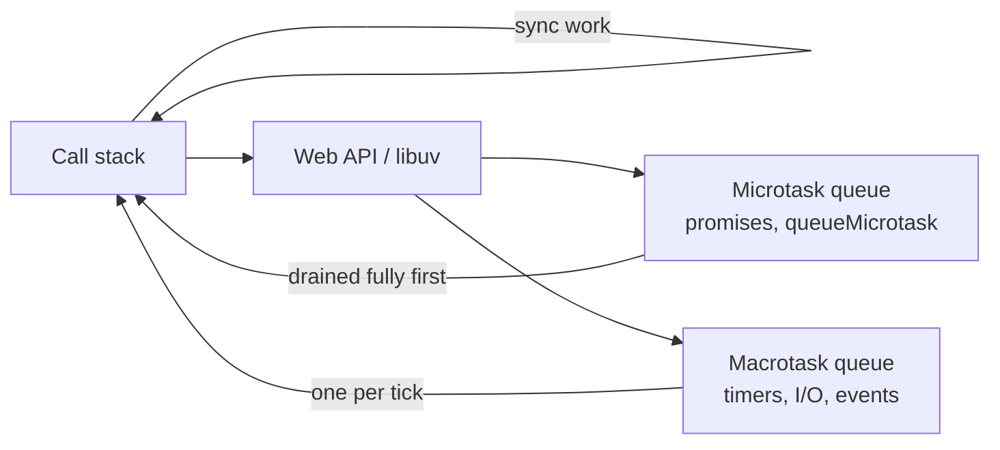

# Concurrency & Async

## Introduction

Four words get used interchangeably and mean different things:

| Term                            | Meaning                                                |
| ------------------------------- | ------------------------------------------------------ |
| **Blocking**                    | The caller waits and can do nothing else               |
| **Non-blocking / asynchronous** | The call returns immediately; the result arrives later |
| **Concurrency**                 | Several tasks are _in progress_ over the same period   |
| **Parallelism**                 | Several tasks _execute at the same instant_            |

**Concurrency is about structure; parallelism is about execution.** You can be
concurrent on one core by interleaving. You cannot be parallel without several.

**A single-threaded Node process is highly concurrent and not at all parallel.**
It handles thousands of simultaneous connections because almost all its time is
spent _waiting_ on I/O, and waiting is exactly what an event loop is good at. It
falls over the moment you give it a CPU-bound task, because that task occupies
the only thread.

**The corollary that catches people:** single-threaded does not mean race-free.
Any `await` is a suspension point where other code runs, so interleaved async
functions can observe each other's half-finished state.

---

## The Event Loop



**The rule that explains most ordering puzzles: the entire microtask queue is
drained after every macrotask, before the next macrotask runs.**

So a promise callback always runs before a `setTimeout(…, 0)` scheduled at the
same moment:

```js
console.log('1');
setTimeout(() => console.log('4'), 0); // macrotask
Promise.resolve().then(() => console.log('3')); // microtask
console.log('2');
// 1, 2, 3, 4
```

**Microtasks:** promise callbacks, `queueMicrotask`, `await` continuations, and
`MutationObserver`. **Macrotasks:** timers, I/O completions, DOM events. Node
adds `process.nextTick`, which runs _before_ other microtasks — a detail worth
knowing and rarely worth using.

**An infinite chain of microtasks starves the loop entirely.** Timers never
fire, the page never repaints, and the process appears hung while consuming a
full core:

```js
// ❌ Never yields — the loop cannot proceed to any macrotask.
function spin() {
  Promise.resolve().then(spin);
}
```

**In the browser, rendering is a macrotask-adjacent step.** Long synchronous
work between frames is what produces jank — see
[Performance](/knowledge-base/web/performance) for INP and the interaction
budget.

---

## CPU-Bound Work

The event loop's strength — one thread, many waits — becomes its weakness the
moment work is computational rather than I/O-bound.

**Move it off the main thread:**

| Environment | Mechanism                                         |
| ----------- | ------------------------------------------------- |
| **Browser** | Web Worker; `OffscreenCanvas` for rendering       |
| **Node**    | `worker_threads`, a child process, or a job queue |
| **Either**  | WebAssembly for hot numeric paths                 |

```js
// Node: keep the event loop free for requests.
import {Worker} from 'node:worker_threads';

const result = await new Promise((resolve, reject) => {
  const worker = new Worker('./resize.js', {workerData: {path}});
  worker.on('message', resolve);
  worker.on('error', reject);
});
```

**Chunking with `setTimeout` keeps the UI alive but does not make the work
faster** — it interleaves rather than parallelising.
`scheduler.yield()` is the modern browser primitive for yielding to input
between chunks, and it resumes with higher priority than a bare timeout.

**For server work, a queue is usually the right answer** rather than a worker
thread: it survives restarts, retries, and scales across machines. See
[Background Workers](/knowledge-base/operations/background-workers) — and note
that high concurrency for CPU-bound work in Node is actively harmful, because
the jobs interleave on one loop and all finish late.

---

## Async Patterns

**Run independent work concurrently.** Sequential `await`s are the most common
avoidable latency in application code:

```js
// ❌ 300 ms — each waits for the previous.
const user = await getUser(id);
const orders = await getOrders(id);
const prefs = await getPrefs(id);

// ✅ 100 ms — all three in flight together.
const [user, orders, prefs] = await Promise.all([
  getUser(id),
  getOrders(id),
  getPrefs(id),
]);
```

**Pick the right combinator:**

| Method               | Behaviour                                    |
| -------------------- | -------------------------------------------- |
| `Promise.all`        | All succeed, or reject on the first failure  |
| `Promise.allSettled` | Waits for all; reports each outcome          |
| `Promise.race`       | First to settle, success or failure          |
| `Promise.any`        | First to _succeed_; rejects only if all fail |

**`Promise.all` rejects fast but does not cancel.** The other promises keep
running, and an unhandled rejection from a later failure can crash Node. Use
`allSettled` when you need every result regardless.

**Bound your concurrency.** `Promise.all` over ten thousand items opens ten
thousand connections. Use a pool — `p-limit`, a semaphore, or batching — or you
will exhaust file descriptors, database connections or the remote service's rate
limit.

**Always set a timeout on external calls.** `AbortSignal.timeout()` makes this
one line, and an unbounded `fetch` is how one slow dependency becomes your
outage:

```js
const res = await fetch(url, {signal: AbortSignal.timeout(5000)});
```

---

## Race Conditions Without Threads

Single-threaded code has no data races over memory, and it absolutely has logical
race conditions. **Every `await` is a suspension point** where other code runs.

```js
// ❌ Two concurrent calls can both read 10, both write 11. One increment lost.
async function increment(id) {
  const row = await db.counters.find(id);
  await db.counters.update(id, {value: row.value + 1});
}

// ✅ Atomic at the database.
await db.query('UPDATE counters SET value = value + 1 WHERE id = $1', [id]);
```

**The same pattern appears everywhere:** check-then-act on a cache, "does this
username exist" followed by an insert, or a token refresh that fires ten times
because ten requests all found the token expired.

**The fixes, in order of preference:**

1. **Make the operation atomic** where it lives — a single SQL statement, a
   unique constraint, `SETNX` in Redis.
2. **Serialise per key** — deduplicate in-flight work so ten callers share one
   refresh.
3. **Lock explicitly** — a database advisory lock or a distributed lock, with a
   TTL above the operation's duration.

**A unique constraint is the most reliable of these**, because the database
enforces it regardless of how many processes race.

**Out-of-order responses are the UI version.** A user types quickly, three
searches fire, and the slowest returns last with stale results. Track a request
identifier and discard responses that are not the newest, or abort the previous
request with an `AbortController`.

---

## Do's and Don'ts

### Do

- Run independent async work with `Promise.all`.
- Use `allSettled` when partial failure is acceptable.
- Bound concurrency with a pool when iterating large collections.
- Set a timeout on every external call.
- Move CPU-bound work to a worker or a queue.
- Make concurrent updates atomic at the database.
- Use `AbortController` to cancel superseded requests.
- Use `performance.now()` for measuring durations.

### Don't

- Don't `await` in a loop when the iterations are independent.
- Don't assume single-threaded means race-free.
- Don't fire unbounded `Promise.all` over thousands of items.
- Don't block the event loop with synchronous CPU work.
- Don't create infinite microtask chains.
- Don't use `process.nextTick` where `queueMicrotask` would do.
- Don't ignore a returned promise — attach a handler or await it.
- Don't rely on `setTimeout(…, 0)` ordering relative to promises.

---

## Common Mistakes

**Sequential awaits for independent calls.** Three 100 ms requests taking
300 ms instead of 100 ms. The single most common avoidable latency in
application code.

**`await` inside `forEach`.** `forEach` ignores the returned promise entirely,
so the loop finishes before any work does. Use `for…of` or `Promise.all` with
`map`.

**Read-modify-write across an `await`.** Lost updates under concurrency, and
impossible to reproduce locally with one user.

**Unbounded concurrency.** Ten thousand simultaneous connections, exhausted file
descriptors, and a rate-limited third party.

**No timeout on `fetch`.** One slow dependency holds every request open until
the process runs out of sockets.

**Blocking the loop with `JSON.parse` on a huge payload.** Synchronous, and
every other request waits.

**Unhandled rejection after `Promise.all` rejects.** The remaining promises keep
running; a later failure has no handler and crashes Node.

**Stale search results.** The slowest response wins because nothing tracks which
request is current.

---

## Debugging

| Symptom                                            | Likely cause                               |
| -------------------------------------------------- | ------------------------------------------ |
| Process pegged at 100% CPU, unresponsive           | Synchronous CPU work or a microtask loop   |
| Timers firing late                                 | Event loop blocked; measure lag            |
| Requests slow only under load                      | Unbounded concurrency exhausting a pool    |
| Lost updates under concurrency                     | Read-modify-write across an `await`        |
| "Cannot read property of undefined" intermittently | Interleaved async mutation of shared state |
| Search shows the wrong results                     | Out-of-order responses                     |
| Node exits before work completes                   | A promise never awaited                    |
| `UnhandledPromiseRejection` crash                  | A rejection with no handler                |

**Measure event-loop lag directly.** A timer scheduled for 100 ms that fires at
900 ms tells you the loop is blocked, and by roughly how much:

```js
let last = performance.now();
setInterval(() => {
  const drift = performance.now() - last - 100;
  if (drift > 50) console.warn({event: 'event_loop_lag', driftMs: drift});
  last = performance.now();
}, 100);
```

Node's `perf_hooks.monitorEventLoopDelay()` gives a proper histogram, and it is
worth exporting as a metric. See
[Monitoring](/knowledge-base/operations/monitoring).

---

## FAQ

**Is JavaScript single-threaded?**
Your code runs on one thread. The runtime is not: timers, network and file I/O
happen elsewhere and queue results back to your thread. That is why I/O is
non-blocking while a `while (true)` loop freezes everything.

**When do I need worker threads?**
When the work is computational and takes more than a few milliseconds — image
processing, parsing large files, cryptography, compression. For I/O, they add
overhead and no benefit.

**`Promise.all` or `allSettled`?**
`all` when any failure should abort the whole operation. `allSettled` when you
want every result and will handle failures individually.

**Does `async` make code faster?**
No. It makes waiting cheaper. An async function that does no I/O is slower than
a synchronous one.

**How many concurrent requests should I allow?**
Bounded by your slowest downstream dependency's capacity — typically its
connection pool size. Start around 10–20 and measure.

**Why does my `forEach` with `await` not wait?**
`forEach` discards the returned promise. Use `for…of` for sequential work, or
`Promise.all(items.map(fn))` for concurrent.

---

## Check your understanding

<Quiz
question="What is the output order, and which rule explains it?"
options={[
{
text: '1, 2, 3, 4 — synchronous code first, then the whole microtask queue, then macrotasks',
correct: true,
why: 'The microtask queue is drained completely after the current synchronous execution and before any macrotask, so the promise callback beats the zero-delay timer.',
},
{text: '1, 2, 4, 3 — setTimeout with 0 delay runs before promise callbacks', why: 'Timers are macrotasks and always yield to pending microtasks.'},
{text: '1, 3, 2, 4 — promise callbacks interrupt synchronous code', why: 'Nothing interrupts synchronous execution; microtasks run only once the stack is empty.'},
{text: '1, 2, 3, 4 — but only in Node; browsers differ', why: 'The microtask/macrotask ordering is specified and consistent across both.'},
]}
explanation={<>Node adds <code>process.nextTick</code>, which runs before other microtasks — worth recognising in stack traces, rarely worth using deliberately. An unbroken chain of microtasks starves the loop entirely: timers never fire and the page never repaints.</>}
reference={{label: 'The event loop', href: '/knowledge-base/general/concurrency#the-event-loop'}}>

```js
console.log('1');
setTimeout(() => console.log('4'), 0);
Promise.resolve().then(() => console.log('3'));
console.log('2');
```

</Quiz>

<Quiz
question="This function loses increments when called concurrently, in a single-threaded runtime with no worker threads. How is that possible?"
options={[
{
text: 'Every await is a suspension point — two calls can both read the old value before either writes, so one update overwrites the other',
correct: true,
why: 'Single-threaded execution prevents data races over memory, not logical races. While one call awaits the database, the other runs and reads the same stale value.',
},
{text: 'The database driver is not thread-safe', width: false, why: 'There are no threads involved; the interleaving happens at await points in one thread.'},
{text: 'JavaScript numbers lose precision when incremented', why: 'Precision is unaffected at these magnitudes.'},
{text: 'The ORM caches the row and serves a stale copy', width: false, why: 'Plausible in some setups, and the read-modify-write pattern is racy even with no caching at all.'},
]}
explanation={<>Make it atomic where the data lives: <code>UPDATE counters SET value = value + 1</code>. Where atomicity is not available, a unique constraint or an explicit lock works — a unique constraint being the most reliable, because the database enforces it no matter how many processes race.</>}
reference={{label: 'Race conditions without threads', href: '/knowledge-base/general/concurrency#race-conditions-without-threads'}}>

```js
async function increment(id) {
  const row = await db.counters.find(id);
  await db.counters.update(id, {value: row.value + 1});
}
```

</Quiz>

<Quiz
question="An endpoint makes three independent API calls, each taking about 100 ms, and responds in 300 ms. What is the fix?"
options={[
{
text: 'Await them together with Promise.all so all three are in flight simultaneously',
correct: true,
why: 'Sequential awaits serialise independent work. Starting all three and awaiting the combined promise makes total time roughly that of the slowest call.',
},
{text: 'Move the calls into a worker thread', width: false, why: 'The work is I/O-bound, not CPU-bound — a worker adds overhead and no parallelism where none was missing.'},
{text: 'Increase the Node thread pool size', why: 'The thread pool serves filesystem and crypto work, not outbound HTTP.'},
{text: 'Cache the responses', width: false, why: 'Helpful on repeat requests, and it does nothing for the first one.'},
]}
explanation={<>Bound the concurrency when the collection is large, though — <code>Promise.all</code> over ten thousand items opens ten thousand connections and exhausts pools or trips rate limits. Use <code>p-limit</code> or batching, and set a timeout on every external call.</>}
reference={{label: 'Async patterns', href: '/knowledge-base/general/concurrency#async-patterns'}}
/>

<Quiz
question="Which of these will block the event loop?"
type="multiple"
options={[
{text: 'Parsing a 50 MB JSON string with JSON.parse', correct: true, why: 'It is fully synchronous — nothing else runs until it completes, including other requests.'},
{text: 'A synchronous image resize on the main thread', correct: true, why: 'CPU-bound work occupies the only thread. Move it to a worker or a queue.'},
{text: 'An unbroken chain of promise callbacks that reschedule themselves', correct: true, why: 'The microtask queue is drained fully before any macrotask, so an infinite chain means timers never fire and the page never repaints.'},
{text: 'A synchronous filesystem call such as readFileSync', correct: true, why: 'It blocks until the disk responds, which is why the async variants exist.'},
{text: 'Awaiting a fetch that takes ten seconds', why: 'Awaiting yields control back to the loop. The request is slow; the loop stays free to handle other work.'},
]}
explanation={<>The distinction is whether the thread is <em>working</em> or <em>waiting</em>. Waiting is what an event loop is built for; working is what starves it. Measure event-loop lag as a metric — a timer set for 100 ms that fires at 900 ms tells you exactly how blocked you are.</>}
reference={{label: 'CPU-bound work', href: '/knowledge-base/general/concurrency#cpu-bound-work'}}
/>

<Quiz
question="A search box fires a request on every keystroke. Occasionally results for an earlier, shorter query appear after results for the current one. What is the correct fix?"
options={[
{
text: 'Track which request is current and discard stale responses, or abort superseded requests with an AbortController',
correct: true,
why: 'Responses can return in any order. Without tracking, whichever finishes last wins the render, regardless of which query it answered.',
},
{text: 'Await each request before sending the next', width: false, why: 'It fixes ordering by making every keystroke wait for the previous request — far worse for responsiveness.'},
{text: 'Increase the debounce interval', width: false, why: 'It reduces how often the race occurs without removing it; a slow response still arrives late.'},
{text: 'Move the requests to a worker thread', why: 'Workers do not change network response ordering.'},
]}
explanation={<>Debouncing and cancellation are complementary: debounce to send fewer requests, and <code>AbortController</code> to ensure only the newest can render. This is the client-side face of the same "last writer wins" hazard as a read-modify-write race.</>}
reference={{label: 'Race conditions without threads', href: '/knowledge-base/general/concurrency#race-conditions-without-threads'}}
/>

---

## References

- [MDN: The event loop](https://developer.mozilla.org/en-US/docs/Web/JavaScript/Reference/Execution_model)
  — task and microtask ordering, specified.
- [Node.js: The event loop, timers and `nextTick`](https://nodejs.org/en/learn/asynchronous-work/event-loop-timers-and-nexttick)
  — libuv phases in detail.
- [MDN: Promise concurrency](https://developer.mozilla.org/en-US/docs/Web/JavaScript/Reference/Global_Objects/Promise#promise_concurrency)
  — `all`, `allSettled`, `race` and `any`.
- [MDN: Web Workers](https://developer.mozilla.org/en-US/docs/Web/API/Web_Workers_API/Using_web_workers)
  — moving work off the main thread.
- [Node.js: `worker_threads`](https://nodejs.org/api/worker_threads.html) — CPU
  parallelism on the server.
- [`scheduler.yield()`](https://developer.mozilla.org/en-US/docs/Web/API/Scheduler/yield)
  — yielding to input between chunks.
