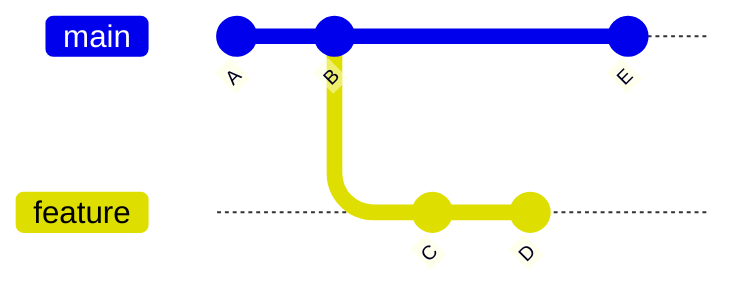
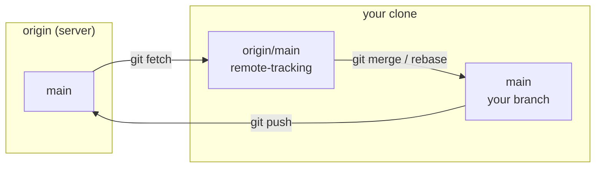
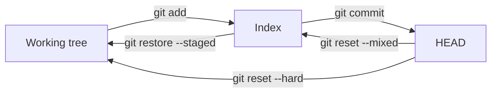
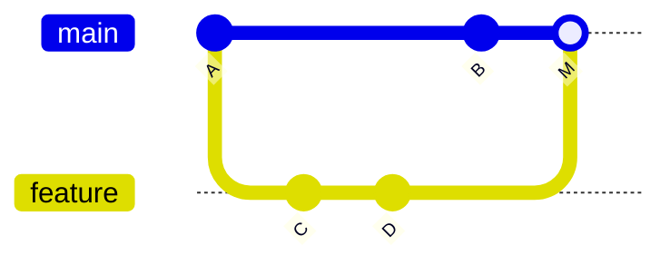

# Key Concepts

## Introduction

Git has a reputation for a confusing command line. The commands are indeed
inconsistent, but the _model underneath them is small and elegant_ — perhaps
four ideas in total. Learn the model and the commands stop looking arbitrary.

This page builds that model from the bottom up: what Git stores, how it points
at what it stores, the three places your files exist simultaneously, and the
shape of history.

---

## The Object Database

At its core, Git is a **content-addressable key–value store**. You give it
content; it gives you back the hash of that content, which is also where it is
stored. Everything else is built on this.

There are four object types.

### Blob — file contents

A blob is the raw bytes of a file. No filename, no permissions, no timestamp —
just content. Two identical files anywhere in the repository, in any commit, are
one blob.

```bash
$ echo "hello" | git hash-object -w --stdin
ce013625030ba8dba906f756967f9e9ca394464a
```

That hash is the SHA-1 of the content plus a small header. It is deterministic:
the same content always produces the same hash, in every repository on earth.

### Tree — a directory

A tree lists names, modes and the hash of what each name points to. Entries are
either blobs (files) or other trees (subdirectories).

```bash
$ git cat-file -p HEAD^{tree}
100644 blob a45bd7…    README.md
100644 blob 9f2e10…    package.json
040000 tree c1d4a8…    src
```

This is where filenames actually live. A blob does not know its own name; the
tree that references it supplies one.

### Commit — a snapshot plus context

A commit points at exactly one tree — the complete state of the project — plus
metadata:

```bash
$ git cat-file -p HEAD
tree d8329fc1cc938780ffdd9f94e0d364e0ea74f579
parent 4b825dc642cb6eb9a060e54bf8d69288fbee4904
author  Ada Lovelace <ada@example.com> 1754136000 +0100
committer Ada Lovelace <ada@example.com> 1754136000 +0100

Add login form
```

Note **`parent`**. That single field is what turns a pile of snapshots into a
history. A commit with two parents is a merge commit. The first commit in a
repository has no parent at all.

### Tag — a named, annotated pointer

An annotated tag is a real object with its own message, tagger and optional
signature, pointing at a commit. A _lightweight_ tag is not an object at all —
just a ref file containing a hash.

### Why content addressing matters

Three consequences follow directly from "the hash is the address":

1. **Integrity is automatic.** A commit's hash depends on its tree and its
   parent, whose hashes depend on theirs. Change one byte anywhere in history
   and every hash from that point forward changes. Silent corruption is
   impossible.
2. **Deduplication is free.** Unchanged files across a thousand commits are one
   blob.
3. **Rewriting history means new commits.** `rebase`, `commit --amend` and
   `filter-repo` cannot modify a commit in place — they build new objects with
   new hashes. This is exactly why rewriting shared history is disruptive: your
   collaborators' commits point at parents that no longer exist on the remote.

---

## Refs: Human Names for Hashes

Nobody remembers `4b825dc642cb…`. A **ref** is a name that points to a hash.

```bash
$ cat .git/refs/heads/main
9f2e10c5b3a4d8f7e1c6b2a9d4e7f0c3b6a5d8e1
```

That is the whole implementation. A branch is a file containing forty
characters.

### Branches are movable pointers

This is the point most tutorials underplay: **a branch is not a copy of the
code, or a container for commits.** It is a pointer to one commit, and it moves
forward automatically when you commit on it.



Here `main` points at E and `feature` points at D. Commits A and B belong to
both branches, because "belongs to" just means "reachable by following parent
links". Creating a branch writes one small file, which is why Git encourages
branching so freely.

### HEAD

`HEAD` is a pointer to _where you are_. Normally it contains a symbolic
reference to a branch:

```bash
$ cat .git/HEAD
ref: refs/heads/main
```

When you commit, Git creates the commit, then updates whatever `HEAD` points at.

**Detached HEAD** is when `HEAD` contains a hash directly instead of a branch
name — which happens after `git checkout <commit>` or checking out a tag. You
can look around and even commit, but no branch is following you, so new commits
become unreachable the moment you switch away. It is not an error state; it just
means "no branch is tracking your position". Create a branch to keep the work:
`git switch -c my-experiment`.

### Remote-tracking branches

`origin/main` is a **local, read-only record of where `main` was on the remote
the last time you talked to it.** It is not live. This one fact explains a
family of confusions:

- `git fetch` updates remote-tracking branches and nothing else. Your work is
  untouched.
- `git status` saying "your branch is behind origin/main by 3 commits" is based
  on the last fetch, not on the current server state.
- `git pull` is simply `git fetch` followed by `git merge` (or `git rebase`).



---

## The Three Trees

At any moment your project exists in three places simultaneously. Nearly every
"what did that command actually do?" question is answered by asking which of the
three it moved.

| Tree                | What it is                              | Inspect with        |
| ------------------- | --------------------------------------- | ------------------- |
| **Working tree**    | The real files you edit on disk         | your editor         |
| **Index (staging)** | The proposed content of the next commit | `git diff --cached` |
| **HEAD**            | The last commit on the current branch   | `git show HEAD`     |



The index is the feature people skip and then miss. It exists so that **what you
commit need not be what is on disk.** You can fix three unrelated things in one
editing session and commit them as three coherent commits with `git add -p`.

### Reading the diff commands through the three trees

Once you see the three trees, the diff family stops needing memorisation:

| Command             | Compares              |
| ------------------- | --------------------- |
| `git diff`          | Working tree ↔ Index  |
| `git diff --cached` | Index ↔ HEAD          |
| `git diff HEAD`     | Working tree ↔ HEAD   |
| `git status`        | All three, summarised |

### Reading reset through the three trees

Likewise `git reset --<mode> <commit>`, which is otherwise the most feared
command in Git:

| Mode      | Moves branch | Resets index | Resets working tree | Safe?                                |
| --------- | ------------ | ------------ | ------------------- | ------------------------------------ |
| `--soft`  | ✅           | ❌           | ❌                  | Yes — changes stay staged            |
| `--mixed` | ✅           | ✅           | ❌                  | Yes — changes stay on disk (default) |
| `--hard`  | ✅           | ✅           | ✅                  | **No — discards uncommitted work**   |

`git reset --soft HEAD~1` therefore means "undo the last commit but keep
everything staged", which is the standard way to redo a commit message or split
a commit that was too big.

---

## The Commit Graph

History is a **directed acyclic graph** (DAG). Each commit points at its
parent(s); there are no cycles, because a commit's hash depends on its parents,
so a commit cannot be its own ancestor.

### Ancestry references

```bash
HEAD~1     # first parent, one step back
HEAD~3     # three steps back along first parents
HEAD^      # same as HEAD~1
HEAD^2     # the *second* parent — only meaningful on a merge commit
HEAD@{2}   # where HEAD was two moves ago (reflog, not ancestry)
main@{yesterday}  # where main pointed yesterday
```

`~` walks _back_ through generations; `^` selects _which parent_ at one step.
`HEAD~2^2` is legitimate and means "go back two commits, then take that merge's
second parent".

### Merge base

The **merge base** of two branches is their most recent common ancestor. It is
the reference point for every three-way merge and every rebase.

```bash
git merge-base main feature
```

Knowing about the merge base makes conflicts comprehensible: Git compares your
version and theirs _against the common ancestor_ and can auto-resolve anything
where only one side changed.

---

## Merging vs Rebasing

Both integrate work from one branch into another. They differ in what history
they leave behind.

### Fast-forward

If the target branch has no commits the source branch lacks, Git just slides the
pointer forward. No merge commit, no new objects.

```text
before:   A ── B ── C ── D          after:   A ── B ── C ── D
          ↑         ↑                                      ↑
        main     feature                              main, feature
```

Force a merge commit anyway with `--no-ff` when you want the branch to remain
visible as a unit in history.

### Three-way merge

When both branches have moved, Git creates a **merge commit with two parents**,
computed from the two tips and their merge base.



- **Preserves exactly what happened**, including the fact that work happened in
  parallel.
- Never rewrites existing commits, so it is always safe on shared branches.
- Produces a history that is harder to read linearly, and `git bisect` has more
  ground to cover.

### Rebase

Rebase takes your commits, computes their diffs, and **replays them as new
commits** on top of a different base.

```text
before:   A ── B            (main)
           ╲
            C ── D          (feature)

after:    A ── B            (main)
                ╲
                 C2 ── D2   (feature — new commits, new hashes)
```

- Produces a **linear** history that reads as a sequence of decisions.
- `C2` and `D2` are _new commits with new hashes_. The originals still exist in
  the reflog but are no longer referenced.
- Because hashes change, rebasing commits that others have pulled forces them to
  reconcile two versions of the same work.

### Which to use

The rule that keeps teams out of trouble:

> **Rebase your own unpublished work to tidy it. Merge to integrate finished
> work into a shared branch. Never rebase a branch other people have based work
> on.**

In practice, most teams settle on: rebase your feature branch onto `main` while
you develop (keeps it current, avoids merge noise), then merge it into `main`
with a squash or a merge commit when it is reviewed.

`git rebase --update-refs` is worth knowing if you stack branches — it moves any
other branch pointers that lived inside the rebased range, instead of leaving
them behind on the old commits.

---

## Merge Conflicts

A conflict is **not** an error. It is Git saying: both sides changed the same
region relative to the merge base, and choosing is a judgement call.

Git auto-resolves anything where only one side changed. What you see is only the
genuinely ambiguous part:

```text
<<<<<<< HEAD
const timeout = 3000;
=======
const timeout = 10_000;
>>>>>>> feature/slow-network
```

- Above `=======` is **ours** — the branch you are on.
- Below is **theirs** — the branch being merged in.

During a _rebase_ these are inverted relative to intuition: "ours" is the branch
you are replaying onto (upstream), and "theirs" is your own commit being
replayed. This trips up nearly everyone; `git status` states which operation is
in progress, so check it before choosing a side.

A far better view is `merge.conflictStyle = zdiff3`, which also shows the
original:

```bash
git config --global merge.conflictStyle zdiff3
```

```text
<<<<<<< HEAD
const timeout = 3000;
||||||| base
const timeout = 5000;
=======
const timeout = 10_000;
>>>>>>> feature/slow-network
```

Now you can see that _both_ sides changed the value, and from what — which is
usually enough to decide. Without the base, you are guessing.

Resolve by editing to the correct final state (not necessarily either side),
then `git add` the file and continue. Abort any time with `git merge --abort` or
`git rebase --abort`.

---

## The Reflog: Your Safety Net

Every time `HEAD` or a branch moves, Git records it locally:

```bash
$ git reflog
9f2e10c HEAD@{0}: reset: moving to HEAD~3
a4b8c21 HEAD@{1}: commit: Add password reset
1c9d3e7 HEAD@{2}: commit: Add login form
```

This is what makes Git recoverable. A "lost" commit after a bad `reset`,
`rebase` or branch deletion is unreachable, not gone — the object is still in
the database, and the reflog still names it.

```bash
git reset --hard HEAD@{1}       # go back to before that reset
git switch -c rescued a4b8c21   # or give the lost commit a branch
```

Two limits worth knowing: the reflog is **local only** (it is not pushed or
cloned), and unreachable objects are eventually garbage-collected — 90 days by
default, 30 for objects that were never reachable.

---

## Stash

The stash is a stack of work-in-progress snapshots, stored as real commits on a
hidden ref:

```bash
git stash push -m "half-done refactor"
git stash list
git stash pop        # apply the top entry and remove it
git stash apply      # apply but keep it in the stash
```

Two traps. By default the stash **ignores untracked files** — use
`git stash -u` or your new files stay behind. And a stash entry has no branch
association, so popping it onto a different branch than you intended is easy and
produces confusing conflicts.

For anything more than a few minutes, a throwaway commit on a branch (`git
commit -m wip`) is clearer than a stash: it is visible, it is named, and it does
not sit on a stack that people forget.

---

## Tags

```bash
git tag v1.4.0                          # lightweight — just a pointer
git tag -a v1.4.0 -m "Release 1.4.0"    # annotated — a real object
git tag -s v1.4.0 -m "Release 1.4.0"    # annotated and GPG-signed

git push origin v1.4.0                  # tags are NOT pushed by default
git push --follow-tags                  # push commits plus annotated tags
```

Use **annotated tags for releases**. They store who tagged, when, and why, they
can be signed, and `git describe` only considers them by default. Lightweight
tags are fine as private bookmarks.

Tags are meant to be immutable. Moving a published tag is a genuinely hostile
act, because clones that already have it will not update it.

---

## Including Other Repositories

| Approach      | How it works                                   | Use when                                              |
| ------------- | ---------------------------------------------- | ----------------------------------------------------- |
| **Submodule** | A pointer to a specific commit of another repo | You need an exact pinned version and separate history |
| **Subtree**   | The other repo's files merged into yours       | You want consumers to need no extra commands          |
| **Package**   | A published dependency via npm, Composer, etc. | Almost always — this is the right answer              |

Submodules are the source of a disproportionate share of Git pain: clones need
`--recurse-submodules`, the pointer commit updates independently of your
branches, and detached HEAD inside a submodule surprises everyone. Reach for a
package registry first; use a submodule only when you genuinely need to build
another repository's source alongside yours.

---

## Hooks

Hooks are scripts Git runs at defined points. Traditionally they live in
`.git/hooks`, which means they are **not committed and not shared** — the reason
teams use Husky or Lefthook to install them.

Common hooks:

| Hook         | Runs                         | Typical use                                    |
| ------------ | ---------------------------- | ---------------------------------------------- |
| `pre-commit` | Before the commit is created | Lint and format staged files                   |
| `commit-msg` | After the message is written | Enforce a message convention                   |
| `pre-push`   | Before objects are sent      | Run the fast test suite                        |
| `post-merge` | After a successful merge     | Reinstall dependencies if the lockfile changed |
| `pre-rebase` | Before a rebase starts       | Refuse to rebase published branches            |

Since **Git 2.54**, hooks can also be defined in configuration rather than only
as files in `.git/hooks`. That allows several hooks per event and centrally
managed hooks across repositories, without a third-party installer:

```ini
[hook "pre-commit"]
  command = npx lint-staged
```

Keep hooks fast. A `pre-commit` hook that runs the full test suite trains people
to use `--no-verify`, which is worse than having no hook. Lint the staged files
in a pre-commit hook, and leave the slow checks to CI.

---

## How Git Stores It All

Loose objects are individual zlib-compressed files under `.git/objects`.
Periodically Git repacks them into **packfiles**, which store similar objects as
deltas against one another and are dramatically smaller. `git gc` — and the
`maintenance.auto` setting from the [setup page](/knowledge-base/git#a-configuration-worth-copying)
— handle this in the background. As of Git 2.54 the default strategy is
_geometric_ repacking, which keeps the work incremental rather than periodically
rewriting everything.

Two forward-looking storage changes are covered on the
[Git overview](/knowledge-base/git#where-git-is-going): the **reftable** ref
backend, and the migration from **SHA-1 to SHA-256** object hashing in Git 3.0.

---

## Do's and Don'ts

### Do

- Think of a branch as a pointer, not a folder.
- Use `git fetch` freely — it changes nothing you own.
- Set `merge.conflictStyle = zdiff3` before your next conflict.
- Check `git status` when a rebase conflicts, to remember which side is "ours".
- Create a branch before experimenting from a detached HEAD.
- Reach for `git reflog` before panicking.

### Don't

- Don't assume `origin/main` reflects the server right now — it reflects your
  last fetch.
- Don't rebase commits that other people have already pulled.
- Don't treat `git reset --hard` as an undo button; it discards uncommitted work
  that the reflog cannot recover.
- Don't use submodules where a package dependency would do.
- Don't move a published tag.

---

## FAQ

**Where do my files actually live?**
As blobs in `.git/objects`, addressed by content hash. The files in your working
directory are a checkout of one particular tree.

**If a branch is just a pointer, what happens when I delete one?**
The pointer goes; the commits remain until garbage collection, and the reflog
still lists them. `git branch -D` prints the hash it deleted precisely so you can
recover it.

**Why did my commit hash change after a rebase?**
Because a commit's hash covers its parent and tree. Replaying it onto a new
parent necessarily produces a different object. It is a new commit representing
the same change.

**Is `git pull` bad?**
It is fine once you know it is `fetch` plus an integration step, and you have
chosen which one via `pull.rebase` or `pull.ff`. What causes trouble is running
it without knowing which of the two it will do.

**What is the difference between `HEAD^` and `HEAD~`?**
`~` moves back through generations along first parents. `^` chooses which parent
at the current step. They are identical on non-merge commits.

---

## Check your understanding

<Quiz
question="You run `git fetch origin`. What has changed in your repository?"
options={[
{
text: 'Remote-tracking branches such as origin/main were updated; your branches and working tree are untouched',
correct: true,
why: 'fetch downloads objects and moves remote-tracking refs. It never modifies your local branches, index or working tree — which is why it is always safe to run.',
},
{
text: 'Your current branch was updated to match the remote',
why: 'That is what pull does, by running an additional merge or rebase after the fetch.',
},
{
text: 'Nothing, unless you also pass --all',
why: 'fetch updates the named remote by default; --all simply fetches every configured remote.',
},
{
text: 'Your working tree files were updated to match the remote',
why: 'No Git command silently overwrites your working tree during a fetch. Only checkout/switch/reset/merge touch files on disk.',
},
]}
explanation={<>This is why <code>git fetch</code> is the safe way to see what has happened upstream. Follow it with <code>git log HEAD..origin/main</code> to read the incoming commits before integrating anything.</>}
reference={{label: 'Remote-tracking branches', href: '/knowledge-base/git/key-concepts#remote-tracking-branches'}}
/>

<Quiz
question="You committed three times, then realised all three should be one commit with a better message. Nothing has been pushed. Which command sets you up to redo it as a single commit, keeping all the changes staged?"
options={[
{text: 'git reset --soft HEAD~~3', correct: true, why: 'Moves the branch pointer back three commits but leaves the index and working tree alone, so all the changes remain staged and ready for one new commit.'},
{text: 'git reset --hard HEAD~~3', why: 'Also resets the index and working tree — your three commits worth of changes would be discarded from disk entirely.'},
{text: 'git revert HEAD~3', why: 'revert creates a new commit undoing an old one. It adds to history rather than reshaping it, and reverting a single ancestor is not what is wanted here.'},
{text: 'git restore --staged .', why: 'That unstages files. It does not move the branch pointer, so the three commits would still be in history.'},
]}
explanation={<>The three <code>reset</code> modes map exactly onto the three trees: <code>--soft</code> moves only the branch, <code>--mixed</code> also resets the index, <code>--hard</code> also resets the working tree. Only <code>--hard</code> can lose work.</>}
reference={{label: 'Reset and the three trees', href: '/knowledge-base/git/key-concepts#reading-reset-through-the-three-trees'}}
/>

<Quiz
question="Which statements about rebase are true?"
type="multiple"
options={[
{text: 'It creates new commits with new hashes', correct: true, why: 'Commits are replayed onto a new base. Since a hash covers the parent, the result is necessarily a different object.'},
{text: 'The original commits remain findable in the reflog', correct: true, why: 'They become unreachable rather than deleted, and the reflog still names them until garbage collection.'},
{text: 'It is safe to rebase a branch that colleagues have already based work on', why: 'Their commits point at parents that no longer exist upstream, forcing everyone to reconcile two versions of the same work. This is the one hard rule about rebase.'},
{text: 'It produces a linear history with no merge commit', correct: true, why: 'That is the point: the branch is replayed as if it had been written on top of the current base.'},
{text: 'It merges the two branches without needing conflict resolution', why: 'Rebase can conflict on every replayed commit — potentially more often than a single merge, which resolves once.'},
]}
explanation={<>The useful policy: rebase your own unpublished work to tidy it, merge to integrate finished work into a shared branch.</>}
reference={{label: 'Merging vs rebasing', href: '/knowledge-base/git/key-concepts#merging-vs-rebasing'}}
/>

<Quiz
question="You are mid-rebase of `feature` onto `main` and hit a conflict. In the conflict markers, which side is labelled HEAD / 'ours'?"
options={[
{
text: 'main — the branch you are replaying onto',
correct: true,
why: 'During a rebase, Git checks out the upstream branch and replays your commits on top of it. So "ours" is the upstream (main) and "theirs" is your own commit being applied.',
},
{
text: 'feature — the branch you are rebasing',
why: 'This is the intuitive answer and it is why so many people resolve rebase conflicts backwards. It is correct for a merge, not for a rebase.',
},
{
text: 'Whichever branch has the more recent commit',
why: 'Timestamps play no part in labelling conflict sides.',
},
{
text: 'It depends on merge.conflictStyle',
why: 'conflictStyle controls whether the common ancestor is displayed, not which side is called ours.',
},
]}
explanation={<>Check <code>git status</code>, which names the operation in progress. Setting <code>merge.conflictStyle = zdiff3</code> helps far more than remembering the labels, because seeing the base usually makes the right resolution obvious.</>}
reference={{label: 'Merge conflicts', href: '/knowledge-base/git/key-concepts#merge-conflicts'}}
/>

<Quiz
question="A colleague force-pushed to a shared branch and overwrote your last two commits. You had already fetched their old state. Nothing of yours is on any remote. Are your commits recoverable, and how?"
options={[
{
text: 'Yes — the commits are unreachable but still in your local object database; git reflog names them and you can branch from them',
correct: true,
why: 'Objects are removed only by garbage collection, and the reflog records every position HEAD and your branches held. This is the standard recovery path.',
},
{
text: 'No — a force push deletes the objects from every clone',
why: 'A force push moves a remote ref. It cannot reach into your local object database, and your reflog is entirely local.',
},
{
text: 'Only if you had pushed them to a second remote first',
why: 'A useful backup habit, but unnecessary here: the objects are already in your local repository.',
},
{
text: 'Yes, but only via git fsck — the reflog does not survive a force push',
why: 'git fsck --lost-found does find dangling objects and is a good fallback, but the reflog is local and entirely unaffected by anything happening on a remote.',
},
]}
explanation={<>The reflog is the single most valuable recovery tool in Git, and it is local by design. Its main limit is exactly that: a repository you have never fetched into cannot help you.</>}
reference={{label: 'The reflog', href: '/knowledge-base/git/key-concepts#the-reflog-your-safety-net'}}
/>

---

## References

- [Pro Git, Chapter 10: Git Internals](https://git-scm.com/book/en/v2/Git-Internals-Plumbing-and-Porcelain)
  — objects, refs and packfiles from first principles.
- [git-rev-parse: Specifying revisions](https://git-scm.com/docs/git-rev-parse#_specifying_revisions)
  — the full grammar for `~`, `^`, `@{…}` and ranges.
- [git-merge: How conflicts are presented](https://git-scm.com/docs/git-merge#_how_conflicts_are_presented)
  — including `zdiff3`.
- [git-reset documentation](https://git-scm.com/docs/git-reset) — the official
  three-trees table.
- [Highlights from Git 2.54](https://github.blog/open-source/git/highlights-from-git-2-54/)
  — config-based hooks and geometric repacking.
