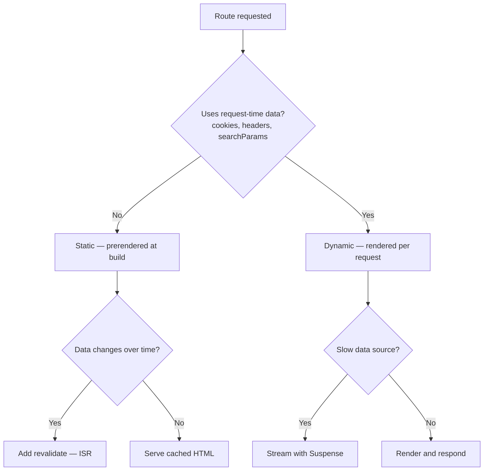

# Rendering and Server-Side Rendering

"Server-side rendering" is often used as though Next.js has one rendering mode.
It has several, and choosing correctly is the single biggest performance lever in
a Next.js app.

## Why render on the server at all?

- **SEO and link previews.** Crawlers and social scrapers receive complete HTML
  rather than an empty shell they must execute JavaScript to fill.
- **Faster first paint.** Users see content before the JavaScript bundle has
  downloaded, parsed and hydrated.
- **Less JavaScript shipped.** Server Components never send their code to the
  browser at all.
- **Secrets stay server-side.** Database URLs, API keys and internal endpoints
  are never exposed to the client.
- **Data lives next to the source.** Fetching from a server close to your
  database beats a round trip from the user's device.

## The rendering strategies



### Static rendering (the default)

Rendered at **build time** and reused for every visitor. Fastest and cheapest.
This is what you get unless something forces the route to be dynamic.

```tsx title="app/blog/[slug]/page.tsx"
// Pre-render these routes at build time.
export async function generateStaticParams() {
  const posts = await getPosts();
  return posts.map((post) => ({slug: post.slug}));
}

export default async function Post({params}: {params: Promise<{slug: string}>}) {
  const {slug} = await params;
  const post = await getPost(slug);
  return <article>{post.title}</article>;
}
```

### Incremental Static Regeneration (ISR)

Static, but refreshed on a schedule. Visitors get cached HTML while a fresh copy
is regenerated in the background.

```tsx
const res = await fetch('https://api.example.com/posts', {
  next: {revalidate: 3600}, // at most once an hour
});
```

### Dynamic rendering

Rendered per request. A route becomes dynamic when it reads request-time data —
`cookies()`, `headers()`, `draftMode()`, or `searchParams`.

```tsx
import {cookies} from 'next/headers';

export default async function Dashboard() {
  // Reading cookies opts this route into dynamic rendering.
  const session = (await cookies()).get('session');
  const user = await getUser(session?.value);
  return <h1>Welcome back, {user.name}</h1>;
}
```

:::warning These APIs are async-only in Next.js 16
`cookies()`, `headers()`, `draftMode()`, `params` and `searchParams` all return
Promises. Synchronous access was removed — and the resulting error appears on the
first request, not at build time.
:::

### Streaming

Dynamic rendering makes the user wait for your slowest query. Streaming sends the
shell immediately and fills slow regions in as they resolve.

```tsx title="app/dashboard/page.tsx"
import {Suspense} from 'react';

export default function Dashboard() {
  return (
    <>
      <Header />
      {/* The page responds immediately; revenue streams in when ready. */}
      <Suspense fallback={<ChartSkeleton />}>
        <SlowRevenueChart />
      </Suspense>
    </>
  );
}
```

A `loading.tsx` file gives a whole route segment this behaviour automatically.

### Client rendering

Marked with `'use client'`. Still server-rendered to HTML on first load, then
hydrated — `'use client'` controls _interactivity_, not whether HTML is produced.

## Choosing a strategy

| Strategy  | Rendered      | Best for                                | Cost                             |
| --------- | ------------- | --------------------------------------- | -------------------------------- |
| Static    | Build time    | Marketing, docs, blog posts             | Cheapest; stale until rebuild    |
| ISR       | Build + timer | Catalogues, articles that change slowly | Cheap; bounded staleness         |
| Dynamic   | Per request   | Dashboards, anything personalised       | Server cost on every request     |
| Streaming | Per request   | Dynamic pages with one slow section     | Complexity; needs good fallbacks |
| Client    | In browser    | Highly interactive widgets              | Ships JS; worse first paint      |

## Common mistakes

- **Accidentally making a whole page dynamic.** One `cookies()` call in a shared
  layout opts every route beneath it out of static rendering. Push request-time
  reads into the smallest component that needs them.
- **Treating `'use client'` as "renders in the browser only."** It still
  server-renders for the initial HTML.
- **Blocking the whole page on one slow query** instead of wrapping it in
  `Suspense`.
- **Assuming `fetch` is cached by default.** Be explicit with
  `next: {revalidate}` and cache tags.

<Quiz
question="A marketing page was fast, but after adding a personalised greeting that reads cookies() in the root layout, every page in the app slowed down. Why?"
options={[
{
text: 'Reading cookies in a layout opts every route beneath it into dynamic rendering',
correct: true,
why: 'Request-time APIs force dynamic rendering, and a root layout wraps every route — so the whole app stopped being statically served.',
},
{
text: 'cookies() is slow to execute',
why: 'The cost is not the call itself; it is losing static rendering for every route under that layout.',
},
{
text: 'The layout needed "use client"',
why: 'That would make things worse — shipping more JavaScript and still not restoring static rendering.',
},
{
text: 'Static rendering was disabled because the build output changed',
why: 'Nothing about build output disables static rendering; the request-time API did.',
},
]}
explanation={<>Move the personalised part into its own small component and wrap it in <code>Suspense</code>, so the rest of the page stays static and streams the dynamic fragment in.</>}
reference={{label: 'Next.js best practices', href: '/knowledge-base/next-js/best-practices'}}
/>

## References

- [Server Components](https://nextjs.org/docs/app/getting-started/server-and-client-components)
- [Partial Prerendering and Cache Components](https://nextjs.org/docs/app/api-reference/config/next-config-js/cacheComponents)
- [Loading UI and Streaming](https://nextjs.org/docs/app/api-reference/file-conventions/loading)
- [`generateStaticParams`](https://nextjs.org/docs/app/api-reference/functions/generate-static-params)
