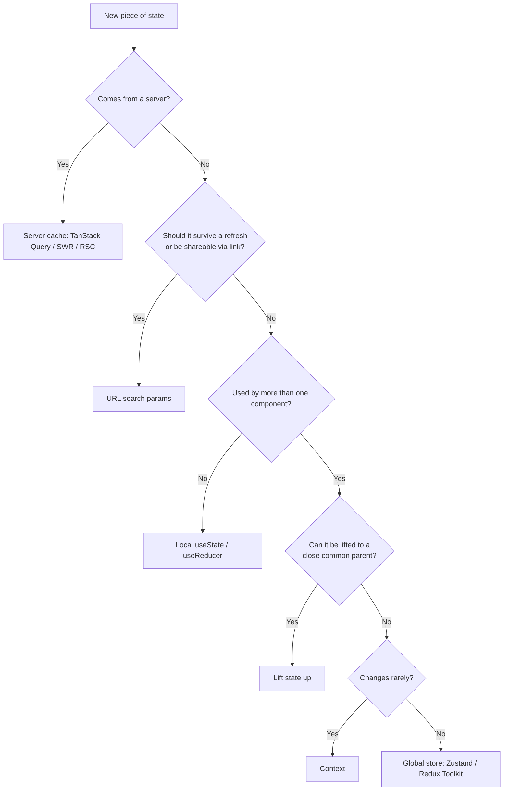

# State Management

Most React state problems are not "which library should I use?" They are "where
should this state live?" Picking the wrong location causes the symptoms teams
usually blame on the library: prop drilling, stale data, and re-render storms.

This page works through the options from simplest to most powerful. **Use the
simplest one that solves your problem.**

## The two kinds of state

The single most useful distinction:

| Kind             | Owned by     | Examples                                    | Tool                       |
| ---------------- | ------------ | ------------------------------------------- | -------------------------- |
| **Client state** | Your UI      | Modal open, form draft, selected tab, theme | `useState`, store, Context |
| **Server state** | Your backend | Users, orders, posts — anything from an API | TanStack Query, SWR, RSC   |

Server state is **cached data you do not own**. It can become stale, needs
refetching, deduplication and revalidation. Storing it in Redux or `useState`
means reimplementing a cache by hand — the most common state-management mistake
in React codebases.

## Choosing where state lives



## Local state

Start here. `useState` for independent values, `useReducer` when several values
change together according to rules.

```jsx
function Counter() {
  const [count, setCount] = useState(0);
  // Use the updater form when the next value depends on the previous one.
  return <button onClick={() => setCount((c) => c + 1)}>{count}</button>;
}
```

Reach for `useReducer` when transitions get conditional:

```jsx
function reducer(state, action) {
  switch (action.type) {
    case 'submit':
      return {...state, status: 'saving', error: null};
    case 'success':
      return {...state, status: 'idle', error: null};
    case 'failure':
      return {...state, status: 'idle', error: action.error};
    default:
      throw new Error(`Unknown action: ${action.type}`);
  }
}
```

### Don't store what you can derive

The most common bug source. If a value can be computed from existing state, do
not mirror it into its own state — the copy will drift.

```jsx
// ❌ fullName goes stale as soon as firstName changes
const [firstName, setFirstName] = useState('Ada');
const [fullName, setFullName] = useState('Ada Lovelace');

// ✅ derive during render
const fullName = `${firstName} ${lastName}`;
```

Only wrap derivation in `useMemo` when profiling shows the computation is
genuinely expensive. With the **React Compiler** (stable as of its 1.0 release),
most manual memoisation becomes unnecessary.

## Lifting state up

When two siblings need the same value, move it to their closest common parent
and pass it down. This is the correct answer far more often than people expect —
reach for Context only when the distance becomes genuinely painful.

## URL as state

Filters, tabs, pagination and search queries usually belong in the URL. It makes
the state shareable, bookmarkable, and survives refresh — for free.

```jsx
'use client';
import {useRouter, useSearchParams, usePathname} from 'next/navigation';

function SortControl() {
  const router = useRouter();
  const pathname = usePathname();
  const searchParams = useSearchParams();

  function setSort(value) {
    const params = new URLSearchParams(searchParams);
    params.set('sort', value);
    router.push(`${pathname}?${params}`);
  }

  return (
    <select value={searchParams.get('sort') ?? 'newest'}
            onChange={(e) => setSort(e.target.value)}>
      <option value="newest">Newest</option>
      <option value="price">Price</option>
    </select>
  );
}
```

## Context

Context solves **prop drilling**, not performance. It is a delivery mechanism,
not a store.

```jsx
const ThemeContext = createContext(null);

export function ThemeProvider({children}) {
  const [theme, setTheme] = useState('light');
  // Without useMemo, every provider render produces a new object identity and
  // re-renders every consumer.
  const value = useMemo(() => ({theme, setTheme}), [theme]);
  return <ThemeContext value={value}>{children}</ThemeContext>;
}
```

:::tip React 19
You can render `<ThemeContext>` directly as the provider — `<ThemeContext.Provider>`
is no longer required.
:::

:::warning Context re-renders everything
**Every** consumer re-renders when the context value changes, regardless of
which part it reads. That is fine for a theme or the current user; it is a
performance problem for values that change on every keystroke. Split rarely
changing and frequently changing values into separate contexts, or use a store
with selectors.
:::

## Global stores

When state is shared widely _and_ changes often, a store with **selector-based
subscriptions** avoids Context's re-render problem — components re-render only
when the slice they select actually changes.

```jsx
import {create} from 'zustand';

const useCartStore = create((set) => ({
  items: [],
  add: (item) => set((s) => ({items: [...s.items, item]})),
  clear: () => set({items: []}),
}));

function CartCount() {
  // Re-renders only when the length changes, not on unrelated cart updates.
  const count = useCartStore((s) => s.items.length);
  return <span>{count}</span>;
}
```

| Library           | Best for                                         | Trade-off                                |
| ----------------- | ------------------------------------------------ | ---------------------------------------- |
| **Zustand**       | Most apps needing a shared client store          | Few conventions — teams must impose them |
| **Redux Toolkit** | Large teams wanting strict, inspectable patterns | More boilerplate and concepts            |
| **Jotai**         | Fine-grained, atom-level reactivity              | Different mental model                   |
| **XState**        | Genuinely complex workflows with illegal states  | Steepest learning curve                  |

## Server state

Do not hand-roll this. A server cache library gives you deduplication, caching,
background revalidation, retries and loading/error states.

```jsx
import {useQuery} from '@tanstack/react-query';

function Profile({userId}) {
  const {data, isPending, error} = useQuery({
    queryKey: ['user', userId],
    queryFn: () => fetch(`/api/users/${userId}`).then((r) => r.json()),
    staleTime: 60_000,
  });

  if (isPending) return <Spinner />;
  if (error) return <ErrorMessage error={error} />;
  return <h1>{data.name}</h1>;
}
```

In frameworks with React Server Components, fetch on the server instead and pass
the result down — see
[Next.js best practices](../next-js/best-practices.md).

## React 19 form and async state

React 19 added hooks that remove most hand-written form state:

```jsx
import {useActionState} from 'react';

function SignupForm() {
  const [state, formAction, isPending] = useActionState(
    async (previous, formData) => {
      const res = await createUser(formData.get('email'));
      return res.ok ? {ok: true} : {error: 'Email already registered'};
    },
    {ok: false},
  );

  return (
    <form action={formAction}>
      <input name="email" type="email" required />
      <button disabled={isPending}>
        {isPending ? 'Creating…' : 'Sign up'}
      </button>
      {state.error && <p role="alert">{state.error}</p>}
    </form>
  );
}
```

- **`useActionState`** — pending state, result and errors for an async action.
- **`useFormStatus`** — lets a nested component (a submit button in a design
  system) read its parent form's pending state without prop drilling.
- **`useOptimistic`** — show the expected result immediately, reconcile on
  completion.
- **`use`** — read a promise or context during render.

## Common mistakes

| Mistake                               | Why it hurts                             | Do instead                             |
| ------------------------------------- | ---------------------------------------- | -------------------------------------- |
| Server data in Redux/`useState`       | Hand-rolls a cache; data goes stale      | TanStack Query, SWR, or RSC            |
| Duplicating derived values into state | Copies drift out of sync                 | Compute during render                  |
| One giant Context for everything      | Every change re-renders every consumer   | Split contexts, or use store selectors |
| Reaching for Redux on day one         | Ceremony before the problem exists       | Local state → lift → then a store      |
| Filters/tabs in component state       | Not shareable, lost on refresh           | Put it in the URL                      |
| Mutating state directly               | React compares by identity; no re-render | Produce a new object/array             |

## FAQ

**Do I still need Redux?**
Only if you want its conventions and tooling at scale. Most apps are served by
server-cache library + local state + a small Zustand store.

**Does the React Compiler remove the need for a store?**
No. It removes manual `useMemo`/`useCallback` work. Where state _lives_ is a
separate question.

**Context or a store?**
Context for values that rarely change (theme, locale, current user). A store for
values that change often or are read by many components.

<Quiz
question="A product list page has filter and sort controls. Users report that sharing a URL loses the applied filters, and pressing Back does not restore them. Where should this state live?"
options={[
{
text: 'URL search params',
correct: true,
why: 'The URL makes the state shareable, bookmarkable, restorable on refresh, and integrated with browser history — exactly the reported symptoms.',
},
{
text: 'A global Zustand store',
why: 'It would survive navigation within the app but is still lost on refresh, and the URL would not be shareable.',
},
{
text: 'React Context at the page root',
why: 'Context only moves state through the tree. It does not persist across refreshes or make the state shareable.',
},
{
text: 'localStorage',
why: 'It survives refresh, but the URL still would not be shareable, and one user’s filters would leak between tabs and sessions.',
},
]}
explanation={<>The symptoms named — sharing and Back — are both browser-navigation concerns, which is the signal that state belongs in the URL rather than in memory.</>}
reference={{label: 'React best practices', href: '/knowledge-base/react-js/best-practices'}}
/>

<Quiz
question="Which of these belong in a server-cache library such as TanStack Query rather than in component state?"
type="multiple"
options={[
{text: 'The list of orders fetched from /api/orders', correct: true, why: 'Server-owned data that can go stale and needs revalidation.'},
{text: 'Whether the confirmation modal is open', why: 'Pure UI state that only this component owns — useState is correct.'},
{text: 'The current user profile loaded from the API', correct: true, why: 'Also server-owned, and typically read in many places, so caching and deduplication help.'},
{text: 'The text currently typed into a search box', why: 'A local draft value. It may _trigger_ a query, but the input value itself is client state.'},
]}
explanation={<>The test is ownership: if the source of truth lives on a server and your copy can become stale, it is server state.</>}
/>

## References

- [React — Managing State](https://react.dev/learn/managing-state)
- [React — Choosing the State Structure](https://react.dev/learn/choosing-the-state-structure)
- [`useActionState`](https://react.dev/reference/react/useActionState)
- [`useOptimistic`](https://react.dev/reference/react/useOptimistic)
- [TanStack Query](https://tanstack.com/query/latest)
- [Zustand](https://zustand.docs.pmnd.rs/)
- [Redux Toolkit](https://redux-toolkit.js.org/)
