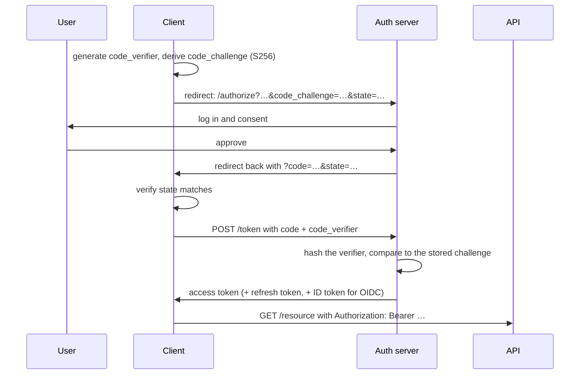

# OAuth 2.1 and OIDC

## Introduction

**OAuth is an authorisation framework.** It lets a user grant an application
limited access to their data on another service, without handing over their
password.

**OpenID Connect (OIDC) is an authentication layer on top of it.** It answers
"who is this user?", which OAuth alone deliberately does not.

The distinction matters and is the source of a great deal of confusion:

|              | OAuth 2.0 / 2.1                     | OIDC                                   |
| ------------ | ----------------------------------- | -------------------------------------- |
| Answers      | _What may this app do?_             | _Who is this user?_                    |
| Issues       | An **access token**                 | An **ID token** (plus an access token) |
| Token format | Opaque or JWT — unspecified         | Always a JWT with defined claims       |
| Use for      | Calling an API on the user's behalf | Signing a user in                      |

**"Sign in with Google" is OIDC**, not plain OAuth. Using a bare OAuth access
token to log someone in is a genuine vulnerability, covered
[below](#the-mistakes).

:::note Version status
**OAuth 2.1 is still a draft** — `draft-ietf-oauth-v2-1` remains in progress at
the IETF and has not been published as an RFC. It is not a new protocol: it
consolidates OAuth 2.0 with the security best current practices that have
accumulated since 2012, and **removes the flows that turned out to be unsafe**.

Following OAuth 2.1 guidance today is correct regardless of its RFC status —
every major provider already requires it in practice.
:::

---

## What OAuth 2.1 Changes

If your knowledge is from an older tutorial, these are the differences that
matter:

| Change                                 | Why                                                       |
| -------------------------------------- | --------------------------------------------------------- |
| **PKCE required for all clients**      | Not just mobile — public _and_ confidential               |
| **Implicit flow removed**              | Tokens in the URL fragment leak via history and referrers |
| **Password grant removed**             | Defeats the entire point: the app handles the password    |
| **Exact redirect URI matching**        | Wildcard matching enabled token theft                     |
| **Refresh token rotation**             | Or sender-constrained tokens, for public clients          |
| **Bearer tokens out of query strings** | URLs land in logs, history and referrers                  |

The **Resource Owner Password Credentials grant** deserves emphasis. It had the
user type their password into the third-party app, which is exactly what OAuth
exists to avoid. It survived for a decade because it was easy. Do not use it.

---

## The Roles

```text
Resource owner    the user
Client            the application wanting access
Authorization     issues tokens after the user consents
  server          (Google, Auth0, your own identity provider)
Resource server   the API holding the data
```

**Client types** determine what security is possible:

- **Confidential** — a server-side application that can keep a secret. A
  traditional web app.
- **Public** — an SPA, mobile app or CLI. Cannot keep a secret, because anyone
  can read the bundle or decompile the binary.

**A public client has no client secret.** Embedding one in a JavaScript bundle
does not make it confidential; it publishes it. PKCE exists precisely because
public clients cannot authenticate themselves.

---

## Authorization Code Flow with PKCE

The one flow you need. It is correct for every client type under OAuth 2.1.



### PKCE

**Proof Key for Code Exchange**, and the mechanism that makes the flow safe.

```ts
// 1. Before redirecting: create a secret and its hash
const verifier = base64url(crypto.getRandomValues(new Uint8Array(32)));
const challenge = base64url(await crypto.subtle.digest('SHA-256', encoder.encode(verifier)));

sessionStorage.setItem('pkce_verifier', verifier);

// 2. Send only the CHALLENGE in the redirect
const url = new URL('https://auth.example.com/authorize');
url.searchParams.set('response_type', 'code');
url.searchParams.set('client_id', CLIENT_ID);
url.searchParams.set('redirect_uri', REDIRECT_URI);
url.searchParams.set('scope', 'openid profile email');
url.searchParams.set('state', crypto.randomUUID());
url.searchParams.set('code_challenge', challenge);
url.searchParams.set('code_challenge_method', 'S256');

// 3. On the callback, exchange the code with the VERIFIER
const tokens = await fetch('https://auth.example.com/token', {
  method: 'POST',
  headers: {'content-type': 'application/x-www-form-urlencoded'},
  body: new URLSearchParams({
    grant_type: 'authorization_code',
    code,
    redirect_uri: REDIRECT_URI,
    client_id: CLIENT_ID,
    code_verifier: sessionStorage.getItem('pkce_verifier')!,
  }),
});
```

**What it defends against.** An attacker who intercepts the authorization code —
through a malicious app registered for the same URI scheme on mobile, a
referrer leak, or browser history — cannot exchange it, because they do not have
the verifier. The code alone is useless.

**Always `S256`**, never `plain`. The `plain` method sends the verifier
unhashed, which defeats the purpose.

### state

A separate parameter with a separate job: **CSRF protection for the callback**.

Generate a random `state`, store it, and verify it matches on return. Without
it, an attacker can trigger a callback with their own authorization code and
link their account to the victim's session — a login CSRF that quietly grafts
the attacker's identity onto the victim's account.

`state` and PKCE are both required, and neither substitutes for the other.

---

## OpenID Connect

OIDC adds identity. Request the `openid` scope and you receive an **ID token**
alongside the access token.

```json
{
  "iss": "https://accounts.google.com",
  "aud": "your-client-id.apps.googleusercontent.com",
  "sub": "110169484474386276334",
  "exp": 1785312000,
  "iat": 1785308400,
  "nonce": "n-0S6_WzA2Mj",
  "email": "ada@example.com",
  "email_verified": true,
  "name": "Ada Lovelace"
}
```

**Validate it as a JWT, and check every claim** — see
[JWT](/knowledge-base/security/jwt):

- `iss` matches the expected issuer exactly.
- **`aud` matches your client id.** Without this, a token issued for a
  _different_ application is accepted by yours — the confused deputy problem,
  and the single most important OIDC check.
- `exp` has not passed.
- `nonce` matches the one you sent, preventing ID token replay.
- The signature verifies against the provider's JWKS.

**Use `sub` as the user identifier, never `email`.** `sub` is stable and unique
within the issuer; email addresses change, and are reassigned. Two accounts with
the same email at different issuers are different people.

**Check `email_verified`.** An unverified email from a provider that allows
arbitrary addresses lets an attacker claim someone else's account if you match
users by email.

Providers publish their configuration, which removes most hand-configuration:

```text
GET https://accounts.google.com/.well-known/openid-configuration
```

---

## Where to Put the Tokens

The decision that determines whether a browser integration is secure.

**Backend for Frontend (BFF) — the recommended pattern.** The server performs
the token exchange, holds the tokens, and gives the browser an ordinary
`HttpOnly` session cookie. The SPA never sees a token.

```text
Browser ──session cookie──▶ Your server ──access token──▶ API
```

This is what OAuth 2.1 guidance recommends for browser applications, and it
removes the entire class of token-theft-via-XSS problems.

**Tokens in the SPA.** If tokens must live in the browser, keep them **in
memory only** — never `localStorage`, which any XSS can read. Accept that a page
refresh loses them and use a silent-refresh mechanism.

**Never put a client secret in a browser or mobile app.** It is not a secret
once shipped. Use PKCE and a public client registration.

---

## Scopes

Scopes limit what a token can do. Request the minimum.

```text
openid profile email          identity only
orders:read                   read orders
orders:write                  create and modify
```

- **Request narrowly.** Asking for broad access reduces consent rates and
  increases the damage if a token leaks.
- **Verify scopes on the resource server.** The token says what was granted;
  your API must check it before acting.
- **Scopes are not authorisation.** `orders:read` says the user permitted this
  app to read orders — not that this user may read _order 1024_. Object-level
  checks still apply. See
  [Authorization](/knowledge-base/security/authorization).

---

## The Mistakes

**Using an access token to authenticate.** The most serious conceptual error. An
access token says "this app may call the API"; it does not say who the user is,
and crucially **it does not say which app it was issued to**. An attacker can
take a token their own app obtained legitimately and present it to yours. If you
call `/userinfo` with it and log in whoever comes back, you have authenticated
the attacker as the victim. **Use the ID token**, and validate its `aud`.

**Skipping `state`.** Login CSRF — the attacker's account gets linked to the
victim's session.

**Skipping PKCE** because the client is confidential. OAuth 2.1 requires it for
all clients.

**Loose redirect URI matching.** Wildcards and prefix matching have both been
exploited to redirect codes to attacker-controlled endpoints. Register exact
URIs.

**Storing tokens in `localStorage`.** One XSS and the tokens are gone.

**Not validating the ID token's `aud`.** Accepts tokens issued for other
applications.

**Matching users by email.** Emails change and can be unverified. Use
`iss` + `sub`.

**Long-lived access tokens.** They cannot be revoked before expiry — keep them
to minutes and use refresh tokens.

**Implementing the protocol yourself.** Use a certified library.

---

## Implementation

**Do not write this from scratch.** The flow has many steps, each with a way to
be subtly wrong, and the failures are silent.

| Platform    | Use                                            |
| ----------- | ---------------------------------------------- |
| Node        | `openid-client`, Auth.js (NextAuth), `@auth/*` |
| Python      | `authlib`                                      |
| PHP         | Laravel Socialite, `league/oauth2-client`      |
| Java / .NET | Spring Security OAuth, Microsoft.Identity.Web  |
| Any         | Auth0, Clerk, WorkOS, Keycloak, Ory Hydra      |

```ts
// openid-client — discovery does most of the configuration for you
import * as client from 'openid-client';

const config = await client.discovery(new URL('https://accounts.google.com'), CLIENT_ID, CLIENT_SECRET);

const verifier = client.randomPKCECodeVerifier();
const challenge = await client.calculatePKCECodeChallenge(verifier);

const url = client.buildAuthorizationUrl(config, {
  redirect_uri: REDIRECT_URI,
  scope: 'openid profile email',
  code_challenge: challenge,
  code_challenge_method: 'S256',
  state,
});

// On callback — validates state, exchanges the code, verifies the ID token
const tokens = await client.authorizationCodeGrant(config, currentUrl, {
  pkceCodeVerifier: verifier,
  expectedState: state,
});
const claims = tokens.claims();
```

**Prefer providers with formal OpenID certification** — it means the
implementation has been tested against the conformance suite.

---

## Do's and Don'ts

### Do

- Use the authorization code flow with PKCE (`S256`) for every client type.
- Generate and verify `state` on every request.
- Validate the ID token fully: `iss`, `aud`, `exp`, `nonce`, signature.
- Identify users by `iss` + `sub`, and check `email_verified`.
- Use a BFF so browser clients hold a session cookie rather than tokens.
- Register exact redirect URIs.
- Request the narrowest scopes that work.
- Verify scopes on the resource server.
- Use a certified library.

### Don't

- Don't use the implicit or password grants — removed in 2.1.
- Don't authenticate users with an access token; use the ID token.
- Don't skip `aud` validation.
- Don't put a client secret in a browser or mobile app.
- Don't store tokens in `localStorage`.
- Don't match users by email address.
- Don't use wildcard redirect URIs.
- Don't put tokens in query strings.
- Don't implement the protocol yourself.

---

## Debugging

| Symptom                            | Cause and fix                                                                                   |
| ---------------------------------- | ----------------------------------------------------------------------------------------------- |
| `redirect_uri_mismatch`            | The registered URI must match exactly — scheme, host, port, path, trailing slash.               |
| `invalid_grant` on token exchange  | Code already used, expired (they are single-use and short-lived), or the wrong `code_verifier`. |
| ID token signature fails           | Stale JWKS cache, or the wrong `kid`. Refresh on unknown key ids.                               |
| `state` mismatch on callback       | Session lost between redirect and return — often a `SameSite=Strict` cookie.                    |
| Works locally, fails in production | Redirect URI not registered for the production host, or HTTP vs HTTPS.                          |
| Refresh token rejected after use   | Rotation is enabled and the old token was replayed. Store the new one each time.                |
| Access token rejected by the API   | Wrong audience, or a missing scope.                                                             |
| Consent screen appears every time  | `prompt=consent` set, or refresh tokens are not being stored.                                   |

---

## FAQ

**OAuth or OIDC?**
OIDC if you are signing users in. OAuth alone if you only need to call an API on
their behalf. OIDC is a superset, so requesting the `openid` scope gives you
both.

**Is OAuth 2.1 finalised?**
Not yet — it remains an IETF draft. Follow its guidance anyway; it codifies
practices providers already require.

**Which flow should I use?**
Authorization code with PKCE. That is the answer for web apps, SPAs, mobile and
desktop. The others were removed or are for specific machine-to-machine cases
(client credentials) and input-constrained devices (device flow).

**Do I need PKCE for a server-side app with a client secret?**
Yes under OAuth 2.1. It protects against code interception regardless of client
type.

**Where should an SPA keep tokens?**
Ideally nowhere — use a BFF and an `HttpOnly` session cookie. If tokens must be
in the browser, keep them in memory only.

**Can I use OAuth for machine-to-machine calls?**
Yes — the client credentials grant, which has no user and therefore no
authorization step.

**How do I log a user out everywhere?**
Revoke the refresh token, clear your session, and use the provider's
end-session endpoint if it publishes one. The access token remains valid until
it expires.

---

## Check your understanding

<Quiz
question="An app implements 'Sign in with Provider' by taking the access token, calling /userinfo, and logging in whichever user comes back. Why is this unsafe?"
options={[
{
text: 'An access token carries no indication of which application it was issued to, so an attacker can present a token obtained by their own app and be logged in as its owner',
correct: true,
why: 'This is the confused deputy problem. Access tokens are for calling APIs; the ID token is the authentication artefact, and its aud claim is what binds it to your client.',
},
{text: 'It is safe, provided the /userinfo call uses HTTPS', why: 'Transport security is irrelevant — the token is legitimately issued, just not to you.'},
{text: 'It is unsafe only if the provider does not support PKCE', why: 'PKCE protects the authorization code in transit. It says nothing about which app a token belongs to.'},
{text: 'It is safe as long as the email is verified', why: 'The attacker’s token can return any user’s profile from their own app. Verification of the address does not establish which client the token was for.'},
]}
explanation={<>Use the ID token and validate <code>aud</code> against your client id. This is the single most important OIDC check, and it is exactly the one that a hand-rolled integration tends to omit.</>}
reference={{label: 'The mistakes', href: '/knowledge-base/security/oauth#the-mistakes'}}
/>

<Quiz
question="What does PKCE protect against, and why is it now required even for confidential clients?"
options={[
{
text: 'Interception of the authorization code — without the code_verifier an intercepted code cannot be exchanged, and OAuth 2.1 requires it universally because interception is not limited to public clients',
correct: true,
why: 'The challenge is sent on the redirect; the verifier only on the back-channel token request. An attacker who captures the code lacks the verifier and cannot redeem it.',
},
{text: 'CSRF on the callback endpoint', why: 'That is what the state parameter is for. Both are required and neither substitutes for the other.'},
{text: 'Token theft from localStorage', why: 'PKCE concerns the code exchange. Where tokens are stored afterwards is a separate problem.'},
{text: 'Replay of the ID token', why: 'That is the nonce claim’s job.'},
]}
explanation={<>Always use <code>code_challenge_method=S256</code>. The <code>plain</code> method sends the verifier unhashed in the redirect, which defeats the entire mechanism.</>}
reference={{label: 'PKCE', href: '/knowledge-base/security/oauth#pkce'}}
/>

<Quiz
question="Which practices does OAuth 2.1 mandate or remove relative to older OAuth 2.0 tutorials?"
type="multiple"
options={[
{text: 'PKCE is required for all clients, not just public ones', correct: true, why: 'Code interception is not exclusive to mobile and SPA clients.'},
{text: 'The implicit flow is removed', correct: true, why: 'It returned tokens in the URL fragment, where they leak through browser history, referrers and logs.'},
{text: 'The resource owner password credentials grant is removed', correct: true, why: 'It had users type their password into the third-party app — precisely what OAuth exists to prevent.'},
{text: 'Redirect URIs must match exactly, with no wildcards', correct: true, why: 'Wildcard and prefix matching have both been exploited to divert authorization codes to attacker endpoints.'},
{text: 'Bearer tokens may be passed in query strings for convenience', why: 'The opposite — 2.1 explicitly prohibits it, because URLs land in server logs, browser history and referrer headers.'},
]}
explanation={<>OAuth 2.1 is not a new protocol; it is OAuth 2.0 with a decade of security best current practice folded in and the unsafe options deleted.</>}
reference={{label: 'What OAuth 2.1 changes', href: '/knowledge-base/security/oauth#what-oauth-21-changes'}}
/>

<Quiz
question="An application matches returning users by the email claim in the ID token. What can go wrong?"
options={[
{
text: 'Emails change and can be unverified or reassigned — an attacker with an unverified address at a permissive provider could take over an existing account',
correct: true,
why: 'The stable identifier is iss + sub. Email is a mutable attribute, and email_verified must be checked wherever email is used at all.',
},
{text: 'Nothing — email is unique within a provider', why: 'It is unique at a point in time, not over time, and the same address at two providers is two different subjects.'},
{text: 'It only breaks if the user has several accounts', why: 'The account-takeover risk exists with a single account.'},
{text: 'It works provided the provider is Google', why: 'Even where a provider verifies addresses, users change them, and the identifier should not depend on that.'},
]}
explanation={<>Store <code>iss</code> and <code>sub</code> as the identity key. Treat email as profile data — useful for display and contact, never as the primary account key.</>}
reference={{label: 'OpenID Connect', href: '/knowledge-base/security/oauth#openid-connect'}}
/>

<Quiz
question="An SPA needs to call an API on the user's behalf. What is the recommended token placement?"
options={[
{
text: 'A Backend for Frontend — the server performs the exchange and holds the tokens, and the browser gets an HttpOnly session cookie',
correct: true,
why: 'The SPA never handles a token, which removes the entire class of XSS token theft. This is what current OAuth security guidance recommends for browser applications.',
},
{text: 'localStorage, so the token survives a page refresh', why: 'Readable by any script on the page. One XSS and the token is exfiltrated and usable from anywhere.'},
{text: 'A non-HttpOnly cookie, so JavaScript can attach it to requests', why: 'Removes the only protection a cookie offers over localStorage.'},
{text: 'Embed a client secret in the bundle and use the client credentials grant', why: 'A secret in a browser bundle is published, and client credentials has no user context at all.'},
]}
explanation={<>If tokens genuinely must live in the browser, keep them in memory only and accept that a refresh loses them. The BFF pattern avoids the trade entirely.</>}
reference={{label: 'Where to put the tokens', href: '/knowledge-base/security/oauth#where-to-put-the-tokens'}}
/>

---

## References

- [OAuth 2.1 draft](https://datatracker.ietf.org/doc/html/draft-ietf-oauth-v2-1)
  — the consolidated specification, still in progress.
- [oauth.net](https://oauth.net/2.1/) — Aaron Parecki's summary of what changed
  and why.
- [RFC 9700: Best Current Practice for OAuth 2.0 Security](https://www.rfc-editor.org/rfc/rfc9700.html)
  — the guidance 2.1 codifies.
- [RFC 7636: PKCE](https://www.rfc-editor.org/rfc/rfc7636) — the mechanism in
  detail.
- [OpenID Connect Core](https://openid.net/specs/openid-connect-core-1_0.html) —
  ID tokens and required validation.
- [OAuth 2.0 for Browser-Based Applications](https://datatracker.ietf.org/doc/html/draft-ietf-oauth-browser-based-apps)
  — the BFF recommendation.
- [openid-client](https://github.com/panva/node-openid-client) — a certified
  Node implementation.
