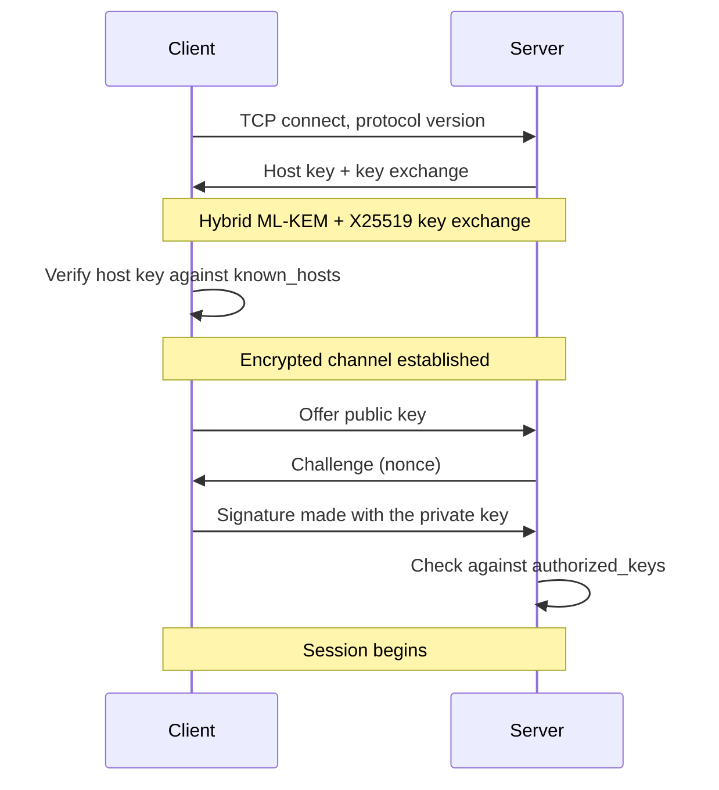

# SSH

## Introduction

SSH (Secure Shell) gives you an authenticated, encrypted channel to a remote
machine. It is how you administer servers, how Git talks to GitHub over
`git@github.com`, how you reach a database that is not exposed to the internet,
and how deploy pipelines get onto hosts.

**The problem it solves.** Its predecessors — telnet, rlogin, FTP — sent
credentials and session data as plaintext across the network. SSH replaced them
with a protocol that encrypts everything, authenticates the _server_ as well as
the user, and verifies message integrity.

Most day-to-day friction with SSH comes from two things: key management, and not
knowing that `~/.ssh/config` exists. Both are worth learning properly once.

:::note Versions
Written against **OpenSSH 10.4** (July 2026). OpenSSH 10 removed DSA entirely,
made hybrid post-quantum key exchange the default, and 10.4 added an
experimental post-quantum signature algorithm. If your notes say to generate RSA
keys, they predate all of this.
:::

---

## Core Concepts

### What happens when you connect



Two separate authentications happen, and conflating them causes most confusion:

1. **The server proves its identity to you** with its _host key_, checked
   against `~/.ssh/known_hosts`. This is what stops you handing your credentials
   to an impostor.
2. **You prove your identity to the server** with your _user key_, checked
   against `~/.ssh/authorized_keys` on the server.

The key exchange derives a shared session key without ever transmitting it.
Since OpenSSH 9.9 the default is a **hybrid** scheme combining ML-KEM
(post-quantum) with X25519 (classical), so a "harvest now, decrypt later"
attacker who eventually gets a quantum computer still cannot recover today's
traffic.

### Key pairs

A key pair is a private key you keep and a public key you distribute. The
private key never leaves your machine; it signs a challenge the server sends.

| Type        | Status                                                          |
| ----------- | --------------------------------------------------------------- |
| **Ed25519** | **The default choice.** Fast, short, no parameter footguns.     |
| Ed25519-SK  | Ed25519 backed by a hardware key (FIDO2/YubiKey). Best of all.  |
| ECDSA       | Works, but the NIST curves are less well regarded than Ed25519. |
| RSA         | Acceptable at ≥3072 bits with SHA-2. Legacy hosts may need it.  |
| DSA         | **Removed in OpenSSH 10.** Not an option.                       |

```bash
ssh-keygen -t ed25519 -C "you@example.com"
# → ~/.ssh/id_ed25519      (private — never share, never commit)
# → ~/.ssh/id_ed25519.pub  (public — safe to paste anywhere)
```

**Always set a passphrase.** An unencrypted private key on a stolen laptop is a
free credential. `ssh-agent` means you type it once per session, so the cost is
negligible.

---

## Setup

### Generate and install a key

```bash
ssh-keygen -t ed25519 -C "you@example.com"

# Copy the public key to a server's authorized_keys
ssh-copy-id user@server.example.com

# Manually, when ssh-copy-id is unavailable
cat ~/.ssh/id_ed25519.pub | ssh user@server 'mkdir -p ~/.ssh && cat >> ~/.ssh/authorized_keys'
```

Permissions matter, and SSH silently refuses keys when they are wrong:

```bash
chmod 700 ~/.ssh
chmod 600 ~/.ssh/id_ed25519 ~/.ssh/authorized_keys
chmod 644 ~/.ssh/id_ed25519.pub ~/.ssh/known_hosts
```

### ssh-agent

The agent holds decrypted private keys in memory so you type the passphrase
once:

```bash
eval "$(ssh-agent -s)"        # start it (usually already running)
ssh-add ~/.ssh/id_ed25519
ssh-add -l                    # list loaded keys
ssh-add -D                    # forget everything
ssh-add -t 4h ~/.ssh/id_work  # auto-expire after four hours
```

On macOS, `ssh-add --apple-use-keychain` stores the passphrase in the Keychain
so it survives reboots. On Linux, the desktop environment usually starts an
agent for you.

### ~/.ssh/config

The single highest-value thing on this page. It turns long commands into short
ones and keeps per-host settings in one reviewable place:

```ssh-config title="~/.ssh/config"
# Applies to every host unless overridden.
Host *
  AddKeysToAgent yes
  ServerAliveInterval 60          # keepalive, stops idle disconnects
  ServerAliveCountMax 3
  HashKnownHosts yes
  # Reuse one TCP connection for multiple sessions — much faster Git over SSH.
  ControlMaster auto
  ControlPath ~/.ssh/sockets/%r@%h:%p
  ControlPersist 10m

Host github.com
  User git
  IdentityFile ~/.ssh/id_ed25519_personal
  IdentitiesOnly yes              # offer ONLY this key

# Work GitHub identity, via a fake hostname.
Host github-work
  HostName github.com
  User git
  IdentityFile ~/.ssh/id_ed25519_work
  IdentitiesOnly yes

Host prod-web
  HostName 203.0.113.10
  User deploy
  Port 2222
  IdentityFile ~/.ssh/id_ed25519_prod

# Reach a private host through a bastion, without landing on the bastion.
Host db-internal
  HostName 10.0.1.50
  User admin
  ProxyJump bastion.example.com
```

```bash
mkdir -p ~/.ssh/sockets   # required for ControlPath above
ssh prod-web              # instead of: ssh -p 2222 deploy@203.0.113.10 -i …
git clone github-work:acme/internal-repo.git
```

Three of these earn their place immediately:

**`IdentitiesOnly yes`** — without it, SSH offers every key in the agent in
turn. Servers commonly disconnect after six failed attempts, so with several
keys loaded you get "Too many authentication failures" while holding a perfectly
good key.

**`ControlMaster`/`ControlPersist`** — subsequent connections to the same host
reuse the first TCP session. Git operations over SSH become noticeably faster
because there is no new handshake each time.

**`ProxyJump`** — connect through a bastion in one step. It replaces the older
`ProxyCommand ssh -W` incantation.

### known_hosts

On first connection you are asked to verify a fingerprint. Accepting stores the
host key; if it ever changes, SSH refuses to connect and prints a large warning.

That warning has two possible causes: the server was legitimately rebuilt, or
you are being MITM'd. Verify out of band before clearing it:

```bash
ssh-keygen -F server.example.com        # what is currently stored
ssh-keygen -R server.example.com        # remove the entry, then reconnect
```

Never "fix" it with `StrictHostKeyChecking no` in a config file — that disables
server verification permanently and defeats the point of the protocol. For
ephemeral CI hosts, pre-seed the expected key instead:

```bash
ssh-keyscan -t ed25519 github.com >> ~/.ssh/known_hosts
```

Better still at scale, use **host certificates**: a CA signs host keys, clients
trust the CA, and rebuilt servers need no client-side changes.

---

## Everyday Usage

```bash
ssh user@host                          # interactive shell
ssh user@host 'systemctl status nginx' # run one command and exit
ssh -t user@host 'sudo journalctl -f'  # force a TTY (needed for sudo prompts)
ssh -v user@host                       # verbose — the first debugging step
ssh -J bastion user@internal-host      # jump host, ad hoc

# File transfer
scp file.txt user@host:/remote/path/
scp -r ./dist user@host:/var/www/
sftp user@host
rsync -avz --delete ./dist/ user@host:/var/www/html/
```

**Prefer `rsync` over `scp`** for anything repeated: it transfers only
differences, preserves permissions, shows progress, and can delete files removed
locally. `scp`'s underlying protocol has also had a series of path-handling
vulnerabilities — including fixes in OpenSSH 10.4 for malicious servers writing
outside the target directory — and OpenSSH now implements it over SFTP for that
reason.

---

## Port Forwarding

Three directions, and the naming confuses everyone at least once.

### Local forwarding: bring a remote port to you

```bash
ssh -L 5432:localhost:5432 user@server
```

"Expose the server's port 5432 on **my** port 5432." Now `psql -h localhost`
reaches the remote database. The `localhost` in the middle is resolved _from the
server's perspective_, so this also reaches hosts only the server can see:

```bash
ssh -L 5432:10.0.1.50:5432 user@bastion   # database behind a bastion
```

This is the correct way to reach a production database: no public port, no
firewall change, authenticated by your SSH key, and it disappears when you close
the session.

### Remote forwarding: expose your port to the server

```bash
ssh -R 8080:localhost:3000 user@server
```

"Anyone on the server hitting port 8080 reaches **my** local port 3000." Useful
for demonstrating a local build or receiving a webhook. By default it binds only
the server's loopback; `GatewayPorts yes` on the server is required to expose it
more widely, and should be considered carefully.

### Dynamic forwarding: a SOCKS proxy

```bash
ssh -D 1080 user@server
```

Turns the SSH connection into a SOCKS5 proxy — point a browser at
`localhost:1080` and traffic exits from the server. Useful for reaching an
internal network, not a substitute for a VPN.

Add `-N` (no command) and `-f` (background) for a forward you just want running:

```bash
ssh -fNL 5432:localhost:5432 user@server
```

---

## Hardening sshd

Server side, in `/etc/ssh/sshd_config`. These settings remove the overwhelming
majority of real attacks:

```ssh-config title="/etc/ssh/sshd_config.d/99-hardening.conf"
# Keys only. This single line eliminates password brute-forcing.
PasswordAuthentication no
KbdInteractiveAuthentication no
PubkeyAuthentication yes

# No direct root login.
PermitRootLogin no

# Limit who may log in at all.
AllowGroups ssh-users

# Reduce exposure.
MaxAuthTries 3
LoginGraceTime 30
X11Forwarding no
AllowAgentForwarding no
PermitTunnel no

# Drop dead sessions.
ClientAliveInterval 300
ClientAliveCountMax 2
```

```bash
sudo sshd -t                       # ALWAYS validate before reloading
sudo systemctl reload sshd
```

:::danger Keep a second session open
Test the new configuration from a _new_ terminal before closing your existing
one. A mistake in `sshd_config` that locks you out of a remote server with no
console access is a genuinely bad afternoon.
:::

Two further points:

**Changing the port to 2222 is not security**, it is noise reduction. It stops
opportunistic scanners filling your logs; it stops nothing else. Do it if you
like quiet logs, but do not count it as a control.

**`fail2ban` matters much less once passwords are disabled.** With key-only
auth, brute forcing is not a threat model. Rate limiting is still reasonable
defence in depth.

### Restricting what a key can do

`authorized_keys` entries accept options — valuable for deploy keys and
automation:

```text title="~/.ssh/authorized_keys"
command="/usr/local/bin/deploy.sh",no-pty,no-port-forwarding,no-agent-forwarding,restrict ssh-ed25519 AAAAC3... deploy-ci
from="203.0.113.0/24" ssh-ed25519 AAAAC3... admin-laptop
```

`command=` forces that command regardless of what the client asks for, so a
stolen CI key can run the deploy script and nothing else. `restrict` disables
all forwarding and PTY allocation, then you re-enable only what is needed.

---

## Security

**Agent forwarding (`-A`) is more dangerous than it looks.** It lets the remote
host use your agent to authenticate onward — and anyone with root on that host
can use it too, as you, for as long as you are connected. Use **`ProxyJump`**
instead, which never exposes your agent to the intermediate machine.

```bash
ssh -J bastion user@internal    # ✅ agent stays local
ssh -A bastion                  # ❌ bastion can impersonate you
```

**Use separate keys per context** — personal, work, production, CI. One
compromised key should not be a universal credential.

**Hardware-backed keys** are the strongest practical option, because the private
key cannot be exfiltrated:

```bash
ssh-keygen -t ed25519-sk -O resident -O verify-required
```

**Rotate keys** when someone leaves, when a laptop is lost, or on a schedule.
`authorized_keys` files accumulate ex-employees for years unless managed by
configuration management.

**Audit access:**

```bash
sudo grep 'Accepted' /var/log/auth.log | tail -50   # successful logins
sudo lastlog
```

**Deploy keys and CI:** prefer a per-repository deploy key with read-only
access, or short-lived OIDC-issued credentials, over a personal key in a CI
secret.

---

## Debugging

`ssh -v` first, always. Add more `v`s for more detail; `-vvv` shows every key
offered and every method attempted.

| Symptom                                           | Cause and fix                                                                                                 |
| ------------------------------------------------- | ------------------------------------------------------------------------------------------------------------- |
| `Permission denied (publickey)`                   | Key not in `authorized_keys`, wrong key offered, or bad permissions. `ssh -v` shows which key was tried.      |
| `Too many authentication failures`                | The agent offered too many keys before the right one. Set `IdentitiesOnly yes` and a specific `IdentityFile`. |
| `WARNING: REMOTE HOST IDENTIFICATION HAS CHANGED` | Host key differs. Verify out of band, then `ssh-keygen -R host`.                                              |
| `Connection refused`                              | Nothing listening on that port — sshd down, or the wrong port.                                                |
| `Connection timed out`                            | Firewall or security group. Not an SSH problem.                                                               |
| Key ignored, no obvious reason                    | Permissions. `chmod 600` the private key, `700` the `.ssh` directory.                                         |
| Works as root, fails as a user                    | `AllowGroups`/`AllowUsers`, or the user's home directory is group-writable.                                   |
| Session freezes after inactivity                  | A NAT or firewall idle timeout. Set `ServerAliveInterval 60`.                                                 |
| `sudo` fails over SSH with no TTY                 | Use `ssh -t`.                                                                                                 |
| Git over SSH is slow on every command             | No connection multiplexing. Add `ControlMaster auto` and `ControlPersist`.                                    |

```bash
ssh -vvv user@host              # full client-side trace
ssh -G user@host                # the effective config for this host — very useful
ssh -T git@github.com           # test GitHub auth without opening a shell
sudo sshd -t                    # validate server config
sudo journalctl -u ssh -f       # server-side logs while you connect
```

`ssh -G host` prints the fully resolved configuration after all `Host` blocks are
applied. When a setting is not taking effect, this shows you what SSH actually
decided.

---

## Do's and Don'ts

### Do

- Use Ed25519 keys with a passphrase, held in `ssh-agent`.
- Put everything in `~/.ssh/config`, including `IdentitiesOnly yes`.
- Use `ProxyJump` rather than agent forwarding.
- Disable password authentication and root login on servers.
- Verify a changed host key out of band before removing it.
- Use `rsync` instead of `scp` for repeated transfers.
- Restrict automation keys with `command=` and `restrict`.
- Keep a second session open while changing `sshd_config`.

### Don't

- Don't generate DSA keys — OpenSSH 10 removed support entirely.
- Don't create keys without a passphrase for interactive use.
- Don't set `StrictHostKeyChecking no`.
- Don't use `-A` agent forwarding on hosts you do not fully control.
- Don't share one key across personal, work and production.
- Don't treat a non-standard port as a security control.
- Don't copy a private key to a server. Ever.

---

## FAQ

**Ed25519 or RSA?**
Ed25519, unless a legacy host refuses it. Shorter, faster, and no key-size or
padding decisions to get wrong.

**Is it safe to put my public key anywhere?**
Yes — that is its purpose. Only the private key is sensitive.

**How do I use different GitHub accounts?**
Define two `Host` entries with different `IdentityFile` values and a fake
hostname for one (`github-work`), then clone using that alias.

**What is the difference between `-L` and `-R`?**
`-L` brings a _remote_ port to your machine. `-R` exposes _your_ port on the
remote machine. Mnemonic: the flag names the side the listening socket opens on.

**Can I SSH without a password or a key?**
Host certificates and short-lived certificates issued by an SSH CA are the
scalable answer for teams. Both are still key-based; they just remove the
`authorized_keys` management problem.

**Should I still install fail2ban?**
With `PasswordAuthentication no`, its main benefit disappears. It remains
reasonable defence in depth, but disabling passwords is the change that matters.

---

## Check your understanding

<Quiz
question="You connect to a bastion and then on to an internal host. Which approach keeps your private key safest?"
options={[
{
text: 'ssh -J bastion user@internal (ProxyJump) — the connection is tunnelled and your agent is never exposed to the bastion',
correct: true,
why: 'ProxyJump tunnels a direct connection through the bastion. Authentication to the internal host happens from your machine, so a compromised bastion cannot use your credentials.',
},
{
text: 'ssh -A bastion, then ssh internal from there',
why: 'Agent forwarding lets anyone with root on the bastion use your agent to authenticate as you, anywhere, for as long as you are connected.',
},
{
text: 'Copy your private key to the bastion and connect from there',
why: 'The worst option. A private key on a shared host is compromised by anyone who can read it or dump memory.',
},
{
text: 'Enable PasswordAuthentication on the internal host and type a password',
why: 'Reintroduces brute-forcing and sends you back to credentials that can be phished or reused.',
},
]}
explanation={<>Put it in <code>~/.ssh/config</code> once with a <code>ProxyJump</code> line and the safe option becomes the convenient one.</>}
reference={{label: 'Security', href: '/knowledge-base/ssh#security'}}
/>

<Quiz
question="Connecting to a server you use daily suddenly fails with REMOTE HOST IDENTIFICATION HAS CHANGED. What should you do?"
options={[
{
text: 'Verify the new host key fingerprint through a channel other than SSH, then remove the old entry with ssh-keygen -R',
correct: true,
why: 'The warning means the server presented a different host key. Legitimate causes (a rebuild) and malicious ones (MITM) look identical from the client, so out-of-band verification is the only way to tell.',
},
{
text: 'Add StrictHostKeyChecking no to your config so it stops warning',
why: 'That permanently disables server authentication for every host — exactly the protection the warning exists to provide.',
},
{
text: 'Delete ~/.ssh/known_hosts entirely and reconnect',
why: 'It silences the warning by discarding every host key you have ever verified, so you accept whatever is presented next time on all hosts.',
},
{
text: 'Regenerate your own key pair',
why: 'Your user key is unrelated. This warning is about the _server_ proving its identity to you.',
},
]}
explanation={<>Host certificates signed by an SSH CA remove this friction at scale: rebuilt servers present a certificate the client already trusts, so no client-side change is needed.</>}
reference={{label: 'known_hosts', href: '/knowledge-base/ssh#known_hosts'}}
/>

<Quiz
question="You need to run psql against a production database that has no public port, from your laptop. Which command does it?"
options={[
{
text: 'ssh -L 5432:localhost:5432 user@dbserver, then connect to localhost:5432',
correct: true,
why: 'Local forwarding maps a port on your machine to a port reachable from the server. Nothing is exposed publicly, access is authenticated by your SSH key, and the tunnel disappears when you disconnect.',
},
{
text: 'ssh -R 5432:localhost:5432 user@dbserver',
why: 'Remote forwarding is the other direction — it would expose _your_ local port on the server.',
},
{
text: 'Open port 5432 in the firewall for your IP address',
why: 'Works, but permanently widens the attack surface for something a tunnel handles temporarily and with authentication.',
},
{
text: 'scp the database file to your laptop',
why: 'Copying a live database file gives you a corrupt snapshot, and it is not a connection.',
},
]}
explanation={<>The middle address resolves from the <em>server's</em> perspective, so <code>-L 5432:10.0.1.50:5432 user@bastion</code> reaches a database only the bastion can see.</>}
reference={{label: 'Local forwarding', href: '/knowledge-base/ssh#local-forwarding-bring-a-remote-port-to-you'}}
/>

<Quiz
question="Which sshd settings meaningfully reduce the attack surface of an internet-facing server?"
type="multiple"
options={[
{text: 'PasswordAuthentication no', correct: true, why: 'Eliminates brute-forcing and credential stuffing outright — the single highest-value line in the file.'},
{text: 'PermitRootLogin no', correct: true, why: 'Forces an attacker to compromise a named account and then escalate, and makes actions attributable.'},
{text: 'AllowGroups ssh-users', correct: true, why: 'Restricts login to an explicit set of accounts rather than every user on the system.'},
{text: 'AllowAgentForwarding no', correct: true, why: 'Stops a compromised server from using a connected user’s agent to move laterally.'},
{text: 'Changing the port from 22 to 2222', why: 'Reduces log noise from opportunistic scanners. It stops no targeted attacker and is not a security control.'},
]}
explanation={<>Validate with <code>sudo sshd -t</code> and test from a second terminal before closing your current session — a config error on a remote host with no console is unrecoverable.</>}
reference={{label: 'Hardening sshd', href: '/knowledge-base/ssh#hardening-sshd'}}
/>

<Quiz
question="A server rejects you with 'Too many authentication failures', but you are certain the correct key is loaded in your agent. What is happening?"
options={[
{
text: 'The agent is offering every loaded key in turn and the server disconnects after MaxAuthTries before reaching the right one',
correct: true,
why: 'Each offered key counts as an authentication attempt. With several keys in the agent you can exhaust the server’s limit before the correct one is tried.',
},
{
text: 'The key has expired',
why: 'SSH keys have no expiry. Certificates do, but that produces a different error.',
},
{
text: 'The server does not support Ed25519',
why: 'That would be an unsupported-key-type error, and every current OpenSSH supports Ed25519.',
},
{
text: 'Your private key permissions are wrong',
why: 'Bad permissions make SSH ignore the key with a specific warning about an unprotected private key file.',
},
]}
explanation={<>Fix it in <code>~/.ssh/config</code> with an <code>IdentityFile</code> for the host plus <code>IdentitiesOnly yes</code>, so exactly one key is offered.</>}
reference={{label: '~/.ssh/config', href: '/knowledge-base/ssh#sshconfig'}}
/>

---

## References

- [OpenSSH manual pages](https://www.openssh.com/manual.html) — `ssh`, `sshd`,
  `ssh_config`, `sshd_config`, `ssh-keygen`.
- [OpenSSH release notes](https://www.openssh.com/releasenotes.html) — DSA
  removal, post-quantum key exchange, the 10.4 security fixes.
- [GitHub: Connecting with SSH](https://docs.github.com/en/authentication/connecting-to-github-with-ssh)
  — key setup and verification for GitHub specifically.
- [SSH Academy: Certificate authentication](https://www.ssh.com/academy/pki/ssh-certificates)
  — host and user certificates at scale.
- [Mozilla OpenSSH guidelines](https://infosec.mozilla.org/guidelines/openssh)
  — a maintained hardening baseline.
