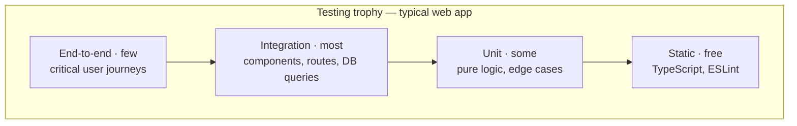

# Testing

## Introduction

A test suite exists to answer one question: **can I change this code without
breaking it?** Everything else — coverage numbers, terminology, framework
choice — is downstream of that.

Tests solve a specific economic problem. Manual verification cost scales with
the number of features, so a growing codebase eventually becomes slower to
change than to rewrite. Automated tests move that cost from "every release,
forever" to "once, when the behaviour is written". They also encode intent: a
well-named failing test explains what was supposed to happen far better than a
comment does.

Tests are not free. Every test is code you must maintain, and a suite that is
slow, flaky, or coupled to implementation details is a net liability. The skill
is not writing more tests — it is writing the _right_ tests at the _right_
level.

---

## Core Concepts

### The levels

Tests are usually described by how much of the system they exercise.

| Level           | Exercises                                    | Typical runtime | Failure tells you            |
| --------------- | -------------------------------------------- | --------------- | ---------------------------- |
| **Unit**        | One function, class or module in isolation   | < 1 ms          | Exactly which line is wrong  |
| **Integration** | Several units together, often with a real DB | 10 ms – 1 s     | Which seam is wrong          |
| **End-to-end**  | The whole system through the real UI         | 1 – 30 s        | Something is wrong somewhere |

The trade-off is a straight line: the more of the system a test covers, the more
confidence a pass gives you, and the less precisely a failure points at the
cause.

### Pyramid or trophy?

The **testing pyramid** says: many unit tests, fewer integration tests, very few
end-to-end tests. It is sound advice for systems with substantial pure logic —
pricing engines, parsers, schedulers, financial calculations.

The **testing trophy** (Kent C. Dodds) argues that for typical web applications
the bulk of value sits in **integration** tests, because most real bugs live in
the wiring between units rather than inside them. A React component test that
renders the component, clicks a button and asserts on the resulting screen
catches far more real defects than fifty tests of individual helper functions.



Neither shape is a law. The useful question is: **for each layer, what does a
bug here cost, and what is the cheapest test that would have caught it?**

The bottom tier is worth stressing. TypeScript and ESLint eliminate whole
classes of defects at zero runtime cost — a strict `tsconfig` is the highest
value-per-effort testing you will ever do.

### Test doubles

"Mock" is used loosely to mean any stand-in. The distinctions matter when
debugging:

| Double    | What it does                                          |
| --------- | ----------------------------------------------------- |
| **Dummy** | Passed to satisfy a signature; never used             |
| **Stub**  | Returns canned answers                                |
| **Spy**   | A real implementation that also records calls         |
| **Mock**  | A stub that also asserts on how it was called         |
| **Fake**  | A working lightweight implementation (in-memory repo) |

Prefer **fakes** over **mocks**. A mock asserts that your code called
`repository.save(x)`; a fake lets you assert that the record can actually be
read back. The first breaks when you refactor, the second does not.

Mock at **architectural boundaries** — the network, the clock, the filesystem,
randomness, third-party SDKs. Mocking your own internal modules usually means
the design needs a seam, not that the test needs a mock.

### What makes a test good

- **Deterministic.** Same input, same result, every run, in any order.
- **Isolated.** Does not depend on another test having run first.
- **Fast.** A suite developers will not wait for is a suite they will not run.
- **Behaviour-focused.** Asserts on observable output, not internals.
- **Readable.** The test is the specification; someone should be able to read it
  instead of the implementation.

The strongest signal of a healthy test: **it fails when the behaviour breaks,
and only then.** Tests that fail on every refactor are measuring the wrong
thing.

---

## Setup

The 2026 JavaScript default is **Vitest** for unit and integration tests and
**Playwright** for end-to-end. Jest remains widespread and perfectly capable —
Jest 30 is current — but new projects generally start on Vitest because it
reuses the Vite config and transform pipeline, so there is no second build
setup to keep in sync.

Vitest 4 (current stable line, 4.1.x) made Browser Mode stable and added visual
regression testing.

```bash
npm install -D vitest @vitest/coverage-v8
npm install -D @testing-library/dom @testing-library/user-event jsdom
```

```ts title="vitest.config.ts"
import {defineConfig} from 'vitest/config';

export default defineConfig({
  test: {
    // 'node' for pure logic and server code; 'jsdom' when the code touches
    // the DOM. Set per-file with a // @vitest-environment comment.
    environment: 'node',
    globals: false, // prefer explicit imports; see note below
    setupFiles: ['./test/setup.ts'],
    coverage: {
      provider: 'v8',
      reporter: ['text', 'html', 'lcov'],
      // Fail the build if core logic regresses, rather than chasing 100%.
      thresholds: {lines: 80, functions: 80, branches: 70},
      exclude: ['**/*.config.*', '**/types.ts', 'test/**'],
    },
  },
});
```

Keeping `globals: false` and importing `describe`/`it`/`expect` explicitly costs
one line per file and buys correct type inference plus obvious provenance.

```json title="package.json"
{
  "scripts": {
    "test": "vitest run",
    "test:watch": "vitest",
    "test:coverage": "vitest run --coverage",
    "test:e2e": "playwright test"
  }
}
```

### Node's built-in runner

Node 24 ships a stable `node:test` module with watch mode, coverage, global
setup/teardown, automatic subtest awaiting and rerun-failed-tests support. For a
dependency-free library or a small service it is genuinely sufficient:

```js title="sum.test.js"
import {test} from 'node:test';
import assert from 'node:assert/strict';
import {sum} from './sum.js';

test('adds numbers', () => {
  assert.equal(sum(2, 3), 5);
});
```

```bash
node --test
node --test --watch
node --test --experimental-test-coverage
```

Choose it when you want zero dependencies. Choose Vitest when you want
TypeScript and JSX handled for you, a rich `expect`, snapshot testing, browser
mode and a mature ecosystem.

### End-to-end setup

```bash
npm init playwright@latest
```

```ts title="playwright.config.ts"
import {defineConfig, devices} from '@playwright/test';

export default defineConfig({
  testDir: './e2e',
  fullyParallel: true,
  forbidOnly: !!process.env.CI, // a stray .only must not pass CI
  retries: process.env.CI ? 2 : 0,
  use: {
    baseURL: 'http://localhost:3000',
    trace: 'on-first-retry', // full timeline for failures, cheap for passes
    screenshot: 'only-on-failure',
  },
  projects: [
    {name: 'chromium', use: {...devices['Desktop Chrome']}},
    {name: 'webkit', use: {...devices['Desktop Safari']}},
  ],
  webServer: {
    command: 'npm run build && npm run start',
    url: 'http://localhost:3000',
    reuseExistingServer: !process.env.CI,
  },
});
```

`trace: 'on-first-retry'` is the single most useful setting here. When a test
fails in CI you get a recorded timeline with DOM snapshots, network activity and
console output — enough to diagnose without reproducing locally.

---

## Basic Usage

### Structure: Arrange, Act, Assert

```ts
import {describe, expect, it} from 'vitest';
import {applyDiscount} from './pricing';

describe('applyDiscount', () => {
  it('takes the given percentage off the subtotal', () => {
    // Arrange
    const order = {subtotal: 200, currency: 'GBP'};

    // Act
    const result = applyDiscount(order, {percentage: 10});

    // Assert
    expect(result.total).toBe(180);
  });

  it('never produces a negative total', () => {
    const order = {subtotal: 50, currency: 'GBP'};

    const result = applyDiscount(order, {percentage: 150});

    expect(result.total).toBe(0);
  });
});
```

Name tests as sentences describing behaviour. `it('never produces a negative
total')` tells you what broke from the CI log alone; `it('works')` does not.

### Testing a component

Render it, interact the way a user would, assert on what a user would see:

```tsx
import {expect, test} from 'vitest';
import {render, screen} from '@testing-library/react';
import userEvent from '@testing-library/user-event';
import {LoginForm} from './LoginForm';

test('shows a validation message when the email is empty', async () => {
  const user = userEvent.setup();
  render(<LoginForm onSubmit={() => {}} />);

  await user.click(screen.getByRole('button', {name: /sign in/i}));

  expect(await screen.findByText(/email is required/i)).toBeVisible();
});
```

Query priority, best first:

1. `getByRole` with an accessible name — how assistive technology sees it.
2. `getByLabelText` — for form fields.
3. `getByPlaceholderText`, `getByText`.
4. `getByTestId` — last resort, for things with no accessible handle.

The three `get`/`query`/`find` prefixes are not interchangeable:

- `getBy*` throws immediately if not found — use when it must already exist.
- `queryBy*` returns `null` — the **only** correct way to assert absence.
- `findBy*` returns a promise and retries — use for anything asynchronous.

### Mocking the network

Mocking `fetch` directly couples tests to how you make requests. **MSW** (Mock
Service Worker) intercepts at the network layer, so the same handlers work in
unit tests, component tests, and the browser during development:

```ts title="test/setup.ts"
import {afterAll, afterEach, beforeAll} from 'vitest';
import {setupServer} from 'msw/node';
import {http, HttpResponse} from 'msw';

export const server = setupServer(
  http.get('/api/tasks', () =>
    HttpResponse.json([{id: 1, title: 'Write tests'}]),
  ),
);

beforeAll(() => server.listen({onUnhandledRequest: 'error'}));
afterEach(() => server.resetHandlers()); // no leakage between tests
afterAll(() => server.close());
```

`onUnhandledRequest: 'error'` is important: it turns an unexpected real network
call into a loud failure instead of a mysterious timeout.

### Controlling time and randomness

Non-determinism is the root of most flakiness. Inject it or fake it:

```ts
import {afterEach, beforeEach, expect, test, vi} from 'vitest';

beforeEach(() => vi.useFakeTimers({now: new Date('2026-01-15T10:00:00Z')}));
afterEach(() => vi.useRealTimers());

test('expires the session after 30 minutes', () => {
  const session = createSession();

  vi.advanceTimersByTime(30 * 60 * 1000);

  expect(session.isExpired()).toBe(true);
});
```

Better still, pass a clock in: `createSession({now: () => Date.now()})` is
trivially testable with no timer mocking at all. **Code that takes its
dependencies as parameters is code that needs no mocking framework.**

---

## Advanced Usage

### Integration tests against a real database

Mocking the database is the classic false economy — it verifies that you called
an ORM method, not that the query is correct. Run the real thing:

```ts
import {afterAll, beforeAll, beforeEach, expect, test} from 'vitest';
import {PostgreSqlContainer} from '@testcontainers/postgresql';

let container: Awaited<ReturnType<PostgreSqlContainer['start']>>;
let db: Database;

beforeAll(async () => {
  container = await new PostgreSqlContainer('postgres:18-alpine').start();
  db = connect(container.getConnectionUri());
  await migrate(db);
}, 60_000); // container startup needs a generous timeout

beforeEach(async () => {
  await db.query('TRUNCATE tasks RESTART IDENTITY CASCADE');
});

afterAll(() => container.stop());

test('findOverdue excludes completed tasks', async () => {
  await db.insert('tasks', {title: 'A', due: '2020-01-01', done: true});
  await db.insert('tasks', {title: 'B', due: '2020-01-01', done: false});

  const overdue = await findOverdue(db);

  expect(overdue.map((t) => t.title)).toEqual(['B']);
});
```

Two rules make this sustainable: use the **same engine and major version as
production** (SQLite-instead-of-Postgres hides real bugs), and **reset state
between tests** rather than depending on execution order.

### API tests

For an HTTP layer, drive the real app object without binding a port:

```ts
import {expect, test} from 'vitest';
import request from 'supertest';
import {app} from '../src/app';

test('rejects a task with no title', async () => {
  const response = await request(app)
    .post('/api/tasks')
    .send({title: ''})
    .set('Accept', 'application/json');

  expect(response.status).toBe(422);
  expect(response.body.errors).toContainEqual(
    expect.objectContaining({field: 'title'}),
  );
});
```

Assert on **status code, response shape and side effects**. Snapshotting an
entire JSON response makes every additive field change a test failure.

### End-to-end tests

E2E tests are expensive, so spend them on journeys where failure costs real
money: sign-up, login, checkout, payment.

```ts
import {expect, test} from '@playwright/test';

test('a customer can complete a purchase', async ({page}) => {
  await page.goto('/products/desk-lamp');
  await page.getByRole('button', {name: 'Add to basket'}).click();

  await page.getByRole('link', {name: 'Basket'}).click();
  await expect(page.getByRole('listitem')).toHaveCount(1);

  await page.getByRole('button', {name: 'Checkout'}).click();
  await page.getByLabel('Card number').fill('4242424242424242');
  await page.getByRole('button', {name: 'Pay'}).click();

  await expect(page.getByRole('heading', {name: 'Order confirmed'})).toBeVisible();
});
```

Playwright's **auto-waiting** is what makes this stable: `click()` waits for the
element to be attached, visible, stable and enabled before acting, and
`expect(locator)` retries until it passes or times out. You should almost never
need an explicit wait.

Reuse authentication instead of logging in through the UI in every test:

```ts
// auth.setup.ts — runs once, saves cookies and localStorage to disk.
await page.context().storageState({path: 'e2e/.auth/user.json'});

// playwright.config.ts
use: {storageState: 'e2e/.auth/user.json'};
```

### Snapshot testing

Useful for serialisers, formatters and generated output. Dangerous for whole UI
trees, where the failure mode is "someone pressed `u` to update and nobody read
the diff".

```ts
expect(formatInvoice(invoice)).toMatchInlineSnapshot(`
  "Invoice #1024
   Subtotal: £200.00
   VAT:      £40.00
   Total:    £240.00"
`);
```

**Inline snapshots** are strictly better than file snapshots for small outputs:
the expected value is visible in the test, so a reviewer sees the change in the
diff.

### Property-based testing

Instead of picking examples, describe an invariant and let the tool search for a
counterexample:

```ts
import fc from 'fast-check';
import {expect, test} from 'vitest';

test('parse is the inverse of format', () => {
  fc.assert(
    fc.property(fc.integer({min: 0, max: 1_000_000}), (pence) => {
      expect(parseMoney(formatMoney(pence))).toBe(pence);
    }),
  );
});
```

This finds boundary cases — zero, off-by-one, rounding at `.005` — that nobody
thinks to write by hand, and it shrinks failures to a minimal reproduction.

---

## Best Practices

### Do

- Test **behaviour visible from outside the module**, not private internals.
- Write the test name as a sentence about the requirement.
- Keep one logical assertion per test — several `expect` calls checking one
  outcome is fine; testing three unrelated behaviours is not.
- Use factories with sensible defaults so each test states only what it cares
  about: `makeUser({role: 'admin'})`.
- Reset all state — DB, mocks, timers, storage — between tests.
- Run tests in CI on every push, and make a red build block merging.
- Fix or delete a flaky test the day you notice it.

### Don't

- Don't assert on CSS classes or DOM structure when a role or label will do.
- Don't mock the module under test.
- Don't share mutable state between tests or depend on execution order.
- Don't chase 100 % coverage; it optimises for the wrong number.
- Don't put `console.log` debugging in place of a proper failure message.
- Don't test third-party libraries — test your usage of them.
- Don't use arbitrary `sleep()` calls to fix timing. Wait for a condition.

### Coverage, honestly

Coverage measures which lines executed, not whether anything was verified. A
test that calls a function and asserts nothing produces perfect coverage.

Use it as a **discovery tool**: sort by lowest coverage and ask whether each gap
is deliberate. A branch threshold of around 70–80 % on core logic catches real
regressions; the last 15 % is usually error paths that cost more to fake than
they protect against.

---

## Common Mistakes

**Testing implementation details.** Asserting that a private method was called,
or that state has a particular internal shape, produces tests that fail on every
refactor while missing actual bugs. Assert on outputs and side effects.

**Over-mocking.** When every collaborator is mocked, the test proves only that
the code calls the functions the test told it to expect. It would still pass if
every one of those functions were broken.

**Ignoring async.** Forgetting `await` on a promise means the assertion runs
before the work finishes — the test passes for the wrong reason and starts
failing randomly under load.

```ts
// ❌ Passes whether or not save() rejects.
test('saves', () => {
  expect(save(record)).resolves.toBeTruthy();
});

// ✅
test('saves', async () => {
  await expect(save(record)).resolves.toBeTruthy();
});
```

**Using `getBy*` to assert absence.** It throws when nothing matches, so the
test errors instead of failing meaningfully. Use `queryBy*` with
`expect(...).toBeNull()`.

**Tests that depend on order.** Usually caused by shared module-level state.
They pass locally and fail when the runner parallelises. Randomise test order
locally to flush these out early.

**Time-dependent assertions.** `expect(result.createdAt).toBe(new Date())` fails
whenever a millisecond elapses. Freeze the clock or assert a range.

**Treating flakiness as noise.** A test that fails 1 % of the time either has a
real race condition in the code or a real race condition in the test. Retrying
until green trains the team to ignore failures.

---

## Debugging

| Symptom                          | Cause and fix                                                                               |
| -------------------------------- | ------------------------------------------------------------------------------------------- |
| Passes alone, fails in the suite | Shared state. Reset DB/mocks/timers in `afterEach`; run with `--sequence.shuffle` to prove. |
| Passes locally, fails in CI      | Timezone, locale, or a machine-speed race. Pin `TZ=UTC` and remove sleeps.                  |
| "Not wrapped in act(…)"          | State updated after the test finished. `await` the interaction and use `findBy*`.           |
| Test times out with no error     | An awaited promise never settles — often an unmocked request. Set MSW to error on those.    |
| Snapshot changes on every run    | Non-deterministic content (dates, ids). Inject fixed values or add a serialiser.            |
| Playwright: element not found    | Wrong frame, or the locator is not unique. Use `--debug` and the Trace Viewer.              |

Practical tools:

```bash
vitest --ui                 # browse the suite, see rendered DOM per test
vitest related src/pricing.ts   # run only tests affected by a file
vitest --sequence.shuffle   # surface order dependencies
vitest --bail=1             # stop at the first failure

playwright test --debug     # step through with Inspector
playwright test --ui        # time-travel runner
playwright show-trace trace.zip   # post-mortem a CI failure
npx playwright codegen http://localhost:3000   # generate locators
```

`screen.debug()` prints the current DOM in Testing Library, and
`screen.logTestingPlaygroundURL()` suggests the best query for an element.

---

## Testing in CI

```yaml title=".github/workflows/test.yml"
name: Test
on: [push, pull_request]

jobs:
  test:
    runs-on: ubuntu-latest
    steps:
      - uses: actions/checkout@v5
      - uses: actions/setup-node@v5
        with:
          node-version: 24
          cache: npm
      - run: npm ci
      - run: npm run typecheck
      - run: npm run lint
      - run: npm run test:coverage
      - run: npx playwright install --with-deps chromium
      - run: npm run test:e2e
      - uses: actions/upload-artifact@v4
        if: failure()
        with:
          name: playwright-report
          path: playwright-report/
```

Order matters: run the cheap checks first so a type error fails in 30 seconds
rather than after a 10-minute browser suite. Always upload the Playwright report
on failure — without the trace, CI-only failures are near-impossible to
diagnose.

---

## Terminology

Terms you will meet in specs, tickets and job descriptions.

**Black box testing** — testing against the specification with no knowledge of
the implementation. Inputs in, outputs checked. Most integration and E2E testing
is black box.

**White box testing** — testing informed by the implementation, deliberately
covering specific branches, loops and error paths. Most unit testing is white
box.

**Grey box testing** — black-box interaction with white-box knowledge, e.g.
knowing which cache to invalidate to exercise a path.

**Smoke testing** — a fast check that the build is not fundamentally broken:
does it boot, does the home page render, can a user log in? Runs before the
expensive suite.

**Sanity testing** — a narrow check that one specific fix works, after a
targeted change.

**Regression testing** — re-running existing tests to confirm a change broke
nothing. In practice this is just "running the suite", which is why automation
matters.

**Acceptance testing / UAT** — validation by stakeholders that the system meets
the business requirement, not merely the written spec.

**Contract testing** — verifying that a producer and consumer of an API agree on
its shape, without running both in one environment. Pact is the common tool.

**Mutation testing** — deliberately introducing bugs and checking that a test
fails. It measures test _quality_ rather than coverage. Stryker is the
JavaScript implementation.

**Load testing** — behaviour under expected peak traffic. **Stress testing** —
behaviour beyond it, to find the breaking point. **Soak testing** — behaviour
over hours, to find leaks. See [Performance](/knowledge-base/web/performance).

**Exploratory testing** — an unscripted human hunting for problems. Still finds
things no automated suite will.

**Accessibility testing** — automated axe checks catch roughly a third of WCAG
issues; keyboard and screen-reader passes catch the rest. See
[Accessibility](/knowledge-base/web/accessibility).

**Security testing** — SAST, dependency scanning, DAST and penetration testing.
See [Security Checklist](/knowledge-base/security/checklist).

---

## FAQ

**How many tests should I write?**
Enough that you would deploy on a Friday. That is a real, calibratable target;
"80 % coverage" is not.

**Should I practise TDD?**
Test-first is genuinely valuable for well-understood logic with a clear
contract, because it forces you to design the interface before the
implementation. It works less well for exploratory UI work. Writing the test
immediately _after_ captures most of the benefit.

**Unit or integration for a React component?**
Integration, almost always. Render the component with its real children, drive
it through the DOM, assert on what appears. Unit-test the pure functions it
calls.

**Vitest or Jest?**
New project: Vitest. Existing Jest suite that works: leave it. Vitest's API is
deliberately Jest-compatible, so migration is mostly config, but there is no
prize for churn.

**Do I need Cypress and Playwright?**
No. Playwright is the current default for new work — genuinely parallel, real
multi-browser support, better tracing. Cypress remains fine if you already have
a suite in it.

**How do I test private functions?**
Through the public interface. If that feels impossible, the private function is
probably a separate module wanting to be extracted — which makes it public and
testable.

---

## Check your understanding

<Quiz
question="A test suite passes locally but fails intermittently in CI. Individual tests pass when run alone. What is the most likely cause?"
options={[
{
text: 'Shared state leaking between tests, exposed when the runner parallelises or reorders them',
correct: true,
why: 'Passing in isolation but failing in a suite is the signature of order dependence — module-level state, an unreset database, or mocks that were never restored.',
},
{
text: 'CI machines are slower, so the tests need longer timeouts',
why: 'Raising timeouts sometimes hides the symptom, but it does not explain why the tests pass individually on the same machine.',
},
{
text: 'The CI Node version differs from local',
why: 'A version mismatch usually produces consistent failures, not intermittent ones.',
},
{
text: 'Coverage instrumentation changes the behaviour of the code',
why: 'V8 coverage does not alter program semantics; it would not cause order-dependent failures.',
},
]}
explanation={<>Prove it locally with <code>vitest --sequence.shuffle</code>. The fix is to reset every piece of shared state — database rows, mocks, fake timers, storage — in <code>afterEach</code>.</>}
reference={{label: 'Debugging tests', href: '/knowledge-base/testing#debugging'}}
/>

<Quiz
question="Which of these should be replaced with a test double in a unit test?"
type="multiple"
options={[
{text: 'An outbound HTTP call to a payment provider', correct: true, why: 'A network boundary: slow, non-deterministic, and you must not charge a real card.'},
{text: 'Date.now() used to compute an expiry', correct: true, why: 'Non-deterministic input. Inject a clock or freeze time, or the test behaves differently at midnight.'},
{text: 'A pure formatting helper in the same package', why: 'Deterministic and fast. Mocking it would only weaken the test — let the real one run.'},
{text: 'Math.random() used to pick a shard', correct: true, why: 'Randomness makes assertions unstable. Seed it or inject the generator.'},
{text: 'A TypeScript type guard', why: 'Types are erased at runtime and guards are pure functions. There is nothing to fake.'},
]}
explanation={<>The rule is to fake things that are slow, non-deterministic, or have side effects outside your process — the network, the clock, the filesystem, randomness. Faking your own pure logic just makes the test lie.</>}
reference={{label: 'Test doubles', href: '/knowledge-base/testing#test-doubles'}}
/>

<Quiz
question="This test passes even when saveUser() rejects. Why?"
options={[
{
text: 'The assertion returns a promise that is never awaited, so the test finishes before it settles',
correct: true,
why: 'expect(...).resolves returns a promise. Without await (or returning it), the test function completes synchronously and the runner sees a pass.',
},
{
text: 'toBeTruthy() passes for rejected promises',
why: 'It would fail — but only if the assertion were ever actually awaited.',
},
{
text: 'Vitest automatically awaits assertions inside test bodies',
why: 'It does not. Async assertions must be awaited or returned explicitly.',
},
{
text: 'The test needs to be wrapped in act()',
why: 'act() relates to React state updates and is unrelated to an unawaited promise assertion.',
},
]}
explanation={<>Enable the <code>no-floating-promises</code> and <code>await-async-utils</code> lint rules — this class of bug is far better caught statically than by review.</>}
reference={{label: 'Common mistakes', href: '/knowledge-base/testing#common-mistakes'}}>

```ts
test('saves the user', () => {
  expect(saveUser({name: 'Ada'})).resolves.toBeTruthy();
});
```

</Quiz>

<Quiz
question="Your team has 95% line coverage and still ships regressions every sprint. Which change is most likely to help?"
options={[
{
text: 'Add integration tests that exercise real seams — routes against a real database, components against a real DOM',
correct: true,
why: 'High line coverage with heavy mocking typically means units are verified in isolation while the wiring between them is untested. That wiring is where the regressions live.',
},
{
text: 'Raise the coverage threshold to 100%',
why: 'The remaining 5% is usually error handling. If 95% did not prevent the regressions, 100% of the same kind of test will not either.',
},
{
text: 'Add more unit tests for the modules that changed most',
why: 'More of the same layer that is already at 95%. It measures the same things again.',
},
{
text: 'Add snapshot tests for every component',
why: 'Snapshots detect _change_, not _incorrectness_, and are usually updated wholesale. They rarely catch logic regressions.',
},
]}
explanation={<>Coverage records which lines ran, not whether behaviour was verified. When coverage is high and confidence is low, the gap is almost always integration-level.</>}
reference={{label: 'Coverage, honestly', href: '/knowledge-base/testing#coverage-honestly'}}
/>

<Quiz
question="An end-to-end test clicks 'Submit' and then asserts on a success banner. It fails roughly one run in ten. Which fix is correct?"
options={[
{
text: 'Assert with a retrying, auto-waiting matcher such as expect(locator).toBeVisible()',
correct: true,
why: 'Playwright retries this assertion until it passes or times out, which is exactly right for something that appears after a network round trip.',
},
{
text: 'Add await page.waitForTimeout(2000) before the assertion',
why: 'A fixed sleep is slower than needed on fast runs and still too short on slow ones. It converts a race into a slower race.',
},
{
text: 'Set retries: 5 in the Playwright config',
why: 'Retries hide flakiness rather than fixing it, and they hide real intermittent product bugs too.',
},
{
text: 'Mark the test as .fixme until the backend is faster',
why: 'A disabled test protects nothing, and backend latency is not the defect — the missing wait is.',
},
]}
explanation={<>Wait for a <em>condition</em>, never for a <em>duration</em>. Every Playwright locator assertion retries automatically, which is why explicit sleeps are almost always a smell.</>}
reference={{label: 'End-to-end tests', href: '/knowledge-base/testing#end-to-end-tests'}}
/>

---

## References

- [Vitest documentation](https://vitest.dev/) — configuration, mocking API,
  browser mode.
- [Playwright documentation](https://playwright.dev/) — locators, fixtures,
  trace viewer.
- [Testing Library guiding principles](https://testing-library.com/docs/guiding-principles)
  — the reasoning behind query priority.
- [Node.js test runner](https://nodejs.org/api/test.html) — the built-in
  `node:test` module.
- [Mock Service Worker](https://mswjs.io/) — network-level mocking.
- [Testcontainers](https://testcontainers.com/) — disposable real dependencies
  for integration tests.
- [Kent C. Dodds — The Testing Trophy](https://kentcdodds.com/blog/the-testing-trophy-and-testing-classifications)
  — where the trophy shape comes from.
- [Martin Fowler — Test Double patterns](https://martinfowler.com/bliki/TestDouble.html)
  — precise definitions of stub, spy, mock and fake.
